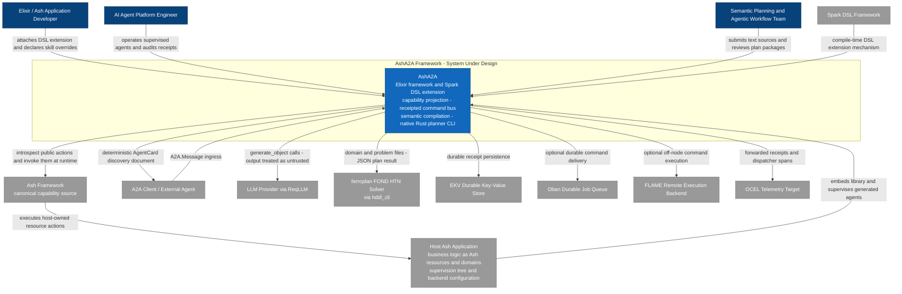
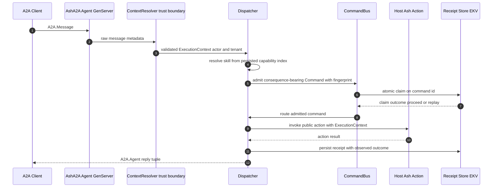
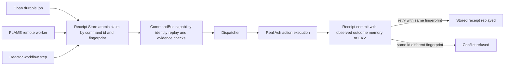
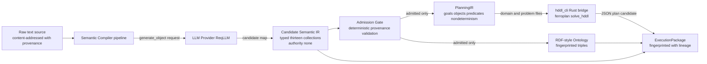

# Project Overview

**System:** `ash_a2a` — Ash-to-A2A Agent Framework
**C4 Model Level:** Level 1 — System Context
**Document Type:** Architecture Documentation

---

## 1. Project Introduction

### 1.1 What AshA2A Is

**AshA2A** is an Elixir framework and Spark DSL extension for the Ash ecosystem. It enables any Ash application to become an A2A (Agent-to-Agent) protocol-compliant agent with **zero hand-written protocol glue**. The framework projects public Ash resource actions into discoverable A2A skills, generates AgentCard discovery documents, and dispatches inbound A2A messages back to real Ash actions through an enforced trust boundary.

Beyond protocol bridging, AshA2A provides a **receipted command bus** for idempotent, replay-safe execution and a **semantic compilation pipeline** that turns raw natural-language text into admitted semantics, an RDF-style ontology, and HDDL/FOND plan candidates via LLM extraction. A native Rust CLI wraps the ferroplan FOND HTN solver for formal planning.

### 1.2 Core Functionality

| Capability | Description |
|---|---|
| **Capability Projection** | Derives A2A skills deterministically from `Ash.Resource.Info.public_actions/1`; overrides may describe or suppress existing capabilities but can never invent new ones. |
| **AgentCard Discovery** | Projects the compiled capability index into a deterministic A2A AgentCard with argument schemas introspected from real actions. |
| **Message Dispatch** | Routes inbound A2A messages to real Ash actions through a named trust-boundary context resolver (`ContextResolver`). |
| **Receipted Command Execution** | All consequence-bearing work flows through a single sanctioned CommandBus that produces replayable receipts (in-memory or durable EKV). |
| **Semantic Compilation** | Converts raw text into candidate semantic IR, applies a deterministic admission gate, and projects admitted artifacts into RDF-style ontologies and PlanningIR. |
| **Planning Synthesis** | LLM-proposed HDDL/FOND plans are always treated as untrusted candidates, re-validated, and executed only as receipted commands; a native Rust bridge invokes the ferroplan FOND HTN solver. |
| **Agent Runtime** | Supervised A2A agent GenServers with durability, task lifecycle tracking, and cluster topology support. |

### 1.3 Business Value

AshA2A gives teams a **safe path to AI-driven automation over existing business logic**:

- **Zero-cost agent exposure** — existing public Ash actions become discoverable agent skills automatically, with guaranteed alignment between what is advertised (AgentCard) and what executes (dispatch behavior).
- **Security-first AI integration** — LLM output is treated strictly as untrusted evidence: every proposed capability is re-validated, and every consequence-bearing action flows through a receipted command bus.
- **Operational trustworthiness** — durable receipts and content fingerprints provide idempotent, replay-safe execution and a complete audit trail of agent activity.

### 1.4 Technical Characteristics

- **Architecture style:** Ports-and-adapters, security-first framework design.
- **Design philosophy:** Deterministic derivation over generation; fail-closed validation at every boundary; receipts and fingerprints as the universal evidence mechanism.
- **Delivery form:** An Elixir library embedded in a host application, a Spark DSL extension, and a native Rust binary (`hddl_cli`) — no UI, no standalone server.

---

## 2. Target Users

### 2.1 User Role Definitions

| Role | Profile | Primary Goal |
|---|---|---|
| **Elixir/Ash Application Developer** | Developer with existing Ash resources | Expose business logic as agent capabilities over A2A without writing protocol code |
| **AI Agent Platform Engineer** | Engineer building multi-agent systems | Operate agents that discover and invoke each other's capabilities safely |
| **Semantic Planning / Agentic Workflow Team** | Team compiling natural-language goals into formal plans | Execute LLM-derived plans against real, governed capabilities |

### 2.2 Usage Scenarios

1. **Capability exposure** — A developer attaches `use Ash.Resource, extensions: [AshA2A]`, optionally declaring residual skill overrides (display name, description, tags, exclusion). The capability index compiles at build time and the AgentCard is published for discovery.
2. **Agent operation** — External A2A clients and agents discover the AgentCard, send `A2A.Message` structs, and receive replies; platform engineers audit receipts and monitor dispatcher spans via telemetry forwarding.
3. **AI-assisted planning** — A team submits raw text sources; the semantic pipeline extracts candidate semantics, a formal FOND plan is produced, and plan steps execute as receipted commands against real capabilities, closing the loop with authority-free feedback observations.

### 2.3 Requirement Analysis

| Role | Key Needs |
|---|---|
| Application Developer | Zero-configuration capability projection; optional DSL overrides; guaranteed AgentCard/dispatch alignment; idempotent replay-safe execution with durable receipts |
| Platform Engineer | Deterministic AgentCard generation; schemas introspected from real actions (not declarations); enforced trust boundary between raw A2A metadata and domain calls; supervised GenServers integrated into host supervision trees |
| Planning Team | Deterministic admission gates with full provenance; candidate-only synthesis that never carries authority; fingerprinted replayable execution packages; FOND/HTN integration with structured success/error contracts |

---

## 3. System Boundaries

### 3.1 Scope Statement

The library boundary spans **everything from A2A message ingress to Ash action invocation and receipt persistence, plus the semantic compilation and planning pipeline**. Host applications embed the framework, supply their own Ash resources, supervise generated agents, and configure storage and delivery backends.

### 3.2 Included Components

| Group | Components |
|---|---|
| DSL & Capability Projection | Spark DSL extension and residual skill overrides; capability index compiler; fail-closed override validator; AgentCard builder |
| Dispatch & Trust Boundary | Dispatcher; context resolver; execution context, identity, and authority models |
| Receipted Execution | Command envelope; CommandBus; receipt model; receipt stores (in-memory and durable EKV backends) |
| Agent Runtime | Agent behaviour compiling resources into supervised A2A GenServers; durable server; task lifecycle; runtime receipts; topology presence and group management |
| Semantic Pipeline | Source anchoring; candidate IR; admission gate; ontology projection; PlanningIR; execution package; feedback |
| Planning | Semantic plan synthesis for unknown boundaries; native Rust `hddl_cli` wrapper around ferroplan |
| Integration Adapters | Delivery adapter (Oban); execution adapters (FLAME, Reactor step); OCEL telemetry forwarder |
| Developer Tooling | Mix tasks (`install`, `verify_architecture`, EDS ledger); architecture verifier; spec assets; benchmarks |

### 3.3 Excluded Components

The following are explicitly **outside** the AshA2A boundary:

- **Host application Ash resources and domains** — the business logic itself
- **External A2A client applications and agent implementations** — consumers of the protocol
- **LLM model providers themselves** — external services invoked via ReqLLM
- **Ferroplan solver internals** — accessed only through the `hddl_cli` wrapper
- **Storage and queue infrastructure operation** — the EKV instance, Oban tables, and databases are operated by the host
- **HTTP transport servers and network plumbing** — transport is the host's responsibility
- **Any user interface**

### 3.4 Boundary Rationale

AshA2A is a **framework, not an application**: it governs the *path* between protocol and business logic (projection, validation, dispatch, receipts, planning) but owns neither the business logic (host's Ash resources) nor the operational infrastructure (queues, storage, transport). This split keeps the framework embeddable and keeps every consequence-bearing decision inside auditable, receipted boundaries.

---

## 4. External System Interactions

### 4.1 External System Inventory

| # | External System | Category | Interaction Type | Direction |
|---|---|---|---|---|
| 1 | **Ash Framework** | Foundational framework | Compile-time introspection via `Ash.Resource.Info`; runtime action invocation through the dispatcher | Outbound |
| 2 | **Spark** | DSL framework | Compile-time DSL extension mechanism on which the `a2a` section is built | Build-time |
| 3 | **A2A Protocol ecosystem** | Protocol consumers | Message ingress/reply; AgentCard discovery document publication | Inbound + Outbound |
| 4 | **LLM providers (via ReqLLM)** | AI service | Synchronous `generate_object` API calls; injectable seam for testing | Outbound |
| 5 | **ferroplan FOND HTN solver** | Native planning library | Subprocess invocation through `hddl_cli`; file I/O; JSON on stdout; strict exit-code contract | Outbound |
| 6 | **EKV** | Storage | Supervised durable on-disk receipt store backend started by `AshA2A.Application` from configuration | Outbound |
| 7 | **Oban** | Job queue | Optional delivery adapter — commands enqueued as durable jobs | Outbound |
| 8 | **FLAME** | Elastic compute | Optional execution adapter — commands run off the host node | Outbound |
| 9 | **OCEL telemetry target** | Observability | Telemetry event forwarding of command receipts and dispatcher spans | Outbound |

Additionally, the **host Ash application** is the embedding context: it attaches the extension, supplies the Ash resources, supervises generated agents, and configures backends.

### 4.2 Interaction Details

**Ash Framework (canonical capability source).** The single most important dependency. Public actions on host Ash resources and domains define *everything the agent can do*. AshA2A introspects these at compile time via Spark transformers and invokes them at runtime through the dispatcher — there is no second source of capability truth.

**A2A Protocol ecosystem (protocol boundary).** External A2A clients and agents consume the generated AgentCard and send `A2A.Message` structs. All inbound metadata is untrusted and must pass the `ContextResolver` trust boundary before any Ash call.

**LLM providers (untrusted evidence source).** ReqLLM's `generate_object` is used to extract semantic candidates and propose HDDL/FOND artifacts. Output is *always* authority-free: everything the model proposes is evidence until the deterministic admission gate validates provenance. The `:generate_object` dependency is injectable (anonymous functions in tests).

**ferroplan (formal planning engine).** The native Rust `hddl_cli` binary reads domain/problem file paths from argv, invokes `ferroplan solve_hddl`, and emits a JSON plan (exit 0) or a JSON error object (exit 1) — a strict, parseable contract.

**EKV / Oban / FLAME (operational backends).** EKV durably persists receipts so they survive process and node restarts (an in-memory backend serves testing). Oban and FLAME are optional ports: adapters funnel commands into the CommandBus but can never bypass its checks.

**OCEL telemetry target (observability sink).** Receives forwarded OCEL events derived from command receipts and dispatcher spans.

### 4.3 Dependency Classification

| Class | Systems | Trust Posture |
|---|---|---|
| Mandatory foundational | Ash Framework, Spark, host application | Trusted — the canonical source of capabilities and DSL mechanics |
| Protocol consumers | A2A clients / external agents | **Untrusted input** — passes trust boundary before domain calls |
| AI services (conditional) | LLM providers, ferroplan | **LLM output untrusted**; ferroplan output contract-checked |
| Runtime infrastructure (optional/replaceable) | EKV, Oban, FLAME | Trusted ports; behavior-neutral, checks enforced inside CommandBus |
| Observability (optional) | OCEL target | Read-only egress of receipts and spans |

---

## 5. System Context Diagram

### 5.1 C4 System Context Diagram

The diagram below shows AshA2A at the center, its three user personas, and all external systems, using C4-standard color conventions (blue = system under design, dark blue = persons, gray = external systems).

**Reading guide.** The host application embeds AshA2A and is simultaneously the source of business logic reached *through* the Ash Framework. A2A clients interact bidirectionally (discovery + messages). LLM providers and ferroplan serve the semantic/planning pipeline; EKV, Oban, FLAME, and OCEL are interchangeable operational ports.

### 5.2 Key Interaction Flows

#### Flow 1 — Capability Projection and AgentCard Discovery (compile-time)

1. The host attaches the extension via `use Ash.Resource, extensions: [AshA2A]` and optionally declares residual `a2a` skill entities.
2. The Spark compile-time transformer introspects `Ash.Resource.Info.public_actions/1` and derives canonical `{resource, action}` skills, layering overrides on top.
3. The fail-closed override validator rejects any override referencing private or nonexistent actions with a structured refusal.
4. `AshA2A.Info` derives the current capability index on demand through the canonical introspection facade.
5. The AgentCard builder projects the index into a deterministic A2A AgentCard consumed by A2A clients.
6. The Agent behaviour backs the index with a supervised A2A GenServer under the host supervision tree.

#### Flow 2 — Inbound A2A Message Dispatch (runtime, importance 10.0)

Key guarantees: raw A2A metadata never reaches Ash calls directly, and the skill executed is always resolved from the persisted, verified capability index — never from raw DSL entities.

#### Flow 3 — Receipted Command Execution via Adapters (delivery and execution paths)

Retries with the same content-derived fingerprint replay the stored receipt (idempotency); conflicting fingerprints under the same command id are refused (intent integrity).

#### Flow 4 — Semantic Compilation Pipeline (text to plan candidate)

The closed loop completes when execution receipts are converted into typed, fingerprinted **feedback observations** (standing `:observed`, authority `:none`) that feed re-planning — LLM-proposed plans are always re-validated against the real capability index before any consequence executes.

### 5.3 Architecture Decision Descriptions

| # | Decision | Rationale at System Context Level |
|---|---|---|
| 1 | **Single canonical capability source** (`Ash.Resource.Info.public_actions/1`) | Advertised surface (AgentCard) and executed behavior (dispatch) are both projections of one source, so they can never diverge. |
| 2 | **Fail-closed boundary validation** | Overrides may describe or suppress existing capabilities but never invent them; any invalid reference is a structured refusal, not a silent pass. |
| 3 | **Named trust boundary** (`ContextResolver`) | A single mandatory passage point converts untrusted A2A metadata into a validated ExecutionContext (actor, tenant). |
| 4 | **Single sanctioned execution path** (CommandBus) | Planning components and adapters may call the CommandBus but cannot bypass capability, identity, replay, and evidence checks. |
| 5 | **Candidate-then-admit for LLM output** | Model output is authority-free evidence until a deterministic admission gate validates provenance; only then do artifacts become admitted state. |
| 6 | **Receipts and fingerprints as universal evidence** | Content-only fingerprints make retries provably identical in intent and make every artifact replayable and auditable. |
| 7 | **Adapters as interchangeable ports** | Oban, FLAME, Reactor, and OCEL are pluggable; all respect CommandBus checks, keeping infrastructure swappable without security trade-offs. |

---

## 6. Technical Architecture Overview

### 6.1 Technology Stack

| Layer | Technology | Role |
|---|---|---|
| Language / Runtime | Elixir / OTP | Framework implementation, supervision trees, GenServers |
| DSL | Spark | Compile-time extension mechanism (`a2a` section, transformers, verifiers) |
| Domain framework | Ash | Canonical capability source; runtime action execution |
| LLM access | ReqLLM | `generate_object` calls for semantic extraction (injectable seam) |
| Formal planning | Rust + ferroplan (via `hddl_cli`) | FOND HTN solving with a strict JSON/exit-code contract |
| Durable storage | EKV | Production receipt persistence (in-memory backend for tests) |
| Delivery / Execution | Oban, FLAME, Reactor | Optional durable delivery, elastic off-node execution, workflow steps |
| Observability | OCEL | Structured event export of receipts and dispatcher spans |
| Tooling | Mix tasks, EEx templates, SPARQL/TTL spec assets, benchmarks | Install scaffolding, architecture verification, evidence ledger, performance testing |

### 6.2 Architecture Patterns

- **Ports and adapters:** Integration Adapters are interchangeable ports; the core (projection, dispatch, receipted execution, semantics) is adapter-agnostic.
- **Trust boundary pattern:** One named resolver mediates every crossing from untrusted protocol data into domain execution context.
- **Command bus with receipts:** All consequence-bearing work is funneled through a single receipted route with atomic claims, replay detection, and durable evidence.
- **Deterministic projection:** The AgentCard, ontology triples, and PlanningIR are all *derived* deterministically from admitted state — never hand-authored or regenerated nondeterministically.
- **Composition over configuration for runtime:** `AshA2A.Application` composes agents and receipt-store children from host configuration, integrating into the host supervision tree.

### 6.3 Internal Domain Landscape (Contextual Summary)

The system context is realized internally by eight strictly separated domains (detail belongs to the Container/Component levels):

| Domain | Type | Importance | Responsibility in Context |
|---|---|---|---|
| Capability Projection & Discovery | Core | 9.5 | Turns public Ash actions into the advertised A2A skill surface |
| Message Dispatch & Trust Boundary | Core | 9.5 | Receives A2A messages; enforces the trust boundary; invokes real actions |
| Receipted Command Execution | Core | 9.0 | Single sanctioned path from Command to execution with replay-safe receipts |
| Semantic Compilation | Core | 8.5 | Candidate-then-admit pipeline from raw text to ontology and PlanningIR |
| Planning Synthesis | Supporting | 7.5 | LLM-proposed plans (re-validated) and the native ferroplan bridge |
| Agent Runtime & Lifecycle | Supporting | 7.5 | Supervised agents, durability, task lifecycle, cluster topology |
| Integration Adapters | Infrastructure | 6.5 | Oban / FLAME / Reactor / OCEL ports, all respecting CommandBus checks |
| Developer Tooling & Governance | Tool Support | 5.5 | Install, architecture verification, evidence ledger, spec assets, benchmarks |

### 6.4 Key Design Invariants

1. **Dispatch never diverges from the AgentCard** — the dispatcher resolves skills exclusively through the persisted, verified capability index.
2. **No direct LLM-proposed execution** — planning-synthesized consequences must enter through the CommandBus; every proposed capability id is re-validated via `AshA2A.Info` first.
3. **Fail-closed everywhere** — invalid overrides, incomplete provenance, and conflicting fingerprints are refusals, never degradations.
4. **Evidence before authority** — nothing generated (LLM candidates, plan proposals, feedback observations) carries authority; only deterministic gates confer it.

### 6.5 Known Alignment Notes

- Receipt-related code is deliberately split between the command domain (`receipt.ex`, `receipt_store`) and the runtime domain (`runtime_receipt.ex`) — **command evidence** versus **lifecycle evidence**. This distinction is intentional but may confuse adopters; the architecture verifier and documentation exist to keep the boundary clear.
- HTTP transport, storage operation, and business logic remain host responsibilities by design; adopters should plan for transport hardening and backend operations outside the framework.

---

*This document constitutes the C4 Level 1 (System Context) view of AshA2A. Container- and Component-level views should be consulted for the internal structure of the eight domains summarized in Section 6.3.*