# System Architecture Documentation

| Document Attribute | Value |
|---|---|
| **System** | `ash_a2a` v26.9.14 |
| **Type** | Elixir Framework / Spark DSL Extension (embedded library in host Ash applications) |
| **Architecture Model** | C4 (System Context → Container → Component) + Workflow, Implementation, and Deployment views |
| **Generation Time** | `2026-09-15 02:52:04 (UTC)` (timestamp: `1789440724`) |
| **Evidence Basis** | Code-validated research corpus: System Context (confidence 8.6), Domain Modules (8.8), Architecture Analysis (9/10, spot-verified against source), Workflow Analysis |
| **Alignment Reference** | Project PRD/ARD §3.2 (skill resolution), §3.5 (trust boundary); ERC evidence ledger under `research/erc/` |

---

## 1. Architecture Overview

### 1.1 Positioning and Design Philosophy

AshA2A turns any Ash application into an A2A (Agent-to-Agent) compliant agent with **zero hand-written protocol glue**. Public Ash resource actions become discoverable agent skills automatically, and every consequence-bearing action flows through a receipted command bus — giving teams a safe, auditable path to AI-driven planning over existing business logic.

The entire architecture is organized around **one central invariant**:

> **The advertised agent surface (A2A AgentCard) and the executed behavior (Ash action dispatch) are both deterministic projections of a single canonical source: `Ash.Resource.Info.public_actions/1`.**

Because both the "what we advertise" and the "what we execute" views are derived — never independently authored — the failure mode "advertised capability ≠ executed behavior" is made **structurally impossible**, not merely tested against.

Three design principles recur at every boundary of the system:

1. **Deterministic derivation over generation.** Capabilities, AgentCards, ontology triples, and capability indexes are *compiled* from real Ash introspection, never declared into existence. Artifact ordering is sorted, content identity is content-addressed, and every projection is reproducible.
2. **Fail-closed validation.** At every trust boundary — override validation (compile time), actor resolution (protocol trust), LLM admission (model trust), consequence classification (execution) — ambiguous, unverified, or unprovenanced input is **refused with a structured error**, never silently defaulted. Invalid input never "partially succeeds."
3. **Receipts and fingerprints as universal evidence.** All consequence-bearing work funnels through a single receipted CommandBus. Content-derived fingerprints and replayable receipts provide idempotency (CommandBus), lineage (ExecutionPackage), re-planning evidence (Feedback), and even cluster topology (presence tracking on runtime receipts).

### 1.2 Core Architecture Patterns

| # | Pattern | Where Applied | Rationale |
|---|---|---|---|
| 1 | **Ports & Adapters (hexagonal)** | Oban, FLAME, Reactor, OCEL adapters | Infrastructure runtimes are interchangeable ports; all of them funnel through the CommandBus and can never bypass its checks |
| 2 | **Receipted Command Bus** | `CommandBus` + `ReceiptStore` (Memory/EKV) | Single sanctioned path for consequence-bearing work; atomic claim/replay semantics deliver exactly-once *effect* semantics over at-least-once delivery |
| 3 | **Compile-time capability projection** | Spark DSL extension + `BuildCapabilityIndex` transformer | Skills derived at compile time from `public_actions/1`; overrides validated before the application can even boot |
| 4 | **Named trust boundaries** | `ContextResolver`, `Admission Gate`, Override Validator, CommandBus consequence checks | Every dangerous crossing has an explicit, documented, fail-closed gate rather than implicit convention |
| 5 | **Candidate-then-admit staged trust** | Semantic Compilation pipeline | LLM output is authority-free (`:candidate` / authority `:none`) until a deterministic gate validates full provenance |
| 6 | **Behaviour-driven swappable infrastructure** | `ReceiptStore` behaviour with Memory and EKV backends | Durability is a backend property, probed by capability (`durable?/0`) rather than hardcoded allowlists |
| 7 | **Dependency-injection seams over mocks** | `:generate_object` option on the Semantic Compiler | Production binds `ReqLLM.generate_object/4`; tests inject anonymous functions — no mocking library required |
| 8 | **Governance as code** | `mix ash_a2a.verify_architecture`, ERC ledger, ggen spec assets | The architecture is not only documented; it is *executed* as verification and *measured* by benchmarks |

### 1.3 Technology Stack

| Layer | Technology | Role |
|---|---|---|
| Language / Runtime | Elixir / OTP (BEAM) | Supervised GenServers, telemetry, fault tolerance |
| DSL Framework | Spark | Compile-time DSL extension mechanism (sections, transformers, verifiers) |
| Business Logic | Ash Framework | Canonical capability source; action introspection and invocation |
| Wire Protocol | A2A structs (`A2A.Message`, `A2A.Agent`, AgentCard) | Agent-to-agent message ingress/reply and discovery |
| AI Extraction | ReqLLM (`generate_object/4`) | Untrusted candidate extraction and plan proposals (injectable seam) |
| Formal Planning | Rust `hddl_cli` → ferroplan FOND HTN solver | Subprocess solver with file I/O and JSON/exit-code contract |
| Receipt Durability | EKV (on-disk KV) | Production receipt store surviving process and node restarts |
| Delivery | Oban | Durable, queued command delivery |
| Elastic Execution | FLAME | Off-node command execution |
| Workflow | Reactor | Command execution as a workflow step |
| Observability | `:telemetry` + OCEL forwarder | Dispatch spans and receipt events exported as OCEL v2 |
| Governance | Mix tasks, EDS/ERC ledger, Turtle ontology, SPARQL queries, Benchee benchmarks | Architecture verification, evidence ledger, spec assets, hot-path benchmarks |

### 1.4 Conceptual Planes

The system is easiest to understand as four cooperating planes:

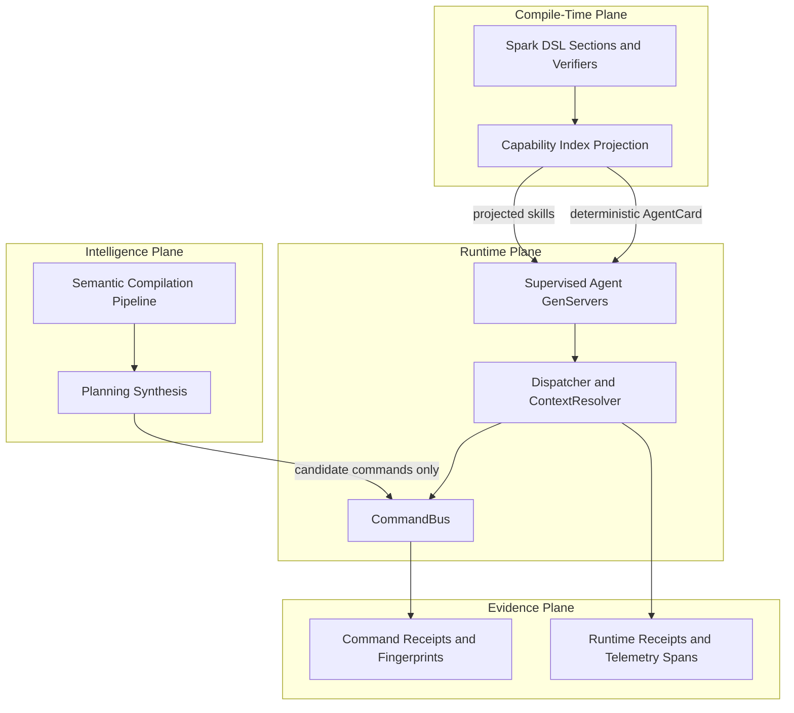

The Intelligence Plane has **no authority of its own**: it may propose, but only the Runtime Plane's CommandBus may execute — and everything it touches lands in the Evidence Plane.

---

## 2. System Context

### 2.1 System Positioning and Value

AshA2A is an **embedded framework**, not a standalone service. It is added to a host Ash application via `use Ash.Resource, extensions: [AshA2A]` and immediately projects that application's public actions into the A2A protocol ecosystem. Its business value rests on three guarantees:

- **Zero-glue capability exposure**: public actions become discoverable agent skills automatically, with optional residual overrides for naming/description/tags/exclusion.
- **Fail-closed safety**: overrides can describe or suppress but never invent capabilities; LLM output is strictly untrusted evidence that is re-validated before use.
- **Safe AI-driven execution**: every consequence-bearing action flows through a receipted command bus, producing durable, replay-safe evidence.

### 2.2 User Roles and Scenarios

| User Role | Scenario | Key Needs |
|---|---|---|
| **Elixir/Ash application developers** | Expose existing Ash resources as agent capabilities | Zero-configuration projection from public actions; DSL overrides for names/descriptions/tags/exclusion; guaranteed AgentCard ↔ dispatch alignment; idempotent durable execution |
| **AI agent platform engineers** | Build multi-agent systems where agents discover and invoke each other | Deterministic AgentCard generation; argument schemas introspected from *real* actions; enforced trust boundary between protocol metadata and domain calls; supervised agent GenServers in host trees |
| **Semantic planning teams** | Compile natural-language goals into formal plans executed against real capabilities | Deterministic admission gates with full provenance; candidate-only plan synthesis with no authority; fingerprinted replayable execution packages and feedback loops; FOND/HTN integration with structured contracts |

### 2.3 External System Interactions

| External System | Interaction Type | Description |
|---|---|---|
| **Ash Framework** | Compile-time introspection (`Ash.Resource.Info`) + runtime action invocation | The canonical capability source |
| **Spark** | Compile-time DSL extension mechanism | Hosts the `a2a` section, transformers, and verifiers |
| **A2A Protocol ecosystem** | Message ingress/reply; AgentCard publication | External clients and agents consume discovery documents and send `A2A.Message` structs |
| **LLM providers (via ReqLLM)** | Synchronous `generate_object` calls (injectable seam) | Extract semantic candidates; propose plans. Output is **always untrusted** |
| **ferroplan FOND HTN solver** | Subprocess via native `hddl_cli`: files in → JSON out → exit-code contract | Formal FOND/HTN planning |
| **EKV** | Supervised storage backend started from configuration | Durable on-disk KV backing production receipts |
| **Oban** | Optional delivery adapter | Durable job queue for command dispatch |
| **FLAME** | Optional execution adapter | Elastic off-node command execution |
| **OCEL telemetry target** | Telemetry event forwarding | Receives forwarded receipts and dispatch spans |

### 2.4 System Boundary Definition

**Included** (the framework owns and implements):
- AshA2A Spark DSL extension and residual skill overrides
- Capability index compiler, fail-closed validator, AgentCard builder
- Dispatcher, context resolver, execution context
- Command envelope, command bus, receipt model, receipt stores (Memory and EKV)
- Agent behaviour compiling resources into supervised A2A GenServers, plus durable server
- Semantic pipeline (Source → IR → Admission → Ontology → PlanningIR → ExecutionPackage → Feedback) and planning semantic synthesis
- Delivery (Oban) and execution (FLAME/Reactor) adapters; OCEL forwarder
- Topology presence/group management; Mix install/verification/ledger tasks; native Rust `hddl_cli`

**Excluded** (host applications and third parties own):
- Host application Ash resources and domains (the business logic itself)
- External A2A client applications and other agent implementations
- LLM model providers themselves; ferroplan solver internals
- Storage/queue infrastructure operation (EKV instance provisioning, Oban tables, database)
- HTTP transport servers and network plumbing; any user interface

### 2.5 System Context Diagram

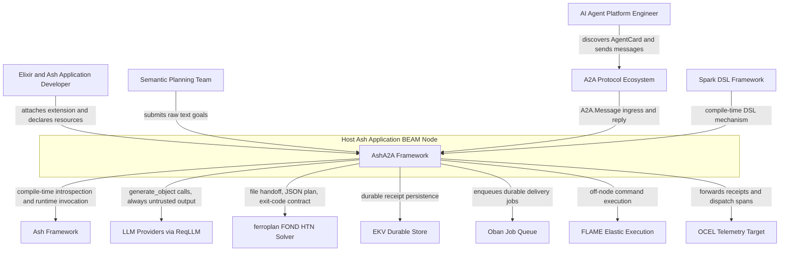

**Boundary clarification:** the framework does *not* own host resources, databases, HTTP transport servers, LLM providers, or solver internals. Host applications supply Ash resources, supervise generated agents under their own supervision trees, and configure storage/delivery backends.

---

## 3. Container View

### 3.1 Domain Module Division

The codebase decomposes into **eight domains** with strictly layered dependencies. Dependencies flow downward and around the CommandBus — no adapter bypasses it.

| Domain | Type | Importance | Complexity | Core Responsibility |
|---|---|---|---|---|
| **C1. Capability Projection & Discovery** | Core | 9.5 | 7.5 | Derive skills from `public_actions/1`; overrides may describe/suppress but **never invent**; build deterministic AgentCard |
| **C2. Message Dispatch & Trust Boundary** | Core | 9.5 | 8.0 | `ContextResolver` strips untrusted metadata; dispatcher resolves skills *only* through the persisted capability index |
| **C3. Receipted Command Execution** | Core | 9.0 | 8.0 | CommandBus = sole route for consequence-bearing work; capability/identity/replay/evidence checks; atomic claim semantics |
| **C4. Semantic Compilation** | Core | 8.5 | 9.0 | Closed-loop pipeline: raw text → admitted semantics → RDF ontology → PlanningIR → fingerprinted ExecutionPackage → Feedback |
| **C5. Planning Synthesis** | Supporting | 7.5 | 8.5 | LLM-proposed plans re-validated against the real index; native Rust bridge to ferroplan |
| **C6. Agent Runtime & Lifecycle** | Supporting | 7.5 | 7.0 | Supervised GenServers; durability and task lifecycle; cluster topology |
| **C7. Integration Adapters** | Infrastructure | 6.5 | 6.0 | Oban/FLAME/Reactor/OCEL — interchangeable ports, all funneling through the CommandBus |
| **C8. Developer Tooling & Governance** | Tool Support | 5.5 | 5.5 | Architecture verification, ERC evidence ledger, ggen spec assets, benchmarks |

### 3.2 Container Architecture Diagram

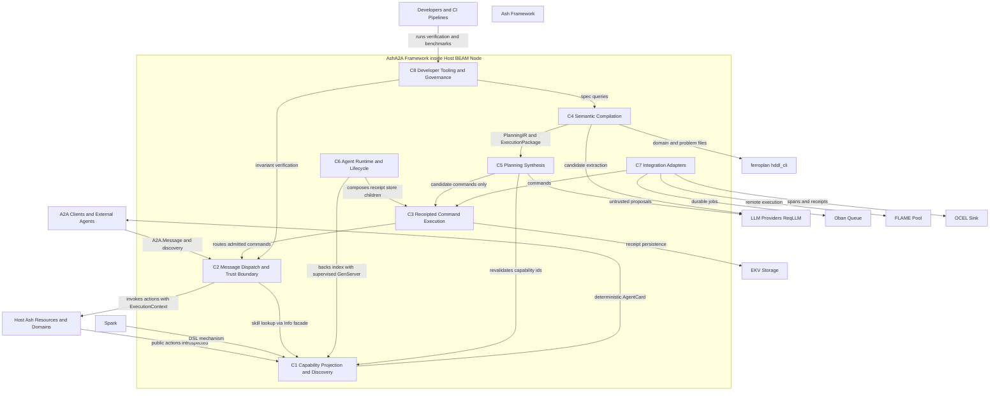

### 3.3 Storage Design

| Store | Technology | Contents | Durability Standing | Ownership |
|---|---|---|---|---|
| **Residual overrides** | Spark-compiled resource/DSL metadata | Only `skill_overrides`, `subject_kind` (resource-vs-domain flag), `semantic_requests` flag | Persisted at compile time with the host application | Framework-owned; deliberately **not** a capability index (see §6.1, D-1) |
| **Memory receipt store** | ETS/in-memory (`ReceiptStore.Memory`) | Command receipts for testing/dev | `:observed` | Framework-owned |
| **EKV receipt store** | On-disk key-value store (`ReceiptStore.Ekv`) | Production command receipts, surviving process/node restarts | `:durable` (detected via `durable?/0` capability probing) | Framework-owned store, host-provisioned EKV instance |
| **Runtime receipts** | In-memory + durable server state | Lifecycle evidence for `DurableServer`, TaskLifecycle, Topology, FLAME | Lifecycle-scoped; **never confers authority** | Framework-owned |
| **Oban queues** | Host database (via Oban) | Durable delivery jobs for commands | Job-level durability; **an Oban job id is never promoted to an A2A TaskID or an execution receipt** | Host-owned infrastructure |
| **Solver handoff files** | Temporary files | Domain/problem files passed to `hddl_cli`; JSON plan/error returned | Transient, contract-based (exit 0 = plan JSON, exit 1 = error JSON) | Framework-generated, subprocess-consumed |
| **Semantic artifacts** | BEAM structs | Content-addressed `Source`, candidate IR, fingerprinted `ExecutionPackage`, `Feedback` | Content-addressed identity enables deduplication and replay | Framework-owned |

The deliberate split between **command receipts** (`receipt.ex`, `receipt_store/*` — evidence of execution attempts, gating replay) and **runtime receipts** (`runtime_receipt.ex` — evidence of lifecycle state, feeding durability/topology) is intentional and must not be conflated: only the former carries idempotency authority.

### 3.4 Inter-Domain Communication Rules

Communication follows a strict, verified set of relations (strength = coupling intensity from domain analysis):

| From | To | Type | Strength | Contract |
|---|---|---|---|---|
| C2 Dispatch | C1 Capability Projection | Service call | 9.0 | Dispatcher resolves skills **exclusively** via `AshA2A.Info` against the persisted index — never by walking raw DSL entities |
| C3 Command Execution | C2 Dispatch | Service call | 9.0 | CommandBus is the single sanctioned path; it invokes Ash actions only after capability/identity/replay/evidence checks pass |
| C7 Adapters | C3 Command Execution | Service call | 8.0 | Oban jobs, FLAME workers, and Reactor steps all funnel through `AshA2A.CommandBus` |
| C5 Planning | C3 Command Execution | Service call | 7.0 | LLM-proposed consequence-bearing actions become Commands; **never executed directly** |
| C5 Planning | C4 Semantic Compilation | Data dependency | 7.0 | Consumes fingerprinted PlanningIR and ExecutionPackage artifacts as candidate inputs |
| C5 Planning | C1 Capability Projection | Data dependency | 6.0 | Every LLM-proposed capability id re-validated via `AshA2A.Info` before use |
| C4 Semantic | C5 Planning | Data dependency | 5.0 | PlanningIR artifacts flow to `hddl_cli`/ferroplan via file handoff |
| C6 Runtime | C3 / C1 | Composition | 6.0 | Application composes receipt-store children; Agent behaviour backs a compiled index with a supervised GenServer |
| C7 Adapters | C2 Dispatch | Data dependency | 4.0 | OCEL forwarder consumes dispatcher spans for external observability |
| C8 Governance | C2 / C4 | Verification / data | 4.0 / 3.0 | Verifier enforces dispatch/command-bus layering; SPARQL queries operate on the generated `ontology.ttl` |

**Layering law:** Core domains (C1–C4) never depend on Supporting (C5–C6) or Infrastructure (C7) domains. Adapters and Planning are *clients* of the core; Governance *observes* the core. This law is mechanically enforced by `mix ash_a2a.verify_architecture`.

---

## 4. Component View

### 4.1 Capability Projection & Discovery (C1)

| Component | Code Path | Responsibility | Key Behaviors |
|---|---|---|---|
| **DSL Extension** | `lib/ash_a2a.ex`, `dsl.ex`, `argument.ex`, `verify.ex` | Top-level Spark extension attached via `use Ash.Resource, extensions: [AshA2A]` | Declares the residual `a2a` section (display name, description, tags, exclusion); compile-time verification of configuration rules |
| **Capability Compiler** | `capability_index/compiler.ex`, `transformers/build_capability_index.ex`, `skill.ex` | Derives the canonical skill set keyed by `{resource, action}` | Introspects `Ash.Resource.Info.public_actions/1`; layers residual overrides on top; sorts output deterministically |
| **Fail-Closed Override Validator** | `capability_index/validator.ex` | Integrity gate for the advertised surface | Rejects overrides naming private or nonexistent actions; returns structured refusal with code and detail → `Spark.DslError` at compile time |
| **AgentCard Builder** | `capability_index/agent_card_builder.ex` | Final wire projection | Deterministically converts a compiled index into the A2A AgentCard; argument schemas always introspected from real `action.arguments` + `action.accept` (the nested `argument` DSL entity is accepted for source compatibility but **deliberately ignored**) |
| **Introspection Facade** | `info.ex`, `capability_index.ex` | Single canonical access path | Persists only residual overrides + subject kind; derives the current index **on demand**, keeping the index a projection rather than a second business model |

### 4.2 Message Dispatch & Trust Boundary (C2)

| Component | Code Path | Responsibility | Key Behaviors |
|---|---|---|---|
| **Agent Behaviour** | `agent.ex` | Live presence for a compiled index | `use AshA2A.Agent, resource_or_domain:` compiles a resource/domain into a supervised A2A GenServer under `A2A.AgentSupervisor`; exposes the AgentCard |
| **Dispatcher** | `dispatcher.ex` | Core dispatch engine | Maps `A2A.Message` → real Ash action via the persisted index; wraps work in `:telemetry.span([:ash_a2a, :dispatch])`; returns `{:reply \| :input_required \| :stream \| :error, parts}` tuples; threads multi-turn `history` into `changeset.context[:a2a_history]` |
| **ContextResolver (Trust Boundary)** | `context_resolver.ex` | The named protocol trust boundary | `from_a2a_message/2`: `actor` comes **only** from the transport-verified `auth_identity` argument (via `A2A.Plug.Auth`), **never** from `message.metadata`; `tenant` only from `auth_identity[:tenant]`; defaults to `nil` so unauthenticated dispatch **fails closed** |
| **Execution Context Model** | `execution_context.ex`, `identity.ex`, `authority.ex` | Typed context for Ash actions | Separates machine **identity** from granted **authority**; carries exactly the fields Ash actions accept (actor, tenant) |

### 4.3 Receipted Command Execution (C3)

| Component | Code Path | Responsibility | Key Behaviors |
|---|---|---|---|
| **Command Envelope** | `command.ex` | Consequence-bearing work unit | Binds machine identities, canonical capability id, admitted input, optional semantic subject, verified authority; **content-derived fingerprint** (transport timestamps excluded) so retries prove the same intent |
| **Command Bus** | `command_bus.ex` | ⭐ Single sanctioned execution path | Pipeline: `inspect_target` → `admit` (capability/authority/replay/evidence checks) → `store.claim` → execute → `commit`; emits `[:ash_a2a, :receipt, :committed]` telemetry; sets a process-dictionary correlation flag so the OCEL forwarder coalesces one event per logical command |
| **Receipt Store Behaviour** | `receipt_store.ex` | Replay-safety contract | `claim/2` atomically returns `{:execute, execution_id}` \| `{:replay, receipt}` \| `{:error, :command_conflict \| :in_flight}`; distinguishes same-fingerprint replay from conflicting fingerprints |
| **Memory Backend** | `receipt_store/memory.ex` | Testing/dev store | Receipts carry standing `:observed` |
| **EKV Backend** | `receipt_store/ekv.ex` | Production durable store | On-disk persistence surviving restarts; declares `durable?/0 → true`, which the CommandBus detects via `function_exported?/3` to upgrade receipt standing to `:durable` |

### 4.4 Semantic Compilation (C4)

| Component | Code Path | Responsibility |
|---|---|---|
| **Pipeline Compiler** | `semantic/compiler.ex` | Orchestrates the full pipeline; injectable `:generate_object` seam (default `&ReqLLM.generate_object/4`, anonymous functions in tests) |
| **Candidate Artifacts** | `source.ex`, `ir.ex`, `planning_ir.ex`, `execution_package.ex`, `feedback.ex` | Typed, candidate-only models: content-addressed `Source` (media type, observation time, provenance); **thirteen-collection** semantic IR with standing `:candidate` and authority `:none`; PlanningIR (goals/objects/predicates/nondeterminism markers); fingerprinted `ExecutionPackage` with lineage; authority-free `Feedback` derived from execution receipts |
| **Admission Gate** | `semantic/admission.ex` | Deterministic gatekeeper: hard **fence** requires `standing: :candidate` + `authority: :none`; per-collection required-field validation; every admitted entity must carry complete `source_quote` provenance; unique IDs and goal presence mandatory |
| **Ontology Projection** | `ontology.ex`, `vocabulary.ex`, `schema.ex` | Projects admitted IR into deterministic, fingerprinted RDF-style triples via a shared vocabulary; suitable for SPARQL spec queries |
| **Semantic Support Models** | `semantic_projection.ex`, `semantic_subject.ex` | Semantic subject identity minting and cross-boundary projection helpers shared with the command boundary |

### 4.5 Planning Synthesis (C5)

| Component | Code Path | Responsibility |
|---|---|---|
| **Semantic Plan Synthesis** | `planning.ex`, `planning/semantic_synthesis.ex` | LLM-driven synthesis of HDDL/FOND candidates and capability ids for goals outside known boundaries; every proposal re-validated via `AshA2A.Info`; consequences routed through CommandBus |
| **LLM Profiles** | `llm_profiles.ex` | Maps configured roles to model specifications |
| **Native FOND Planner Bridge** | `native/hddl_cli/` (Rust) | Wraps ferroplan `solve_hddl`; reads domain/problem paths from argv; emits JSON plan (exit 0) or JSON error object (exit 1) — a strict exit-code contract maximizing isolation and debuggability |

### 4.6 Agent Runtime & Lifecycle (C6)

| Component | Code Path | Responsibility |
|---|---|---|
| **Application Wiring** | `application.ex` | Composes agents and `receipt_store_children/0` from configuration; host-side supervision integration |
| **Durability & Task Lifecycle** | `durability/durable_server.ex`, `task_lifecycle.ex`, `runtime_receipt.ex` | Durable agent server resilient to restarts; task lifecycle state; runtime receipts as lifecycle evidence |
| **Topology** | `topology/presence.ex`, `topology/group.ex` | Cluster presence tracking and agent grouping built on runtime receipts for multi-node deployments |

### 4.7 Integration Adapters (C7) and Governance (C8)

| Component | Code Path | Responsibility |
|---|---|---|
| **Delivery Adapters** | `delivery.ex`, `delivery/oban.ex` | Enqueue commands as durable Oban jobs; deliver into the CommandBus. Doctrine: Oban job ids never become A2A TaskIDs or receipts |
| **Execution Adapters** | `execution/flame.ex`, `reactor/execute_command.ex` | Off-node execution via FLAME; command execution as a Reactor workflow step calling `AshA2A.CommandBus` |
| **Telemetry Forwarder** | `telemetry/ocel_forwarder.ex` | Exports receipts and dispatcher spans as OCEL v2 events with real `object_id` (never fabricated) |
| **Mix Tasks & Verification** | `mix/tasks/ash_a2a.install.ex`, `verify_architecture.ex`, `architecture_verifier.ex` | Host scaffolding; automated architecture-invariant checks (self-contained fixtures compiled under `:dev`, independent of `MIX_ENV=test`) |
| **Research & Evidence Ledger** | `mix/tasks/eds.ledger.ex`, `research/erc.ex`, `research/erc/` | ERC-*.json evidence entries recording research decisions |
| **Spec Assets & Benchmarks** | `priv/ggen/` (ontology.ttl, spec.rq, EEx templates), `bench/ash_a2a_bench.exs` | SPARQL queries over the pack ontology; template scaffolding; dispatcher/command-bus benchmarks |

### 4.8 Core Runtime Component Diagram

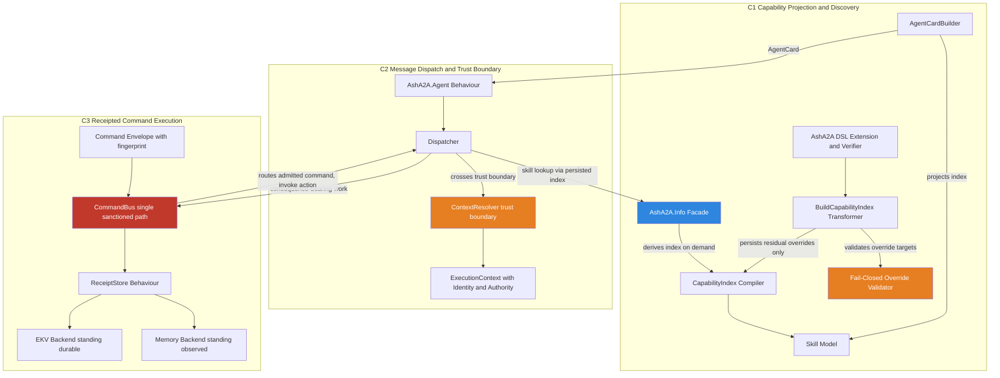

**Legend:** red = the single sanctioned execution path; orange = fail-closed trust gates; blue = the canonical introspection facade.

### 4.9 Semantic and Planning Component Diagram

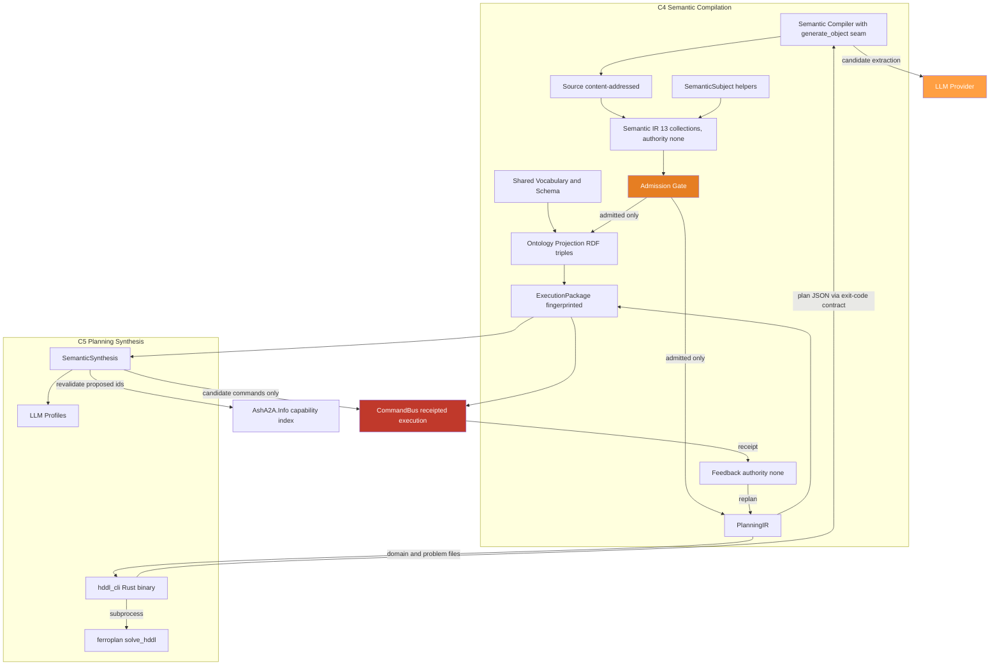

### 4.10 Runtime, Adapters, and Governance Component Diagram

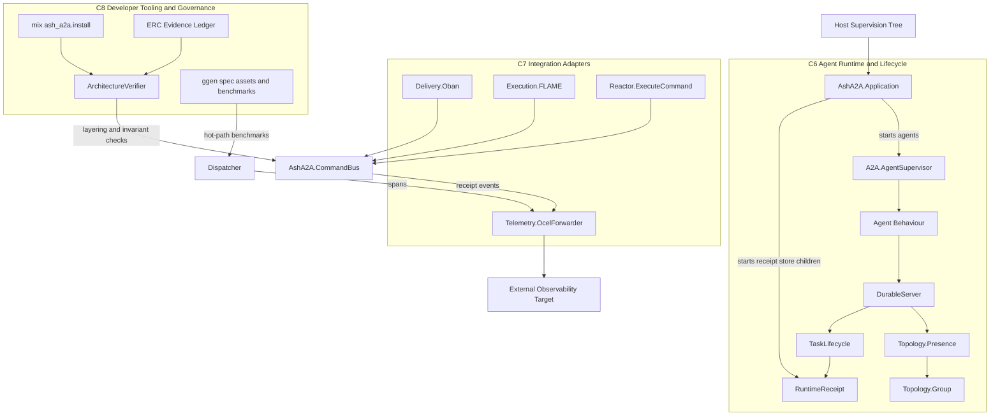

---

## 5. Key Processes

### 5.1 Capability Projection & AgentCard Discovery (Importance 9.5 — compile-time to runtime)

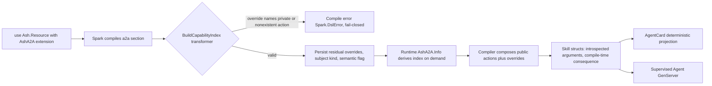

**Narrative.** The host attaches the extension; the Spark transformer runs at compile time. Overrides are fail-closed validated — they may *describe* (rename, retag, document) or *suppress* (`expose? == false`) existing capabilities but can **never invent** new ones. Only residual metadata is persisted; the capability index itself is derived on demand through `AshA2A.Info`, guaranteeing the index always reflects current Ash introspection. The AgentCard is built deterministically (sorted skills, schemas from real actions) and backed by a supervised GenServer.

### 5.2 Inbound A2A Message Dispatch (Importance 10.0 — the primary runtime flow)

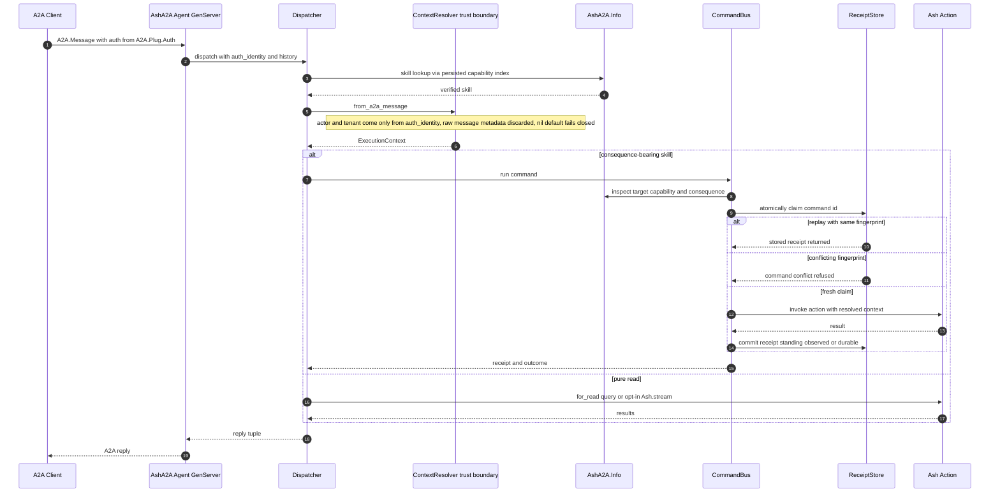

**Narrative and guarantees.**
1. **Message ingress** — the supervised GenServer (from `use AshA2A.Agent, resource_or_domain:`) receives the message.
2. **Trust boundary crossing** — `ContextResolver.from_a2a_message` is the mandatory passage point (PRD/ARD §3.5): raw protocol metadata never reaches Ash calls.
3. **Verified skill resolution** — lookup goes through `AshA2A.Info` against the persisted index (PRD/ARD §3.2), so dispatch can never diverge from the advertised AgentCard.
4. **Receipted admission** — consequence-bearing commands pass the CommandBus's capability, identity, consequence, and replay checks with atomic claims.
5. **Execution & receipt** — the real Ash action runs; the receipt records attempt and observed outcome (`:observed` or `:durable` standing).
6. **Reply** — the caller receives an `A2A.Agent` tuple for success, replay, refusal, or error alike.

### 5.3 Receipted Command Execution via Adapters (Importance 9.0)

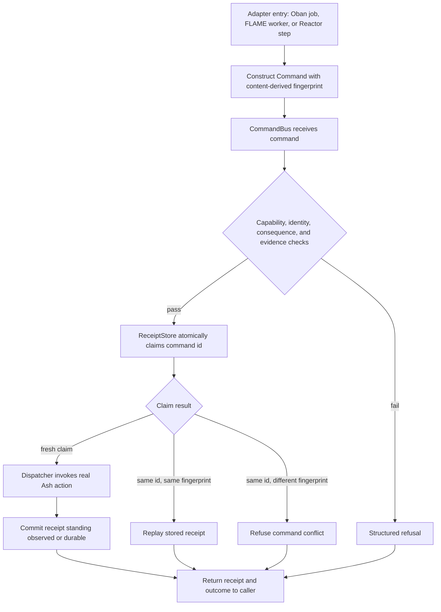

**Key guarantee:** fingerprints derive from **semantic command content only** — retries carrying fresh transport timestamps still prove the same intent against the same manufactured subject. The durable EKV backend ensures receipts survive restarts; the Oban adapter enforces that an Oban job id is never promoted to an A2A TaskID or an execution receipt.

### 5.4 Semantic Compilation Pipeline (Importance 9.0)

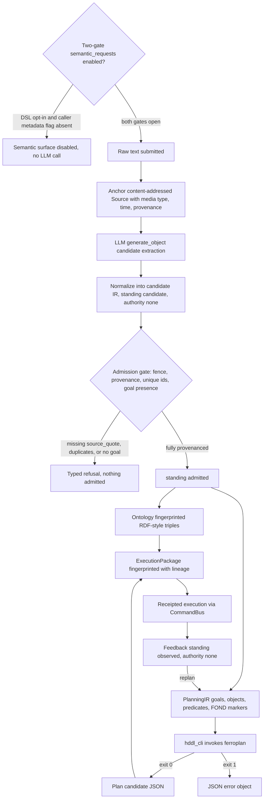

**Key guarantee:** everything the LLM proposes is untrusted evidence until the deterministic admission gate validates complete provenance. Access to this surface is itself two-gated (INV-7): the resource must declare `a2a do semantic_requests true end` **and** the caller's message metadata must set `semantic_request: true` — semantic compilation is "an explicit production A2A surface, never a surprise LLM invocation," enforced and fixture-tested inside the ArchitectureVerifier.

### 5.5 LLM Plan Synthesis & Receipted Feedback Loop (Importance 8.5)

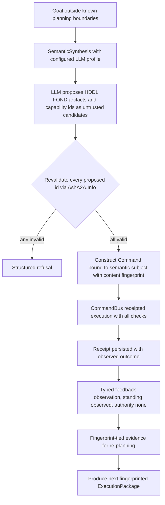

**Key guarantee:** the model's output never carries authority. This is the only true closed loop in the system — it spans three domains (Planning Synthesis → Capability Projection for re-validation → Receipted Command Execution), and closes with receipts converted into authority-free feedback feeding `replan/3`.

### 5.6 Exception Handling Mechanisms

The system follows a uniform doctrine: **refuse, never degrade**. Structured failure modes:

| Boundary | Failure Condition | Mechanism |
|---|---|---|
| Override validator (compile time) | Override references private or nonexistent `{resource, action}` | Structured refusal → `Spark.DslError`; application cannot boot |
| ContextResolver | No verified `auth_identity` | `actor`/`tenant` default to `nil`; dispatch fails closed — no silent trust |
| CommandBus — consequence | Generic unclassified `:action` | `:consequence_unclassified` refusal (never treated as safe either way) |
| CommandBus — authority | `:change`/`:external_do` without admitted authority | `:authority_required` / `:authority_mismatch` refusal |
| CommandBus — replay | Same command id, different fingerprint | `:command_conflict` refusal |
| CommandBus — concurrency | Claim already in flight | `:in_flight` result (caller retries) |
| Admission Gate | Fence violation, missing `source_quote`, duplicate ids, absent goal | Typed refusal; **nothing** is admitted |
| Solver bridge | ferroplan failure | JSON error object on stdout with exit code 1 — structured, machine-parsable |
| Dispatcher | Unknown skill or Ash execution error | A2A error reply tuple (`:error, parts`) — never a partial success |

---

## 6. Technical Implementation

### 6.1 Core Module Implementation

**CommandBus admit pipeline (the invariant enforcement point).** `run/4` executes: `inspect_target` (resolve capability + consequence via `AshA2A.Info`) → `admit/2` (authority and consequence checks) → `store.claim/2` (atomic idempotency gate) → dispatcher invocation (non-bang Ash API) → `commit` (receipt with standing). It sets a process-dictionary correlation flag so the OCEL forwarder emits **one** event per logical command — valid because `:telemetry.span` is synchronous and `run/4` is non-reentrant (documented constraint, risk R-4).

**Consequence classification (INV-2).** Computed **once at compile time** from the action and carried as capability truth — never recomputed from `action.type` at dispatch. Semantics: `:observe` passes without authority; `:change` and `:external_do` require `Authority.admits?/2`; `:unknown` (unclassified generic `:action`) is **refused**.

**Trust boundary (INV-3).** `ContextResolver.from_a2a_message/4` is documented and implemented as the sole provenance point: `actor` exclusively from the transport-verified `auth_identity` parameter; `tenant` exclusively from `auth_identity[:tenant]`; `nil` defaults; no fallback to `message.metadata`. Exception (deliberate, risk R-5): non-privilege-bearing `:context` metadata passes through unfiltered (mirroring `ash_ai`); any future privilege-bearing key must move behind the gate.

**Receipt claim semantics (INV-6).** `claim/2` is atomic and returns `{:execute, execution_id}` | `{:replay, receipt}` | `{:error, :command_conflict | :in_flight}`. Durability is detected by capability probing — `Code.ensure_loaded?/1` + `function_exported?(store, :durable?, 0)` — never hardcoded module allowlists; a durable backend upgrades receipt standing to `:durable`.

**Transformer scope (D-1, documented drift).** Despite its historical name, `Transformers.BuildCapabilityIndex` **does not persist a capability index**; it persists only residual overrides, subject kind, and the semantic-requests flag. The index is derived on demand via `AshA2A.Info` — making the "projection, not a second business model" invariant *stronger* than originally described.

### 6.2 Key Algorithm and Mechanism Design

| Mechanism | Design | Why It Matters |
|---|---|---|
| **Content-derived fingerprints** | Hash over semantic command content only; transport timestamps excluded | Retries across adapters/uptime prove identical intent; enables replay, lineage, and re-planning evidence |
| **Atomic claim state machine** | Fresh / replay / conflict / in-flight outcomes | Exactly-once *effect* over at-least-once *delivery* |
| **Admission fence** | Hard precondition `standing == :candidate && authority == :none` before any validation | LLM artifacts cannot enter the admitted state by construction, only by deterministic gate passage |
| **Deterministic projection** | `Enum.sort_by(& &1.id)` on skill lists; content-addressed sources; sorted ontology triples | Byte-stable AgentCards and artifacts; replayability and diff-ability |
| **Capability probing** | `function_exported?/3` for `durable?/0`, `available?/0` | Backends advertise their own properties; no hardcoded infrastructure allowlists |
| **DI seams** | `:generate_object` 4-arity option; `:store`/`store_opts` on CommandBus | Mock-free testing; production/test parity of the code path |
| **Exit-code contract** | `hddl_cli`: argv paths → JSON on stdout → exit 0/1 | Isolation, debuggability, and language-agnostic solver integration |

### 6.3 Data Structure Design

| Structure | Shape Highlights | Standing / Authority Model |
|---|---|---|
| `Skill` | `id`, introspected `arguments` (from `action.arguments` + `action.accept`), compile-time `consequence` | Canonical capability truth |
| `Command` | Machine identities, capability id, admitted input, optional semantic subject, verified authority, content fingerprint | Executable only via CommandBus |
| `Receipt` | Command id, fingerprint, attempt, observed outcome, standing | Command evidence; gates replay |
| `ExecutionContext` / `Identity` / `Authority` | Actor/tenant fields Ash accepts; distinct machine identities; authority carried separately from identity | Verified at the trust boundary |
| `Source` | Content-addressed; media type; observation time; provenance | Evidence anchor |
| Semantic `IR` | Thirteen typed collections | `:candidate` / authority `:none` until admitted |
| `PlanningIR` | Goals, objects, predicates, nondeterminism (FOND) markers | Planner-ready, fingerprinted |
| `ExecutionPackage` | Source + IR + ontology + PlanningIR + plan candidate, full lineage | Content-fingerprinted, replayable |
| `Feedback` | Typed observation derived from execution receipts | `:observed` / authority `:none` |
| `RuntimeReceipt` | Lifecycle state evidence | Feeds DurableServer/Topology/FLAME; never confers authority |

### 6.4 Documented Architectural Invariants (Code-Verified)

| ID | Invariant | Enforcement Point |
|---|---|---|
| **INV-1** | Single source of capability truth: skills derive **exactly** from `Ash.Resource.Info.public_actions/1` | `CapabilityIndex.Compiler.compile/3`; validator + moduledoc doctrine |
| **INV-2** | Fail-closed consequence classification; `:unknown` refused with `:consequence_unclassified`; consequence computed once at compile time | `CommandBus.admit/2` |
| **INV-3** | Named trust boundary: actor/tenant only from `auth_identity`; `nil` default fails closed | `ContextResolver.from_a2a_message/4` |
| **INV-4** | CommandBus is unbypassable; Oban job ids never become TaskIDs or receipts | All adapters; moduledoc doctrine; ArchitectureVerifier |
| **INV-5** | Candidate-then-admit for all LLM output; hard fence; full `source_quote` provenance; fingerprinted downstream artifacts | `Admission.admit/2` + pipeline |
| **INV-6** | Idempotent, replay-safe execution with atomic claims and durability-probed standing | `ReceiptStore` behaviour + backends |
| **INV-7** | Semantic compilation surface is two-gated: DSL `semantic_requests true` **and** caller metadata `semantic_request: true` | Compiler surface check; fixture-tested in `ArchitectureVerifier` |

### 6.5 Architectural Risk Register

| # | Risk | Severity | Mitigation / Guidance |
|---|---|---|---|
| R-1 | **Single-agent mailbox serialization** — one Agent GenServer serializes all calls; slow dispatch blocks the agent | Medium | Documented; run multiple named instances per resource/tenant behind `A2A.AgentSupervisor`. Accepted trade-off |
| R-2 | **EKV claim atomicity is single-node** — no CAS (`if_vsn:`) yet; cross-node claim races on one command id are unsolved | Medium | Explicitly scoped out; treat one command id as single-writer or partition command ids per node until CAS lands |
| R-3 | **Streaming reads cannot intercept lazy failures** — errors raised while draining `Ash.stream!/2` escape the fail-closed contract | Low | Documented; inherent to lazy enumerables; opt-in feature |
| R-4 | **Process-dictionary OCEL correlation** — valid only while `run/4` is non-reentrant and dispatch is synchronous | Low | Documented constraint; revisit before any async/reentrant dispatch change |
| R-5 | **`:context` metadata passes through unfiltered** — intentional for non-privilege keys | Low | Documented; any future privilege-bearing key must move behind the auth gate |

### 6.6 Performance Considerations and Optimization Strategies

| Hot Spot | Analysis | Optimization Path |
|---|---|---|
| **LLM extraction latency** | Dominant cost in semantic compilation | Batch sources; cache admitted artifacts by content fingerprint (the content-addressed `Source` identity already supports dedup) to avoid redundant model invocations for identical inputs |
| **Solver subprocess overhead** | File I/O + process spawn per solve | For high-frequency planning, consider a persistent solver process or NIF — trading the current contract's maximum isolation/debuggability for latency |
| **Receipt store contention** | Atomic claims are the serialization point of the CommandBus path | Monitor EKV under high-retry workloads; replay semantics already minimize duplicate Ash executions |
| **Capability index derivation** | Computed on demand per dispatch hot path | Memoizing the derived index per compilation is safe because derivation is deterministic |
| **Benchmarks** | `bench/ash_a2a_bench.exs` exercises dispatcher and CommandBus hot paths | Use as the regression baseline for any dispatch-path change |

---

## 7. Deployment Architecture

### 7.1 Runtime Environment Requirements

| Requirement | Detail |
|---|---|
| **Elixir/OTP host application** | AshA2A is a library; it runs inside the host's BEAM nodes and supervision tree — there is no standalone process |
| **Rust toolchain** | Needed only at **build time** to compile `native/hddl_cli`; the binary ships with the release and is invoked as a subprocess |
| **EKV instance** | Required for durable production receipts; node-local on-disk storage provisioned by the host |
| **Database (optional)** | Only if the Oban delivery adapter is enabled (Oban tables live in the host database) |
| **FLAME infrastructure (optional)** | Only if elastic off-node execution is enabled |
| **LLM provider access (optional)** | Only if semantic compilation and/or plan synthesis surfaces are enabled (both additionally require INV-7's two-gate opt-in for the A2A surface) |
| **Transport** | Host-owned HTTP/Plug layer (e.g., `A2A.Plug.Auth`) terminates A2A wire traffic before it reaches the framework |

### 7.2 Deployment Topology

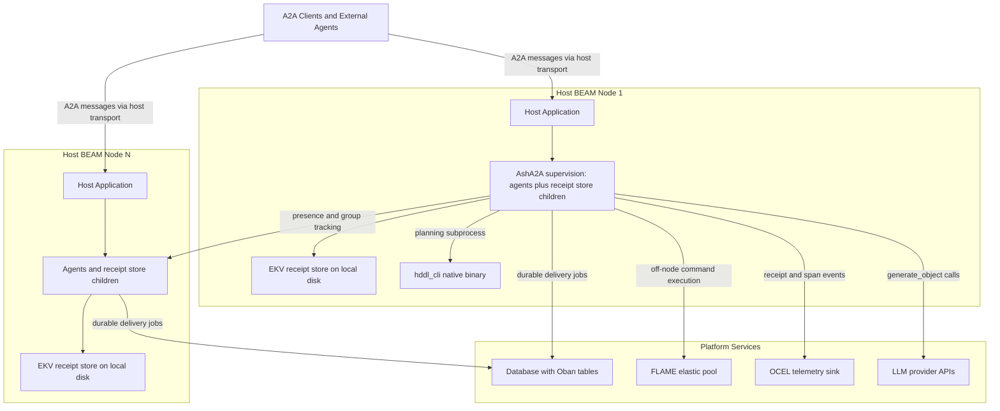

### 7.3 Supervision and Startup Sequence

1. The host application starts its supervision tree; `AshA2A.Application` contributes children composed **from configuration**: `receipt_store_children/0` starts the configured receipt backend (Memory for tests, EKV for production).
2. Agents declared via `use AshA2A.Agent, resource_or_domain:` are started under `A2A.AgentSupervisor`. Each agent holds its compiled capability index and publishes its AgentCard on demand.
3. `DurableServer` processes attach to agents, using `TaskLifecycle` state and runtime receipts to resume work across restarts.
4. `Topology.Presence` registers node/agent presence (built on runtime receipts); `Topology.Group` manages agent grouping for cluster deployments.
5. On restart, EKV-persisted receipts are reloaded; retried commands with matching fingerprints **replay** stored receipts rather than re-executing Ash actions.

### 7.4 Scalability Design

- **Vertical within a node:** mitigate the single-agent mailbox bottleneck (R-1) by running multiple named agent instances per resource/tenant behind `A2A.AgentSupervisor`.
- **Horizontal across nodes:** cluster deployments use presence/group topology for discovery; Oban provides durable cross-node delivery; FLAME elastically scales execution capacity off the host node.
- **Idempotency under scale:** fingerprint-based replay makes retries safe everywhere, but command-id claims are the serialization point — partition command ids per node (or adopt the planned EKV CAS surface) for high-throughput multi-node writes (R-2).
- **Extension points:** new receipt backends implement the `ReceiptStore` behaviour (declaring `durable?/0` as appropriate); new delivery/execution runtimes follow the adapter pattern and **must** funnel through `AshA2A.CommandBus`; new LLM roles are added via `LLMProfiles` without touching pipeline code.

### 7.5 Monitoring and Operations

| Concern | Mechanism | Operational Guidance |
|---|---|---|
| **Runtime observability** | `:telemetry.span([:ash_a2a, :dispatch])`; `[:ash_a2a, :receipt, :committed]`; OCEL forwarder exports receipts/spans as OCEL v2 events with real `object_id` | Attach telemetry handlers or the OCEL sink; alert on refusal codes (`:consequence_unclassified`, `:authority_required`, `:command_conflict`) as security signals, not just errors |
| **Architecture conformance** | `mix ash_a2a.verify_architecture` (self-contained fixtures under `:dev`) | Run in CI on every change; it mechanically enforces dispatch/command-bus layering and the INV-7 two-gate surface |
| **Decision evidence** | ERC ledger (`research/erc/*.json`, `mix eds.ledger`) | Treat as the project's ADR-equivalent; consult before refactoring trust gates |
| **Spec conformance** | SPARQL queries (`spec.rq`) over `priv/ggen/ash_a2a/ontology.ttl` | Use for semantic-pack audits |
| **Performance** | `bench/ash_a2a_bench.exs` dispatcher and CommandBus benchmarks | Benchmark before/after any hot-path change; watch receipt-store contention under retry-heavy loads |
| **Failure and recovery** | Durable EKV receipts + runtime receipts + DurableServer | Verify EKV disk availability; after node crashes, expect replays (not re-executions) for fingerprint-matching retries; note Oban job ids are deliberately never promoted to receipts |

### 7.6 Configuration Decision Matrix

| Decision | Test/Development | Production (single node) | Production (cluster) |
|---|---|---|---|
| Receipt store | `ReceiptStore.Memory` (`:observed`) | `ReceiptStore.Ekv` (`:durable`) | `ReceiptStore.Ekv` per node; partition command ids or await CAS support (R-2) |
| Delivery | Direct dispatch | Oban optional | Oban recommended |
| Execution | In-node | FLAME optional | FLAME for burst elasticity |
| Agents | Single instance per resource | Multiple instances under hot paths (R-1) | Presence/group across nodes |
| Semantic surface | Disabled unless tested | Two-gate opt-in (INV-7) only where intentional | Same; verify gates via ArchitectureVerifier in CI |

---

### Closing Assessment

The implementation substantiates the documented architecture with high fidelity. Capability truth flows one way — Ash introspection → index → AgentCard — with dispatch structurally incapable of diverging from advertisement. Every dangerous boundary has a named, fail-closed gate (override validator, ContextResolver, admission fence, CommandBus consequence/authority checks). Evidence is uniform — fingerprints and deliberately separated command/runtime receipts provide replay-safety and audit lineage from raw text through LLM candidates to formal plans to executed commands. Governance is mechanized: the architecture is not merely documented but *executed* by `mix ash_a2a.verify_architecture`, measured by benchmarks, and ledgered as ERC evidence. The two actionable follow-ups from the validation pass are documentation-side: fold the `semantic_requests` two-gate decision into the formal invariant list (done here as INV-7), and correct the transformer-naming description in downstream research artifacts (noted as D-1).