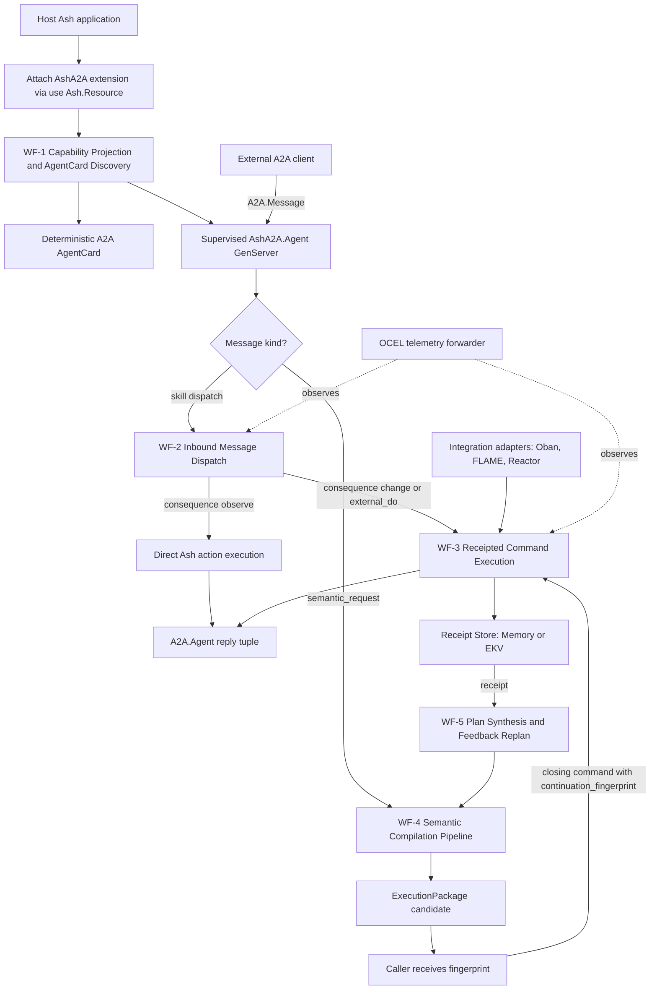
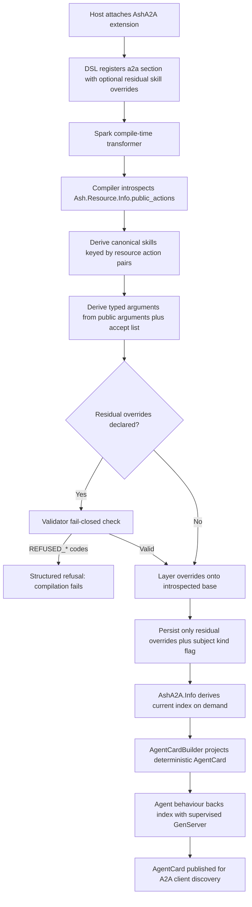
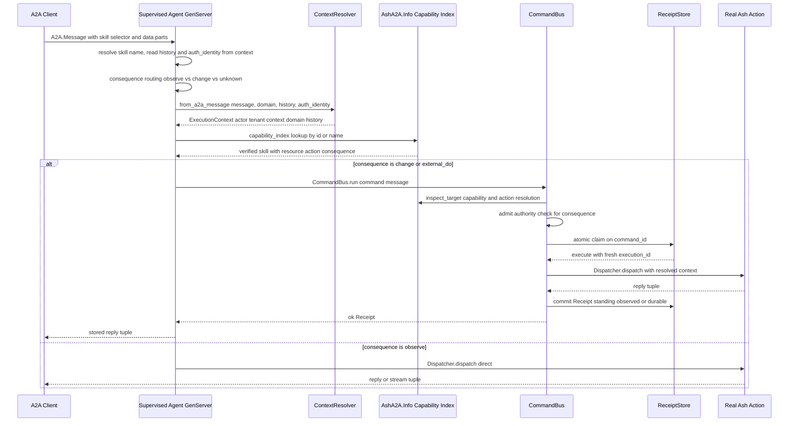
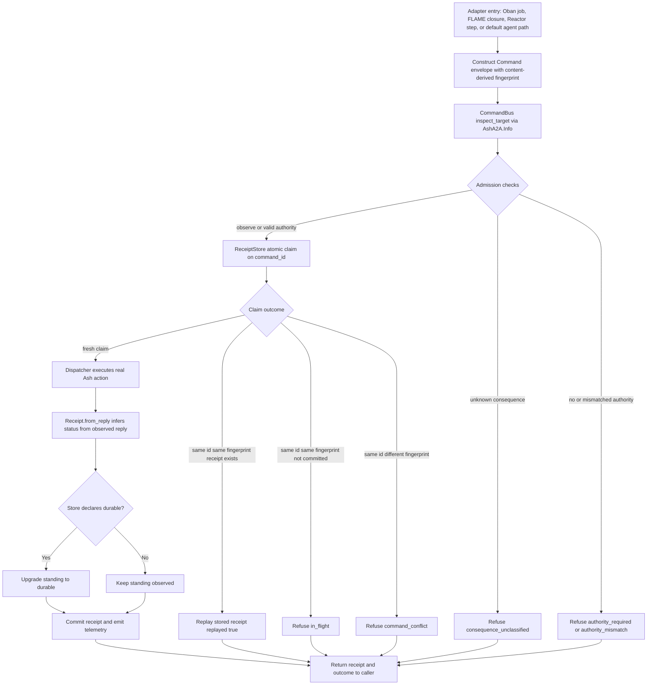
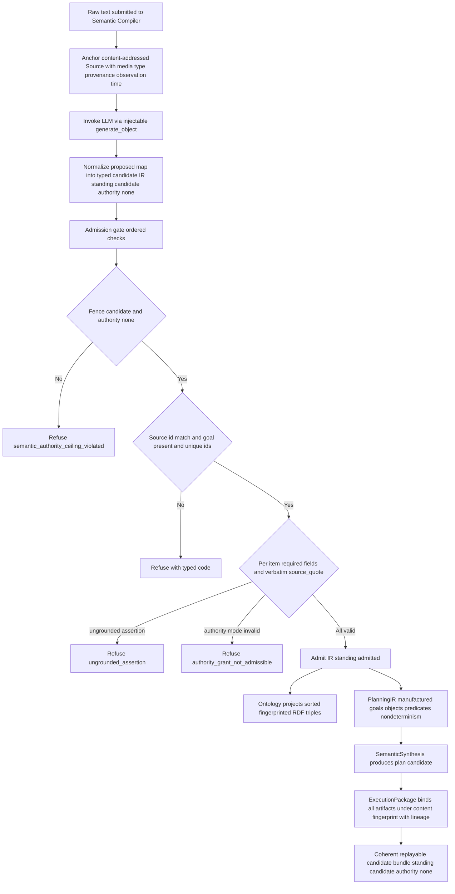
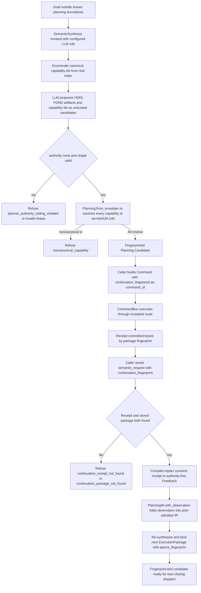

# Core Workflows

**Project**: `ash_a2a` — Elixir framework and Spark DSL extension projecting public Ash resource actions into A2A (Agent-to-Agent) protocol skills, with receipted command execution and a semantic compilation pipeline for formal planning.
**Document generated**: from source-code insight and architecture research; all entry points, modules, and invariants cited below are verifiable in `lib/ash_a2a/` and `native/hddl_cli/`.

---

## 1. Workflow Overview

### 1.1 System Positioning and Workflow Scope

AshA2A turns any Ash application into an A2A-compliant agent with zero hand-written protocol glue. Every workflow in the system is organized around one central invariant: **the advertised agent surface (AgentCard) and the executed behavior (Ash action dispatch) are both deterministic projections of a single canonical source — `Ash.Resource.Info.public_actions/1`**. This makes "advertised ≠ executed" divergence structurally impossible rather than merely tested against.

The system's workflows form three concentric layers:

1. **Capability layer (compile-time → discovery)**: public Ash actions are projected into an A2A skill index and a deterministic AgentCard.
2. **Runtime layer (message ingress → execution → evidence)**: inbound A2A messages cross a named trust boundary, resolve through the verified capability index, and every consequence-bearing action flows through the single sanctioned receipted CommandBus.
3. **Semantic/planning layer (evidence → plan → feedback loop)**: raw text is compiled into admitted semantics and FOND plan candidates via LLM extraction behind a deterministic admission gate; execution receipts close the loop as authority-free feedback.

### 1.2 Workflow Map



### 1.3 Core Execution Paths and Their Importance

| Workflow | Entry Point | Importance | Purpose |
|---|---|---|---|
| WF-2 Inbound A2A Message Dispatch | `AshA2A.Agent.__dispatch__/3` → `AshA2A.Dispatcher.dispatch/5` | 10.0 | Core runtime path: message ingress → trust boundary → verified skill resolution → Ash execution → reply |
| WF-1 Capability Projection & AgentCard Discovery | `use Ash.Resource, extensions: [AshA2A]` + `AshA2A.Info` | 9.5 | Zero-configuration skill derivation, fail-closed override validation, deterministic discovery document |
| WF-3 Receipted Command Execution | `AshA2A.CommandBus.run/4` | 9.0 | Single sanctioned path for consequence-bearing work: capability/identity/authority/replay checks + durable receipts |
| WF-4 Semantic Compilation Pipeline | `AshA2A.Semantic.Compiler.compile/3` | 9.0 | Closed-loop pipeline: raw text → admitted semantics → ontology → PlanningIR → FOND plan candidate |
| WF-5 LLM Plan Synthesis & Receipted Feedback | `AshA2A.Planning.SemanticSynthesis.synthesize/4` + `Compiler.replan/4` | 8.5 | AI-assisted planning for unknown boundaries with receipt-driven re-planning |

### 1.4 Key Process Nodes

- **`AshA2A.ContextResolver.from_a2a_message/4`** — the named trust boundary (PRD/ARD §3.5). Converts raw `A2A.Message` metadata into a validated `ExecutionContext` containing exactly the fields Ash accepts (`actor`, `tenant`, `context`, `domain`, `history`).
- **`AshA2A.Info.capability_index/1` / `skill/2`** — the only access path to capabilities. Skills are always derived through `AshA2A.CapabilityIndex.Compiler` from `Ash.Resource.Info.public_actions/1`; dispatch never walks raw DSL entities, so it can never diverge from the AgentCard (PRD/ARD §3.2).
- **`AshA2A.CommandBus.run/4`** — the single sanctioned route from an admitted Command to the dispatcher. Enforces capability, identity, authority, replay, and evidence checks; planning components and adapters may call it but cannot bypass it.
- **`AshA2A.ReceiptStore` implementations** (`Memory`, `Ekv`) — own the atomic command-id claim, distinguishing same-id/same-fingerprint replay from same-id/different-fingerprint conflict.
- **`AshA2A.Semantic.Admission.admit/2`** — the deterministic quality gate deciding which LLM-proposed semantic candidates become admitted state.
- **`AshA2A.Semantic.ExecutionPackage`** — the immutable, content-fingerprinted output envelope binding source, IR, ontology, PlanningIR, and plan candidate.

### 1.5 Process Coordination Mechanisms

Coordination across workflows rests on five mechanisms that appear at every boundary:

1. **Deterministic derivation** — capability indexes, AgentCards, ontology triples, and PlanningIR artifacts are computed (never authored), making them replayable and auditable.
2. **Content fingerprints (SHA-256)** — universal evidence currency: command identity (`Command.fingerprint/1`), package lineage (`ExecutionPackage.fingerprint/1`), feedback identity (`Feedback.fingerprint/1`), and content-addressed `Source.id`.
3. **Standing/authority fencing** — every artifact structurally carries `standing` (`:candidate` / `:admitted` / `:observed` / `:durable`) and `authority: :none`; constructors fence on these fields and refuse anything else.
4. **Fail-closed validation** — every entry point refuses rather than degrades (structured refusals with typed codes).
5. **Telemetry correlation** — `[:ash_a2a, :dispatch, :start|:stop]` spans and `[:ash_a2a, :receipt, :committed]` events, with a process-dictionary flag so a CommandBus-routed dispatch emits exactly one OCEL event.

---

## 2. Main Workflows

### 2.1 WF-1: Capability Projection & AgentCard Discovery Flow

**Business value**: turns public Ash actions into discoverable agent skills with zero hand-written protocol glue. The AgentCard a client sees is guaranteed to describe exactly what dispatch can serve.

**Process steps**:

1. **Extension attachment** — the host declares `use Ash.Resource, extensions: [AshA2A]`. The DSL extension (`lib/ash_a2a.ex`, `dsl.ex`) registers the residual `a2a` section. Public Ash actions need no declaration; optional `a2a skill` entities exist only as overrides (display name, description, tags, exclusion, consequence classification).
2. **Compile-time index build** — the Spark transformer (`transformers/build_capability_index.ex`) triggers the Capability Compiler, which introspects `Ash.Resource.Info.public_actions/1` and derives canonical skills keyed by the `{resource, action}` identity. Capability ids are stable strings: `"#{inspect(resource)}.#{action}"` (`Compiler.capability_id/2`).
3. **Argument derivation** — per-skill arguments come from two real introspection surfaces: the action's `public?: true` arguments, plus (for `:create`/`:update`) the action's `accept` list, each entry typed from the real attribute. Declared arguments are listed before accept-derived entries and de-duplicated by name.
4. **Override layering** — residual overrides are matched by `{resource, action}` and layered over the introspected base. An override with `expose? == false` suppresses the capability; overrides may **describe or suppress but never invent** capabilities.
5. **Fail-closed validation** — `CapabilityIndex.Validator` rejects duplicate skill names (`REFUSED_DUPLICATE_SKILL_NAME`), nonexistent actions (`REFUSED_ACTION_NOT_FOUND`), and private actions (`REFUSED_ACTION_NOT_PUBLIC`) with structured refusals. Compilation fails closed.
6. **Persistence of residuals only** — the extension persists only the override list plus a resource-vs-domain flag (`ash_a2a_skill_overrides`, `ash_a2a_subject_kind`). The index itself is always re-derived on demand through `AshA2A.Info.capability_index_result/1` — the index is a projection, never a second business model.
7. **AgentCard projection** — `CapabilityIndex.AgentCardBuilder` deterministically converts the derived index into `A2A.AgentCard` (skills sorted by id; descriptions and argument tags introspected from the real action structs). The same index always yields the same card.
8. **Runtime backing** — the `AshA2A.Agent` behaviour compiles the index into a real supervised `A2A.Agent` GenServer whose card is generated at macro-expansion time from `AshA2A.Info.agent_card/2` — never hand-written.



**Key guarantee**: derivation always flows from `Ash.Resource.Info.public_actions/1`; argument schemas are always introspected from real actions rather than trusted from declarations.

### 2.2 WF-2: Inbound A2A Message Dispatch Flow (Core Workflow)

**Business value**: the primary runtime workflow — an external A2A client's message deterministically reaches the real Ash action it names, under a hard trust boundary, with idempotency for consequence-bearing work.

**Step-by-step execution order** (`AshA2A.Agent.__dispatch__/3` → `AshA2A.Dispatcher.dispatch/5`):

1. **Message ingress** — the supervised GenServer generated by `use AshA2A.Agent, resource_or_domain:` receives the `A2A.Message`. `history` (prior-turn transcript from `A2A.Agent.context().history`) and `auth_identity` (from `context.metadata["a2a.auth"][:identity]`, populated exclusively by `A2A.Plug.Auth` after real credential verification) are extracted up front. Both default safely: `[]` and `nil`.
2. **Route selection** — if the resource declares `a2a do semantic_requests true end` **and** the message sets `semantic_request: true`, the message routes to the semantic compilation path (§2.4). Otherwise it routes to skill dispatch. Both gates are real capability/config truth — never content sniffing.
3. **Skill name resolution** — the skill selector is read from `metadata[:skill]` (atom-or-string convention). A resource with exactly one compiled skill dispatches it by default; zero skills → `{:no_skill, _}`, multiple → `{:ambiguous_skill, _}`.
4. **Consequence routing** — the skill's `consequence` (compile-time truth carried on `AshA2A.Skill`, defaulted per action type: `:read`→`:observe`, `:create`/`:update`/`:destroy`→`:change`, generic `:action`→`:unknown`) selects the path:
   - `:observe` → direct `Dispatcher.dispatch/5` (no CommandBus; also covers streaming reads correctly, since receipts cannot preserve a live enumerable).
   - `:change` / `:external_do` → a `Command` is built (with `command_id = message.message_id`, principal normalized from `auth_identity`, and a synthesized `Authority` via `Authority.from_verified_identity/2` — `nil` when unauthenticated) and routed through `CommandBus.run/4` (§2.3).
   - `:unknown` → refused closed with `{:error, %{code: :consequence_unclassified}}` **before any dispatch attempt** — defense in depth, independent of `CommandBus.admit/2`.
5. **Trust boundary crossing** — `ContextResolver.from_a2a_message/4` is the mandatory passage point. Field provenance is strict: `actor` = the explicit `auth_identity` argument verbatim (never from `message.metadata`); `tenant` = `auth_identity[:tenant]` only; `context` = `metadata[:context]` (non-privilege-bearing, safe to pass through); `domain` and `history` are caller-supplied, never message-derived. Omitting `auth_identity` fails closed to `actor: nil, tenant: nil`.
6. **Verified skill lookup** — the dispatcher resolves the skill **exclusively** through `AshA2A.Info.capability_index/1` (matching either the canonical wire `id` or the display `name`), never by walking DSL entities and never via atom interning (`String.to_existing_atom/1` was removed as a real fail-open bug). Unknown skill → tagged `{:error, {:skill_lookup, {:unknown_skill, _}}}`.
7. **Input extraction** — the caller's structured arguments come from the first `A2A.Part.Data` part; text-only messages dispatch with `%{}`. This same extraction is reused for command fingerprinting so the fingerprinted input is exactly what the action receives.
8. **Action resolution and execution** — the real `%Ash.Resource.Actions.*{}` struct is resolved via `Ash.Resource.Info.action/2`, then execution branches on `action.type`: `Ash.Query.for_read/3` + `Ash.read/2` (or `Ash.stream!/2` when the caller opts in with `stream: true`), `Ash.Changeset.for_create/3`, `for_update/3` (after primary-key record resolution via `Ash.get/3`, with pk fields dropped from the update input), `for_destroy/4` (hard destroys receive no attribute input, per Ash's own `accept: []` semantics), or `Ash.ActionInput.for_action/3`. All non-bang Ash APIs are used — one caller's failure can never crash the shared agent process.
9. **Reply mapping** — outcomes map to the exact `A2A.Agent.reply()` contract: `{:reply, _}`, `{:input_required, _}` (reserved for caller-fixable invalid/missing-argument errors), `{:stream, Enumerable.t()}`, `{:error, _}` (`:forbidden`/`:framework`/`:unknown` classes and config defects like `TenantRequired` folded into legible text).
10. **Telemetry** — the whole path runs inside `:telemetry.span([:ash_a2a, :dispatch], ...)`, with the failing stage tagged into the stop event (`:skill_lookup`, `:action_resolution`, `:execution`) and a real `object_id` (primary key of the record acted on) surfaced for OCEL relationship forwarding.



### 2.3 WF-3: Receipted Command Execution Flow

**Business value**: idempotent, replay-safe execution for every consequence-bearing action. The fingerprint protocol means a client that retries after a dropped response gets the original receipt instead of a double execution — and a divergent retry is refused rather than silently accepted.

**Execution order in `CommandBus.run/4`**:

1. **Target inspection** (`inspect_target/2`) — resolve the skill via `AshA2A.Info.skill/2` and the action via `Ash.Resource.Info.action/2`. Failure → `:capability_not_found` / `:action_not_found` refusals. The consequence classification is read from `skill.consequence` (compile-time truth), never recomputed from `action.type`.
2. **Admission** (`admit/2`) —
   - `:observe` → admitted without authority.
   - `:change` / `:external_do` → require an `Authority` bound to the command's principal and capability; `Authority.admits?/2` checks subject equality, capability equality, and expiry. Missing → `:authority_required`; mismatch/expired → `:authority_mismatch`.
   - `:unknown` → refused with the distinct typed code `:consequence_unclassified` (never defaults to either "safe to skip" or "safe to execute").
3. **Atomic claim** — the store (default resolved via `CommandBus.default_store/0` from application config) claims the command id. Claim outcomes:
   - **Fresh** → `{:execute, execution_id}`; a new execution identity (`Ash.UUIDv7`) is minted.
   - **Same id + same fingerprint + committed receipt** → `{:replay, receipt}` with `replayed?: true`; the original reply is returned without re-execution.
   - **Same id + same fingerprint, not yet committed** → `{:error, :in_flight}`.
   - **Same id + different fingerprint** → `{:error, :command_conflict}`.
4. **Execution** — the dispatcher runs inside `dispatch_with_ocel_correlation/4`, which sets a process flag so the OCEL forwarder defers its event until the single receipt-committed telemetry event fires (preventing duplicate OCEL events per logical command).
5. **Receipt production** — `Receipt.from_reply/4` records the attempt: distinct receipt identity, command/execution/agent/principal/capability identities, semantic subject, fingerprint, consequence, and a `status` inferred only from the observed reply shape (`:completed`, `:input_required`, `:stream_opened`, `:failed`). `standing` starts at `:observed` and is upgraded to `:durable` **only** when the configured store exports `durable?/0 → true` (checked dynamically, no hardcoded allowlist; `Ekv` declares it, `Memory` does not).
6. **Commit + evidence emission** — the store commits the receipt (fingerprint-checked against the claim) and `[:ash_a2a, :receipt, :committed]` telemetry fires.

**Fingerprint discipline**: `Command.fingerprint/1` hashes only semantic command content — agent, principal, task, capability id, input, authority token, semantic subject — **never** `command_id` or transport timestamps. Therefore retries with fresh timestamps prove the same intent. Two supporting implementation details preserve this: `Authority.from_verified_identity/2` derives a **deterministic** token id from `{subject, capability_id}` (a random token would change the fingerprint per retry and break replay detection), and the continuation path uses the caller-supplied `continuation_fingerprint` as the `command_id` (see §2.5), so the receipt for a semantic closing command is addressable by the existing command-id-keyed `fetch/2` with no parallel index.

**Adapter funneling**: the Oban delivery adapter (`delivery/oban.ex`) records durable queue insertion only — "an Oban job id is never promoted to A2A TaskID or to an execution receipt"; the eventual worker must reconstruct an admitted command and call the CommandBus. The FLAME adapter places the *closure* remotely; the placed closure calls `CommandBus.run/4`, so the same fence applies on every node, and placement itself is recorded as a `RuntimeReceipt`. The Reactor `ExecuteCommand` step likewise only calls the CommandBus. All adapters inherit replay/conflict semantics for free.



### 2.4 WF-4: Semantic Compilation Pipeline Flow

**Business value**: turns raw natural-language evidence into a formal FOND plan candidate, with every LLM contribution held as untrusted candidate evidence until a deterministic gate admits it with full provenance.

**Pipeline stages** (`AshA2A.Semantic.Compiler.compile_source/3`):

1. **Source anchoring** — the raw text is bound into a content-addressed `Source` (`id` = SHA-256 of `{media_type, provenance, text}`), making identical inputs replayable without minting new semantic subjects. A source is evidence, not authority.
2. **LLM extraction** — the injectable `:generate_object` 4-arity function (real `ReqLLM.generate_object/4` in production, anonymous functions in tests — a dependency-injection seam that avoids mocking libraries) extracts a proposed map under `Schema.extraction/0`. The prompt explicitly instructs: reuse public ontology prefixes, require a verbatim `source_quote` per assertion, preserve uncertainty/exclusions, and never grant authority.
3. **IR normalization** — `IR.from_map/2` folds the proposal into a typed struct of thirteen collections (entities, relations, events, goals, constraints, capabilities, authorities, observations, uncertainties, exclusions, temporal_relations, causal_hypotheses, unresolved), always `standing: :candidate`. If the model proposes any authority other than `"none"`, the IR is marked `authority: :invalid` and cannot pass the fence.
4. **Admission gate** (`Admission.admit/2`) — a deterministic, ordered check sequence:
   - **Fence**: candidate standing + authority `:none`, else `:semantic_authority_ceiling_violated`.
   - **Source match**: IR's `source_id` must equal the Source's id (`:semantic_source_mismatch`).
   - **Goal presence**: at least one goal (`:semantic_goal_missing`).
   - **Unique ids**: all item ids binary and globally unique (`:semantic_identity_invalid`).
   - **Per-item validation**: every collection has a required-field contract (e.g., relations need `id, kind, subject, predicate, object, source_quote`); each item's `source_quote` **must appear verbatim in the source text** (`:ungrounded_assertion`); authority items' `mode` must be one of `described | denied | unknown` (`:authority_grant_not_admissible`).
   - Any failure refuses the entire candidate — nothing is partially admitted.
5. **Ontology projection** — admitted IR is projected into deterministic, sorted RDF-style triples via the shared `Vocabulary` (rdf:type, schema:description, prov:wasDerivedFrom, plus entity-type expansion), fingerprinted by content. Only admitted, authority-free IR can be projected.
6. **PlanningIR manufacture** — goals, objects, predicates, constraints, task candidates, nondeterminism markers, observations, and exclusions are extracted into the formal-planning projection, fingerprinted, still `authority: :none`. Requires admitted semantics (`:planning_ir_requires_admitted_semantics` otherwise).
7. **Plan synthesis** — `Planning.primary_goal/1` and the observation map feed `SemanticSynthesis.synthesize/4` (§2.5), producing a fingerprinted `Planning.Candidate`.
8. **Package binding** — `ExecutionPackage.new/6` fences all four artifacts (admitted IR + `authority: :none` everywhere; candidate-standing candidate), then binds everything under a SHA-256 fingerprint of `{source.id, ontology.fingerprint, planning.fingerprint, candidate.fingerprint}` with `parent_fingerprint` lineage support.

**Batch mode**: `compile_many/3` processes texts with `Task.async_stream/3` (default `max_concurrency: 50`, ordered results), wrapping each worker in `isolated_compile/3` so one text's exception becomes a `{:error, %{code: :semantic_worker_exit}}` value instead of crashing the batch.



### 2.5 WF-5: LLM Plan Synthesis & Receipted Feedback Flow (Closed Loop)

**Business value**: AI-assisted planning for goals outside known planning boundaries. The model proposes; the framework validates; only receipted commands execute; real outcomes feed back as authority-free observations.

**Synthesis path** (`SemanticSynthesis.synthesize/4`):

1. **Capability menu** — the canonical capability ids are enumerated from the real index (`Info.capability_index/1`), sorted; an empty index refuses closed (`:no_canonical_capabilities`).
2. **Constrained generation** — the LLM prompt presents the goal, observation JSON, and the **closed set** of capability ids; the JSON schema itself enforces `authority: ["none"]` (enum) and that `capability_ids` be strings from the allowed set. The prompt explicitly forbids claiming execution.
3. **Normalization + fencing** — `normalize_proposal/2` re-checks `authority == "none"` and the shape (`:planner_authority_ceiling_violated` / `:invalid_semantic_plan_shape` refusals).
4. **Candidate admission** — `Planning.from_envelope/3` extracts every `capability_id(s)` anywhere in the envelope, builds a fingerprinted `Planning.Candidate` (fenced to `standing: :candidate, authority: :none`), and **re-resolves every proposed id through `AshA2A.Info.skill/2`**; any noncanonical id halts admission with `:noncanonical_capability`. The model cannot grant authority or invent capabilities — the schema constrains generation, but validation does not trust it.

**Closing the loop — continuation and replan (GAP B)**:

1. The compile reply carries the package's `execution_package_fingerprint` (plus candidate standing, authority none, re-admitted capability ids, hddl/fond/rationale). The package is stored in `AshA2A.Semantic.PackageStore`, keyed by that fingerprint — deliberately a **separate** store from the ReceiptStore, so candidate output can never be retrieved as if it were receipted evidence.
2. To execute a step of the plan, the caller sends an ordinary skill-dispatch message that additionally carries `continuation_fingerprint` metadata. That fingerprint becomes the closing command's `command_id` (and is recorded in `Command.metadata["execution_package_fingerprint"]`), so the resulting receipt is addressable via the existing command-id-keyed `ReceiptStore.fetch/2`. Because the command fingerprint is computed from content only, this command-id override does not alter replay/conflict semantics — but two different closing commands sent under one fingerprint do collide on `:command_conflict`, enforcing single-writer semantics per package.
3. A subsequent `semantic_request` message carrying that `continuation_fingerprint` triggers **replan**: two independent lookups must succeed — the committed receipt for the fingerprint and the stored package. Missing receipt → `:continuation_receipt_not_found` (which is also exactly what a refused closing dispatch produces: the refusal IS the signal); missing package → `:continuation_package_not_found`.
4. `Compiler.replan/4` converts the receipt into typed `Feedback` (`standing: :observed, authority: :none`, fingerprinted over `{package.fingerprint, observation}`), folds the observation into the **prior** admitted PlanningIR via `PlanningIR.with_observation/2` (re-fingerprinted), re-synthesizes, and binds a **new** `ExecutionPackage` with `parent_fingerprint: package.fingerprint` and the accumulated feedback list. The next package is fenced exactly like a fresh compile — a replanned candidate can no more auto-execute than a first-compile candidate. Callers may chain compile → close → receipt → replan indefinitely.



---

## 3. Flow Coordination and Control

### 3.1 Multi-Module Coordination Mechanisms

Coordination is expressed as a strict call lattice rather than ad-hoc signaling:

| From | To | Mechanism | Invariant enforced |
|---|---|---|---|
| Dispatcher | Capability Projection | Service call via `AshA2A.Info` | Skills resolved only from the verified index — dispatch can never diverge from the AgentCard |
| CommandBus | Dispatcher | Single sanctioned invocation | No caller reaches Ash execution for `:change`/`:external_do` work without admission + receipt |
| Planning Synthesis | Capability Projection | Data dependency (re-validation) | Every LLM-proposed capability id must resolve in the real index |
| Planning Synthesis | CommandBus | Service call | Consequence-bearing steps are commands; never executed directly |
| Semantic Compilation | Planning Synthesis | Data dependency (fingerprinted artifacts) | Only admitted, authority-free PlanningIR feeds synthesis |
| Agent Runtime | Capability Projection + ReceiptStore | Composition | Agents publish derived cards; supervision wires stores from config |
| Integration Adapters | CommandBus | Service call funnel | Oban/FLAME/Reactor inherit the full check fence |
| Telemetry | Dispatcher + CommandBus | Event observation | `dispatch` spans + `receipt_committed` events, OCEL-deduplicated per logical command |

### 3.2 State Management and Synchronization

The system models state as **immutable evidence artifacts with lifecycle standings**, not mutable session objects:

- **Standing state machine**: `:candidate` (LLM proposals, plan candidates, execution packages) → `:admitted` (semantic IR, ontology, PlanningIR) → `:observed` (receipts at creation, feedback) → `:durable` (receipts committed to a store declaring `durable?/0`). Transitions happen only inside constructors that fence on the prior standing; nothing may skip or reverse a transition.
- **Authority ceiling**: every artifact structurally carries `authority: :none`. `Command.authority` is the single, separately-verified authority slot; LLM and planner outputs are structurally incapable of carrying it.
- **Claim state in the receipt store**: per command id, the entry transitions `absent → claimed (fingerprint + execution_id, receipt: nil) → committed (receipt attached)`. The three-way claim decision (`execute` / `replay` / `:in_flight` / `:command_conflict`) is a synchronized read-modify-write serialized through the store (GenServer mailbox in `Memory`; EKV-backed get/put in `Ekv`).
- **Task lifecycle state** (agent runtime): `A2A.Agent`'s state machine parks tasks in `:input_required` and accumulates `history` across turns; AshA2A threads that history into Ash context as `:a2a_history` so multi-turn continuations are visible to resource actions. Cancellation is observable via the `[:ash_a2a, :agent, :cancel]` telemetry event carrying the verified identity — no fabricated `on_cancel` hook exists, so compensation is host-subscribed.

### 3.3 Data Passing and Sharing

- **Execution context as the only channel into Ash**: `ExecutionContext{actor, tenant, context, domain, history}` → `build_opts/2` produces the Ash opts (`domain:` preferring the skill's persisted domain, `actor:`, `tenant:`, `context:` with `:a2a_history` merged). Raw wire metadata cannot leak into Ash calls.
- **Fingerprints as shareable references**: a caller never receives an `ExecutionPackage` struct — only its fingerprint. Resolution of fingerprint → struct happens solely through `PackageStore`; fingerprint → receipt solely through the command-id-keyed store lookup. This keeps wire payloads small and makes evidence auditable.
- **Typed identity separation**: `AshA2A.Identity` kinds (`:principal | :agent | :task | :command | :execution | :runtime`) are deliberately non-interchangeable; `external/1` renders them (`"command:..."`, `"execution:..."`) for passing through Oban args, Reactor context, receipts, and topology providers without a second identity system.
- **Deterministic token synthesis**: `Authority.from_verified_identity/2` binds an already-verified transport identity to one capability with a deterministic token id, so identical retries hash to identical command fingerprints.

### 3.4 Execution Control and Scheduling

- **Process topology**: `AshA2A.Application` attaches the OCEL forwarder (no-op until an ingest URL is configured), starts the configured receipt-store children (`Memory` GenServer; or `EKV` instance with sensible defaults for `:name`, `:data_dir`, `:cluster_size`; custom stores own their own supervision), the semantic `PackageStore`, and `A2A.AgentSupervisor` with configured agents.
- **Concurrency model**: a generated agent is **one GenServer per resource/domain — a mailbox, not a worker pool**. Calls to one agent instance serialize; throughput-critical deployments run multiple named instances (per resource, or sharded per tenant). Cross-agent concurrency is natural under the BEAM; the semantic batch pipeline adds controlled parallelism via `Task.async_stream` with bounded `max_concurrency`.
- **Streaming**: `:read` skills stream lazily when the caller opts in per call (`stream: true` in the data part) — deliberately a caller choice, since virtually every real Ash `:read` action carries a non-nil pagination struct that cannot distinguish intent. The stream uses `Ash.stream!/2` with `allow_stream_with: :full_read`; eager build errors are caught fail-closed, lazy drain errors propagate to the caller as with any enumerable.
- **Delivery scheduling**: Oban provides durable at-least-once delivery; the receipted claim makes redelivery idempotent. FLAME provides elastic off-node execution with the identical fence. Reactor composes command execution into multi-step workflows with `command_bus_opts` threading history/auth through workflow context.

---

## 4. Exception Handling and Recovery

### 4.1 Error Detection and Handling — Fail-Closed Refusal Catalog

Detection happens at fixed gates; every refusal is a structured `%{code: atom, detail: term}`:

| Gate | Refusal codes | Trigger |
|---|---|---|
| Capability validator (compile time) | `REFUSED_DUPLICATE_SKILL_NAME`, `REFUSED_ACTION_NOT_FOUND`, `REFUSED_ACTION_NOT_PUBLIC` | Override names a nonexistent/private action or duplicates a name |
| Dispatcher | `{:skill_lookup, {:unknown_skill, _}}`, `{:action_resolution, {:unknown_action, _, _}}`, `{:no_skill, _}`, `{:ambiguous_skill, _}`, `{:missing_argument, _}` | Unresolvable selector/action, default-selection ambiguity, missing pk inputs |
| Reply mapping | `{:invalid_config, _}` | `TenantRequired`/`NoPrimaryAction`-class defects (never mislabeled `:input_required`, since no client input could fix them) |
| CommandBus admission | `:capability_not_found`, `:action_not_found`, `:authority_required`, `:authority_mismatch`, `:consequence_unclassified` | Capability/authority/classification failures |
| Receipt store | `:in_flight`, `:command_conflict`, `:unclaimed_command` | Claim-state violations |
| Semantic pipeline | `:semantic_authority_ceiling_violated`, `:semantic_source_mismatch`, `:semantic_goal_missing`, `:semantic_identity_invalid`, `:semantic_fields_missing`, `:ungrounded_assertion`, `:authority_grant_not_admissible`, `:planning_ir_requires_admitted_semantics`, `:ontology_requires_admitted_semantics`, `:semantic_package_authority_ceiling_violated` | Any admission/fence failure — the whole candidate is refused, nothing partially admitted |
| Plan synthesis | `:no_canonical_capabilities`, `:planner_authority_ceiling_violated`, `:invalid_semantic_plan_shape`, `:noncanonical_capability`, `:planner_capability_projection_missing`, `:unsupported_planner` | Untrusted-proposal validation failures |
| Continuation | `:continuation_receipt_not_found`, `:continuation_package_not_found`, `:continuation_fingerprint_invalid`, `:semantic_request_missing_text` | Broken or malformed replan chains |
| Native solver | JSON error object + exit 1 (vs. plan JSON + exit 0) | `hddl_cli`'s simple success/error contract |

### 4.2 Exception Recovery Mechanisms

- **Idempotent retry recovery**: the primary recovery path is the replay protocol. A client retrying the same logical command (same `message_id`/`command_id`, same content) receives the stored receipt marked `replayed?: true` — no duplicate Ash execution. A crashed-and-redelivered Oban job is absorbed the same way. `:in_flight` naturally covers concurrent duplicate submissions; the second claimant is told to wait rather than double-execute.
- **Receipt-driven replan recovery**: a failed or partial closing dispatch produces a receipt with `status: :failed`; that receipt is still valid feedback. Replanning folds the real observation into the prior PlanningIR, so the next candidate is planned from evidence of what actually happened — recovery is evidence-based, not blind retry.
- **Durability tiering**: `standing: :observed` receipts (Memory store) recover in-process retries; `standing: :durable` receipts (EKV) recover across process and node restarts. The durable-server and task-lifecycle modules build on runtime receipts so agent work survives restarts, and topology presence/grouping tracks liveness on the same evidence.

### 4.3 Fault Tolerance Strategy Design

1. **No-raise dispatch contract**: every default dispatch path resolves through non-bang APIs so a malformed or misconfigured request becomes a typed `{:error, ...}` reply, never an uncaught exception that could crash the shared agent GenServer (which would terminate every in-flight task it manages). The semantic paths, where `LLMProfiles.model_spec!/1` legitimately raises on unconfigured roles, are wrapped in `try/rescue` to hold the identical contract.
2. **Batch isolation**: `compile_many` rescues per-worker exceptions into error values (`:semantic_worker_exit`), so one bad text cannot take down a batch; genuine task exits (`:timeout`) still surface as `{:exit, reason}` mapped to error values.
3. **Fail-open bug elimination as policy**: where a fail-open hazard existed, it was structurally removed — e.g., skill matching against the real compiled index instead of `String.to_existing_atom/1` (whose success depended on incidental VM atom-table state); `:unknown` consequence never defaulting to either safe branch; tenant-required errors routed to `:invalid_config` instead of misleading `:input_required`.
4. **Telemetry as detection substrate**: stage-tagged dispatch stop events (`:skill_lookup`, `:action_resolution`, `:execution`), receipt-committed events, cancel events, and OCEL forwarding give operators real observability of every workflow, including which stage failed and on which real object id.

### 4.4 Failure Retry and Degradation

- **Retry semantics by consequence**: `:observe` reads are naturally retryable; `:change`/`:external_do` retries are idempotent via the claim/replay protocol; `:unknown` skills are never retried until a resource author classifies them (`consequence: :observe | :change | :external_do` in the `a2a` skill declaration).
- **Graceful degradation of optional infrastructure**: adapters detect availability dynamically (`Code.ensure_loaded?/1` + `function_exported?/3`): Oban/FLAME absent → `{:error, {:unsupported, :oban | :flame}}`; OCEL forwarder short-circuits without an ingest URL; custom receipt stores are legal as long as they implement the three-callback behaviour and manage their own supervision.
- **Solver failure handling**: the ferroplan bridge's exit-code contract keeps planning failures machine-readable (JSON error + exit 1), letting `plan_with_ferroplan/4` and upstream pipelines convert solver failure into structured refusals rather than crashes.

---

## 5. Key Process Implementation

### 5.1 Consequence Classification (Core Business Rule)

Classification is computed **once at compile time** in `CapabilityIndex.Compiler.project/3` and carried as capability truth on the skill:

```text
:read     -> :observe     (unambiguously non-consequence-bearing)
:create   -> :change      (canonical Ash data-layer write)
:update   -> :change
:destroy  -> :change
:action   -> :unknown     (no safe default: cannot distinguish a pure
                           calculation from a mutating/externally-
                           effecting operation until the author
                           classifies it explicitly)
```

This single classification drives both routing (Agent `:observe` → direct dispatch; `:change`/`:external_do` → CommandBus; `:unknown` → refused) and CommandBus admission (defense in depth: `admit/2` independently refuses `:unknown`). `action.type` is never re-derived at runtime as a binary read/write judgment, because type alone cannot classify a generic `:action`.

### 5.2 Trust Boundary Implementation

The boundary is enforced by construction, not convention:

- `ContextResolver.from_a2a_message/4` extracts exactly five fields with fixed provenance: `actor` ← `auth_identity` argument (verbatim; the verified identity produced out-of-band by `A2A.Plug.Auth`), `tenant` ← `auth_identity[:tenant]` only, `context` ← `metadata[:context]` (deliberately passthrough: never privilege-bearing), `domain` ← dispatcher argument, `history` ← agent task context. Everything else in `message.metadata` is discarded.
- `verified_auth_identity/1` reads exclusively from `context.metadata["a2a.auth"][:identity]` — a key the A2A plug populates only after real credential verification — and returns `nil` otherwise, so unwired deployments fail closed to unauthenticated dispatch instead of trusting wire input.
- Metadata lookups use a single atom-or-string convention (`AshA2A.MetadataKey`), accommodating both in-process atom-keyed callers and JSON string-keyed wire input.

### 5.3 Fingerprinting Algorithm (Universal Evidence Mechanism)

One recipe repeats across all evidence artifacts:

```elixir
term
|> :erlang.term_to_binary()
|> then(&:crypto.hash(:sha256, &1))
|> Base.encode16(case: :lower)
```

Applied over:
- `Command`: `{agent_id, principal_id, task_id, capability_id, input, authority_token, semantic_subject_token}` — **content only**, no `command_id`, no timestamps → retries prove identical intent.
- `Source`: `{media_type, provenance, text}` → content-addressed evidence identity.
- `Ontology`: sorted triple set → deterministic semantic projection identity.
- `PlanningIR`: struct minus its own fingerprint (re-fingerprinted after observation folds).
- `Planning.Candidate`: `{planner, formalism, capability_ids, plan}`.
- `ExecutionPackage`: `{source.id, ontology.fingerprint, planning.fingerprint, candidate.fingerprint}` → lineage via `parent_fingerprint`.
- `Feedback`: `{package.fingerprint, observation}` → evidence tied to the exact package.
- `Authority` (verified-identity path): `{subject.value, capability_id}` → deterministic token id preserving replay semantics.

### 5.4 Replay Protocol Implementation

The three-way claim decision, identical in both backends:

```text
claim(command):
  entry = get(external(command_id))
  nil                            -> put(claim{fingerprint, execution_id, receipt: nil})
                                    -> {:execute, execution_id}
  fingerprint matches + receipt  -> {:replay, Receipt.replay(receipt)}   # replayed?: true
  fingerprint matches, no receipt-> {:error, :in_flight}
  otherwise                      -> {:error, :command_conflict}

commit(receipt):
  entry exists and fingerprint matches claim -> put(entry with receipt) -> :ok
  otherwise                                  -> {:error, :unclaimed_command}
```

`Memory` serializes claims via its GenServer mailbox; `Ekv` replicates the decision logic against on-disk storage (survives restarts; cross-node CAS contention via EKV's `if_vsn:` remains available to hosts needing distributed locking). The default store is resolved once through `CommandBus.default_store/0` so every caller (agent, adapters, replan lookups) shares one source of truth.

### 5.5 Data Processing Pipeline (Semantic Compilation)

The pipeline is a strict, short-circuiting `with` chain — each stage accepts only the fenced output of the previous one:

```text
text -> Source.new (content id)
     -> generate_object(model, prompt, Schema.extraction(), llm_opts)   [injectable seam]
     -> IR.from_map(source.id, proposed)                                 [typed, candidate, authority fenced]
     -> Admission.admit(source, ir)                                      [ordered: fence, source match,
                                                                          goal presence, unique ids,
                                                                          per-item required fields +
                                                                          verbatim source_quote +
                                                                          authority mode vocabulary]
     -> Ontology.from_ir(admitted_ir)                                    [sorted RDF triples, fingerprinted]
     -> PlanningIR.from_ir(admitted_ir, ontology)                        [goals/objects/predicates/
                                                                          nondeterminism, fingerprinted]
     -> SemanticSynthesis.synthesize(domain, primary_goal, observation)  [closed capability menu, fenced proposal,
                                                                          re-admission of every id]
     -> ExecutionPackage.new(source, ir, ontology, planning_ir, candidate)
```

Failure at any stage returns a typed refusal map (`{:error, %{code: _, detail: _}}`); unknown errors are normalized to `{:error, %{code: :semantic_compilation_failed}}`. Nothing downstream of the LLM seam is doubled or mocked — IR construction, admission, ontology, PlanningIR, package fencing, and fingerprinting all execute for real in tests and production alike.

### 5.6 Business Rule Execution: The Advertised-Equals-Executed Rule

The dispatch lookup deliberately matches skills on **both** the canonical wire `id` (`"Module.action"` form, the identifier the AgentCard advertises) and the residual display `name` — the same two-field match `AshA2A.Info.skill/2` performs — so a spec-faithful client selecting by `id` and one selecting by display name take identical paths through both the CommandBus route and the direct route. Combined with the index-only lookup rule, this yields the system's defining property: **every executable skill appears in the AgentCard, and everything in the AgentCard executes as advertised**.

### 5.7 Technical Implementation Notes and Optimization Opportunities

1. **Capability index memoization**: `AshA2A.Info.capability_index/1` re-derives the index on demand (deterministically). Since derivation is pure and compile-anchored, memoizing per compilation on hot dispatch paths is a safe, behavior-preserving optimization.
2. **LLM extraction latency** dominates semantic compilation; because `Source.id` is content-addressed, caching admitted artifacts by source fingerprint can eliminate redundant model invocations for identical inputs. Batch compilation is already parallel (bounded at 50 by default).
3. **Solver handoff cost**: `hddl_cli` communicates via file I/O and exit codes; a persistent solver process or NIF would reduce per-plan overhead at the cost of the current file-based isolation and debuggability — a deliberate trade-off to revisit only under high-frequency planning loads.
4. **Receipt store contention**: the atomic claim is the serialization point of the CommandBus path. Under high-retry workloads, monitor `Ekv` latency; replay behavior already minimizes duplicate Ash executions, so contention, not execution volume, is the scaling factor.
5. **Per-agent serialization**: one GenServer per resource/domain means slow in-flight dispatches block that instance only; horizontal scaling is achieved by running multiple named agent instances (per resource or sharded per tenant) behind `A2A.AgentSupervisor`.
6. **OCEL event deduplication**: the CommandBus sets a process-dictionary correlation flag around its internal dispatch so exactly one OCEL event per logical command is forwarded — a pattern worth preserving if additional dispatch entry points are ever introduced.

---

### Appendix: Workflow-to-Code Reference

| Workflow | Primary modules | Evidence artifacts produced |
|---|---|---|
| WF-1 Capability Projection | `ash_a2a.ex`, `dsl.ex`, `transformers/build_capability_index.ex`, `capability_index/compiler.ex`, `capability_index/validator.ex`, `capability_index/agent_card_builder.ex`, `info.ex` | Derived skill index, `A2A.AgentCard` |
| WF-2 Message Dispatch | `agent.ex`, `dispatcher.ex`, `context_resolver.ex`, `execution_context.ex`, `identity.ex` | Telemetry spans (stage-tagged), OCEL dispatch events with `object_id` |
| WF-3 Receipted Command Execution | `command_bus.ex`, `command.ex`, `authority.ex`, `receipt.ex`, `receipt_store.ex`, `receipt_store/memory.ex`, `receipt_store/ekv.ex`, `delivery/oban.ex`, `execution/flame.ex`, `reactor/execute_command.ex` | `Receipt` (`:observed`/`:durable`), `Delivery`, `RuntimeReceipt` (placement) |
| WF-4 Semantic Compilation | `semantic/compiler.ex`, `semantic/source.ex`, `semantic/ir.ex`, `semantic/admission.ex`, `semantic/ontology.ex`, `semantic/planning_ir.ex`, `semantic/execution_package.ex`, `semantic/package_store.ex`, `native/hddl_cli/src/main.rs` | Admitted IR, ontology triples, PlanningIR, plan candidate, fingerprinted `ExecutionPackage` |
| WF-5 Synthesis & Feedback | `planning/semantic_synthesis.ex`, `planning.ex`, `semantic/feedback.ex`, `llm_profiles.ex`, `agent.ex` (continuation wiring) | `Planning.Candidate`, `Feedback`, lineage-linked successor packages |