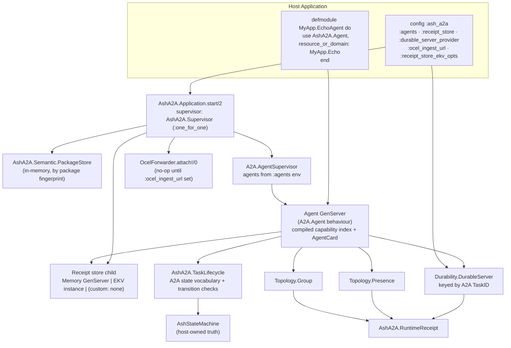
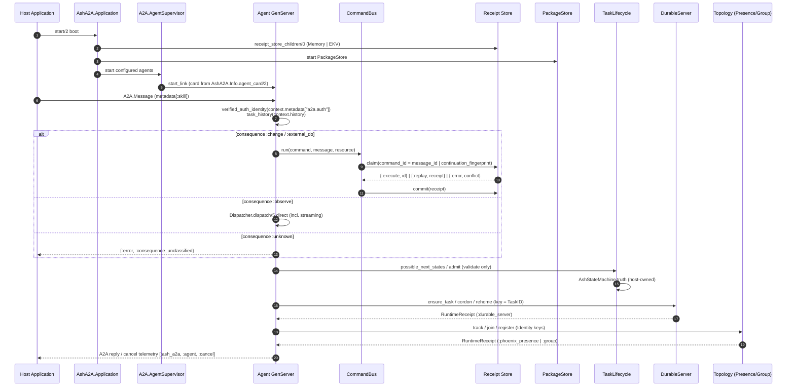

# Agent Runtime & Lifecycle — Technical Documentation

**Project:** `ash_a2a` v26.9.14
**Domain:** Agent Runtime & Lifecycle (Supporting Domain — importance 7.5, complexity 7.0)
**Primary code paths:**

| Module | Path |
|---|---|
| Agent Behaviour | `lib/ash_a2a/agent.ex` |
| Application Wiring | `lib/ash_a2a/application.ex` |
| Task Lifecycle | `lib/ash_a2a/task_lifecycle.ex` |
| Durability Adapter | `lib/ash_a2a/durability/durable_server.ex` |
| Runtime Receipt | `lib/ash_a2a/runtime_receipt.ex` |
| Topology Adapters | `lib/ash_a2a/topology/presence.ex`, `lib/ash_a2a/topology/group.ex` |
| Supporting Primitives | `lib/ash_a2a/identity.ex`, `lib/ash_a2a/metadata_key.ex`, `lib/ash_a2a/semantic/package_store.ex` |

---

## 1. Domain Overview

The Agent Runtime & Lifecycle domain turns the statically compiled capability index into **live, supervised runtime processes**. Every other domain in AshA2A produces artifacts — skills, indexes, cards, plans, commands — but this domain gives them presence: an actual GenServer a remote caller can send an `A2A.Message` to, a supervision tree that wires receipt stores, and the durability, lifecycle, and topology machinery that keeps agent work resilient across process and node restarts.

Its relationship to the rest of the system is compositional:

- **Composition → Capability Projection & Discovery (strength 6.0):** the Agent behaviour backs a compiled capability index with a supervised GenServer and publishes its AgentCard through the `AgentCardBuilder` — the card the process advertises is always the index-derived card, never hand-written.
- **Composition → Receipted Command Execution (strength 6.0):** `AshA2A.Application` composes receipt-store children from configuration (`receipt_store_children/0`), and runtime modules produce evidence via `AshA2A.RuntimeReceipt`, a *separate, deliberate* receipt type from the command `AshA2A.Receipt`.

The domain is built on three design rules that recur everywhere in its code:

1. **Host-owned supervision.** AshA2A never seizes the supervision tree; it contributes children to a named supervisor (`AshA2A.Supervisor`) and delegates agent hosting to `A2A.AgentSupervisor` in the host application.
2. **Fail-closed at every boundary.** Missing auth identity resolves to `nil` (no fabricated actor); an unclassified consequence refuses before dispatch (`:consequence_unclassified`); unsupported providers return typed `{:error, {:unsupported, ...}}` tuples rather than crashing.
3. **Observed evidence, never authority.** Every runtime mutation (presence track, durable-server actuation, group join) yields a `RuntimeReceipt` whose standing is `:observed` — evidence of what a provider did, never a grant of Ash domain standing, task completion, or command authority.

---

## 2. Runtime Composition Model

### 2.1 Module Responsibilities

| Module | Responsibility | Key Guarantees |
|---|---|---|
| `AshA2A.Agent` | `__using__` macro compiling a resource/domain into a runnable `A2A.Agent` GenServer | Card derived from real index; dispatch routes through `Dispatcher`/`CommandBus`; consequence-based routing; no-raise contract |
| `AshA2A.Application` | OTP application callback; supervision tree composition | Starts receipt store, `PackageStore`, `A2A.AgentSupervisor`; attaches OCEL forwarder |
| `AshA2A.TaskLifecycle` | Adapter over host-owned `AshStateMachine` task truth | Canonical A2A state vocabulary; validates transitions; never performs one |
| `AshA2A.Durability.DurableServer` | Optional bridge to Phoenix `DurableServer` runtimes, keyed by A2A TaskID | Provider-substitution seam; every mutation returns `RuntimeReceipt` |
| `AshA2A.RuntimeReceipt` | Uniform evidence struct for runtime/provider operations | `standing: :observed`; never confers authority |
| `AshA2A.Topology.Presence` | Adapter over host `Phoenix.Presence` | Reads = ephemeral projection; mutations = receipted evidence |
| `AshA2A.Topology.Group` | Adapter over a host `Group` process registry | Graceful degradation when host lacks the module |

### 2.2 Supervision Tree

`AshA2A.Application.start/2` builds the tree in a fixed order and composition:

```elixir
children =
  receipt_store_children() ++
    [
      {AshA2A.Semantic.PackageStore, []},
      {A2A.AgentSupervisor, agents: agents}
    ]

Supervisor.start_link(children, strategy: :one_for_one, name: AshA2A.Supervisor)
```

- **`receipt_store_children/0`** reads `config :ash_a2a, :receipt_store` (default `AshA2A.ReceiptStore.Memory`):
  - `AshA2A.ReceiptStore.Memory` → starts its own GenServer child.
  - `AshA2A.ReceiptStore.Ekv` → starts a real `EKV` instance **on the store's behalf**, so choosing the durable backend gets the same automatic wiring the default gets. Options are defaulted via `receipt_store_ekv_opts/0` (`:name` → `AshA2A.ReceiptStore.Ekv`, `:data_dir` → `System.tmp_dir!/ash_a2a_receipt_store_ekv`, `:cluster_size` → 1) and overridable via `config :ash_a2a, receipt_store_ekv_opts: [...]`. The tmp-dir default is appropriate for local/dev; production deployments must supply a persistent `:data_dir`.
  - Any custom store → **no child**: non-default stores own their own supervision lifecycle.
- **`AshA2A.Semantic.PackageStore`** is always started under its own registered name. It is deliberately a separate store from `:receipt_store`: a `Receipt` records receipted DO evidence (`standing: :observed`), while an `ExecutionPackage` is candidate-only compiler output (`standing: :candidate`, `authority: :none`) — conflating the stores would let a candidate be retrieved *as if* it were receipted evidence.
- **`A2A.AgentSupervisor`** hosts the agent modules listed in `config :ash_a2a, :agents`. Each entry is a module defined with `use AshA2A.Agent, resource_or_domain: ...`.
- **OCEL Telemetry** — `AshA2A.Telemetry.OcelForwarder.attach!/0` is called unconditionally at boot. It is idempotent (`{:error, :already_exists}` is normalized to `:ok`) and its handlers short-circuit to `:ok` unless `config :ash_a2a, :ocel_ingest_url` is set, so attaching costs nothing when unconfigured while making forwarding live-by-default the moment a host configures an ingest URL.



---

## 3. The Agent Behaviour (`AshA2A.Agent`)

### 3.1 Compile-Time Mechanics of `__using__`

```elixir
defmodule MyApp.EchoAgent do
  use AshA2A.Agent, resource_or_domain: MyApp.Echo
end

children = [
  {A2A.AgentSupervisor, agents: [MyApp.EchoAgent]}
]
```

The macro performs a compile-time bridge between the capability index and the wire-level `A2A.Agent` behaviour:

1. `resource_or_domain` is expanded via `Macro.expand/2` in the caller context; remaining opts are evaluated with `Code.eval_quoted/3`. Both must be literal (a module alias, literal strings/atoms) — this is a hard requirement because `A2A.Agent.__using__/1` inspects card options with `Keyword.has_key?/2` directly on the AST at macro-expansion time.
2. `__card_opts__/2` calls `AshA2A.Info.agent_card/2`, deriving `name`, `description`, `version`, and `skills` **from the real, persisted, verified capability index** (PRD §3.2) — never hand-written. The card options are spliced as a literal keyword list via `unquote(Macro.escape(card_opts))` so the nested `use A2A.Agent, <opts>` expansion receives an inspectable AST.
3. The generated module implements `handle_message/2` (delegating to `__dispatch__/3`) and `handle_cancel/1` (delegating to `__cancel__/2`), both `defoverridable` so a host can override either while keeping the default receipted path.

**Structural guarantee:** because the card is a projection of `AshA2A.Info.agent_card/2` and dispatch runs through `AshA2A.Dispatcher.dispatch/5`, the process *can never advertise a skill dispatch can't serve* — the advertised/executed alignment invariant holds by construction, not by test.

### 3.2 Message Ingress: `__dispatch__/3`

`handle_message/2` extracts two values from the `A2A.Agent` context before routing:

- **`history`** — the accumulated multi-turn transcript that `A2A.Agent.Runtime` builds for a continued (`task_id:`) task. It is threaded into `Dispatcher.dispatch/5`, folded into the Ash `context:` opt as `:a2a_history`, and readable by resource actions via `context[:a2a_history]`. A context lacking `:history` (direct unit-test call, first turn) falls back to `[]`.
- **`auth_identity`** — extracted **exclusively** from `context.metadata["a2a.auth"]`, the key `A2A.Plug` populates only after `A2A.Plug.Auth`'s credential verification succeeds. `message.metadata` — the caller-controlled field — is never consulted for actor/tenant (PRD §3.5 trust boundary). Absent metadata resolves to `nil`, so an unauthenticated dispatch **fails closed**: no actor, no tenant, and (as shown below) no `Authority` for consequence-bearing commands.

Routing then branches on the semantic two-gate:

### 3.3 Consequence-Based Routing (`dispatch_skill/4`)

Skill resolution reads `metadata[:skill]` through `AshA2A.MetadataKey` (atom-then-string convention). A resource/domain with **exactly one** compiled skill allows the caller to omit `:skill` entirely — that single skill is the default; zero skills yields `{:no_skill, _}`, multiple yield `{:ambiguous_skill, _}`.

The target skill's `consequence` — computed once at compile time by `AshA2A.CapabilityIndex.Compiler` and carried as capability truth — selects one of four branches:

| Consequence | Route | Rationale |
|---|---|---|
| `:observe` | Direct `AshA2A.Dispatcher.dispatch/5` | No receipt needed; also the only path that preserves a real `{:stream, enumerable}` reply (a receipt's `summarize/1` would collapse it to a placeholder before the caller could drain it) |
| `:change`, `:external_do` | `AshA2A.CommandBus.run/4` | Receipted admission: capability/identity checks, atomic `ReceiptStore.claim`, replay/conflict detection, committed `AshA2A.Receipt` |
| `:unknown` | Refused: `{:error, %{code: :consequence_unclassified, ...}}` | A capability nobody declared safe is *not reachable through the default path* merely because nobody classified it. (`CommandBus.admit/2` independently refuses `:unknown` — defense in depth.) |
| Lookup failure | Falls through to direct dispatch | The dispatcher's existing tagged errors (`{:skill_lookup, _}`, `{:action_resolution, _}`) surface unchanged, instead of a second, divergent error shape |

### 3.4 Command Construction (`build_command/4`)

For consequence-bearing skills the agent constructs a real `AshA2A.Command`:

- **`command_id`** is the protocol-native `A2A.Message.message_id` — not a fresh UUID. This is what engages `CommandBus`'s replay/conflict detection for genuine client retries through the default agent path: same `message_id` + identical semantic content (fingerprint hashes `agent_id`/`principal_id`/`task_id`/`capability_id`/`input`/`authority_token`, never `command_id`) **replays** the original receipt; same id with divergent content is a hard `:command_conflict` refusal — never a silent double-execution.
- **`principal_id`** — `AshA2A.Identity.principal(auth_identity || "anonymous")`. An unauthenticated caller still gets a `:principal` identity but **no `Authority`**: `Authority.from_verified_identity/2` returns `nil` for `nil`, so `:change` admission fails closed with `:authority_required` before the Ash action is reached. This synthesized authority admits only its own principal/capability pair; it adds a receipted gate ahead of dispatch and does not replace Ash's own actor/policy authorization, which still runs inside the wrapped dispatcher call.
- **Continuation linkage (GAP B):** if the message also carries `:continuation_fingerprint` metadata, *that fingerprint* — not `message.message_id` — becomes the command id, and is recorded in `Command.metadata["execution_package_fingerprint"]`. Because `ReceiptStore` indexes only by `command_id`, this choice lets the existing `store.fetch/2` resolve "the receipt for this package" with no parallel index. A structural consequence: two different closing commands under the same fingerprint collide on one command id and hit the same-id/different-fingerprint conflict refusal — **single-writer semantics per execution package**, for free.

### 3.5 Explicit Semantic Compilation Surface (v26.9.14)

A message is routed to semantic compilation only when **both** independent gates pass — never via content sniffing, never as a fallback for an unrecognized skill:

1. **Compile-time truth:** the resource/domain declared `a2a do semantic_requests true end` (`AshA2A.Info.semantic_requests_enabled?/1`).
2. **Caller signal:** the inbound message sets `:semantic_request`/`"semantic_request"` metadata to `true`.

A message missing either gate falls through to ordinary skill resolution exactly as before the feature existed. Within the semantic branch:

- **Fresh compile** — `A2A.Message.text/1` must yield real text (a flagged message without text is a caller error, refused with `:semantic_request_missing_text`, never an empty-string compile). The compiled package is stored in `AshA2A.Semantic.PackageStore` under its own fingerprint before its reply returns.
- **Replan** — a `:continuation_fingerprint` triggers two **independent, fail-closed lookups**: (1) a previously committed `Receipt` under `Identity.command(fingerprint)` (`:continuation_receipt_not_found` otherwise — a refused closing dispatch never reaches `store.commit`, so the receipt's absence *is* the refusal signal), and (2) a resolvable `ExecutionPackage` in the `PackageStore` (`:continuation_package_not_found` otherwise). Both lookups pass into `Compiler.replan/4`, which runs `Feedback.from_receipt/2` (typed, authority-`:none` observation) → `PlanningIR.with_observation/2` (folds the observation into the *prior* admitted IR) → re-synthesis against the real index. The next package is fenced `standing: :candidate, authority: :none` — structurally, not by any opt — so a replanned candidate can no more auto-execute than a first-compile candidate, and chaining further replans is unbounded.

### 3.6 The No-Raise Contract and the One-Mailbox Constraint

Two operational properties of the generated GenServer are documented explicitly in the module:

- **No-raise contract.** Every other dispatch path resolves through non-bang APIs so one malformed request can never crash the shared GenServer (which would kill every other in-flight task it manages). The semantic branch is held to the identical contract: `Semantic.Compiler.compile/3` legitimately raises `ArgumentError` for an unconfigured LLM role, so the branch wraps compilation in `try/rescue` and converts exceptions into typed `{:error, %{code: :semantic_compilation_failed | :semantic_replan_failed, detail: ...}}` replies.
- **One mailbox, not a worker pool.** A generated agent is a single GenServer; all `:message`/`:cancel`/`:get_task`/`:list_tasks` calls serialize through one mailbox. A slow in-flight dispatch (a long-running Ash action) blocks every other call to the *same* agent instance. This is inherent to `A2A.Agent`'s design. For throughput across skills/resources, run multiple named agent instances (one per resource/domain, or sharded per tenant) behind `A2A.AgentSupervisor`.

### 3.7 Cancellation (`__cancel__/2`)

`handle_cancel/1` is invoked by the runtime's state machine only after it confirms the task is cancelable (terminal states short-circuit earlier); the real-world window is a task parked in `:input_required`. The implementation:

- Builds a synthetic, never-dispatched `A2A.Message` purely to reuse `ContextResolver.from_a2a_message/4`'s `:context` extraction rather than re-implementing it.
- Sources actor/tenant from the same `verified_auth_identity/1` extraction — never from cancel-request metadata — so the telemetry event reports the real verified caller.
- Executes `[:ash_a2a, :agent, :cancel]` telemetry with the resolved `ExecutionContext` (actor/tenant/domain) plus `task_id`/`context_id`. There is deliberately **no** `on_cancel` DSL hook and none is fabricated; this telemetry event is the real, attachable hook a resource author can subscribe to via `:telemetry.attach/4` for Ash-side cleanup — replacing the prior silent, unobservable inherited `:ok` no-op.

---

## 4. Lifecycle State Management (`AshA2A.TaskLifecycle`)

`TaskLifecycle` is an **adapter over host-owned AshStateMachine task truth**, not a state machine itself. Its declared states form the canonical A2A task vocabulary:

```elixir
@states [:submitted, :working, :input_required, :auth_required,
         :completed, :failed, :canceled, :rejected]
```

Public surface:

| Function | Behaviour |
|---|---|
| `states/0` | Returns the canonical vocabulary |
| `available?/0` | `Code.ensure_loaded?(AshStateMachine)` — capability probing, no hardcoded assumptions |
| `possible_next_states/2` | Delegates to `AshStateMachine.possible_next_states/1,2` (arity probed via `function_exported?/3`); `{:error, {:unsupported, :ash_state_machine}}` when the extension is absent |
| `admit/3` | Validates a desired state is in the vocabulary (`{:error, {:unknown_a2a_state, state}}` otherwise) and in the possible next set (`{:error, {:transition_not_admitted, state}}` otherwise) |

The critical contract: **this module never performs a transition.** Transition legality always comes from `AshStateMachine.possible_next_states/1,2` when installed; ownership of task truth stays with the host's state machine, and the adapter only exposes interoperable checks against the A2A vocabulary.

---

## 5. Durability (`AshA2A.Durability.DurableServer`)

An optional adapter bridging task lifecycle operations to a Phoenix `DurableServer` runtime, so agent work survives process and node restarts.

**Keying.** The A2A TaskID is the stable DurableServer key: `key/1` returns `Identity.external(task_identity)` (e.g. `"task:..."`). DurableServer's PID, storage lock, and node placement remain *provider state* — never conflated with task identity.

**Provider substitution seam.** `provider/0` reads `config :ash_a2a, :durable_server_provider`, defaulting to `DurableServer.Supervisor`. The seam substitutes API-compatible providers only: it does not change TaskID semantics, manufacture durability, or grant command authority. `available?/0` probes via `Code.ensure_loaded?(provider())`.

**Operations** — all keyed by task identity, all returning `{:ok, RuntimeReceipt.t()} | {:error, term()}`:

| Function | Provider call | Notes |
|---|---|---|
| `ensure_task/5` | `ensure_started_child` | Spec `{server_module, key: key(task_id), initial_state: initial_state}` |
| `lookup/2` | `lookup` | Read; returns provider projection, not a receipt |
| `rehome_task/5` | `rehome_child` | Moves the task across supervisors/nodes |
| `cordon_task/3` | `terminate_and_cordon_child` | Stops and reserves the key |
| `uncordon_task/2` | `uncordon_child` | Releases the reservation |
| `delete_task/3` | `terminate_and_delete_child` | Marked `irreversible?: true` in receipt metadata |

**Invocation discipline.** `invoke/2` probes the provider with `Code.ensure_loaded?/1` + `function_exported?/3` and returns a typed `{:error, {:unsupported, :durable_server, function, arity}}` when the provider lacks an operation — an adapter against a smaller provider degrades explicitly rather than raising. `actuate/4` wraps every successful mutation in a `RuntimeReceipt` (`provider: :durable_server`), so durability actions are observable on the same evidence channel as everything else in the domain.

---

## 6. Runtime Receipts (`AshA2A.RuntimeReceipt`)

`RuntimeReceipt` is the uniform evidence struct for **consequence-bearing runtime/provider operations** — the lifecycle twin of the command-domain `AshA2A.Receipt`. The split is deliberate and must not be conflated: command receipts gate execution replay; runtime receipts record what a provider *observed*.

**Structure:**

```elixir
@enforce_keys [:receipt_id, :provider, :operation, :subject, :status, :recorded_at]
defstruct [:receipt_id, :provider, :operation, :subject, :status, :result,
           :recorded_at, standing: :observed, metadata: %{}]
```

**Construction (`new/5`):**

- `receipt_id` — `Identity.runtime(Ash.UUIDv7.generate())`, i.e. a time-ordered UUIDv7 wrapped in a typed `:runtime` identity, keeping the id sortable and unambiguous against other identity kinds.
- `subject` — normalized: an `AshA2A.Identity` is converted to its external tagged string form (`"#{kind}:#{value}"`); other values pass through.
- `status` — derived from the provider result: `:ok` / `{:ok, _}` → `:completed`; `{:error, _}` → `:failed`; anything else → `:observed`.
- `result` — summarized: PID-bearing tuples become `%{pid: inspect(pid), metadata: meta}` so evidence records never retain live process references.
- `metadata` — a plain map from the caller's keyword opts.

**Standing invariant.** Runtime receipts deliberately carry only `:observed` provider standing. They do **not** confer Ash domain standing, A2A task completion, command execution, or authority. This is the moduledoc-level contract that keeps topology and durability evidence strictly observational — a presence `track` receipt proves a track happened, nothing more.

---

## 7. Cluster Topology

### 7.1 `AshA2A.Topology.Presence`

An adapter over the host application's `Phoenix.Presence` module. Presence is **strictly ephemeral topology**.

- `available?/1` validates a usable presence module: loaded, with `track/4` and `list/1` exported.
- `key/1` derives the tracking key from `Identity.external/1` (or stringifies arbitrary values).
- Reads (`list/2`) return the host Presence projection — reads are *not* receipted; they are ephemeral observations of provider state.
- Mutations (`track/5`, `update/5`, `untrack/4`) are provider mutations and therefore return `{:ok, RuntimeReceipt.t()}` with `provider: :phoenix_presence`.
- The moduledoc states the boundary outright: Presence never owns Ash domain state, A2A TaskID lifecycle, authority, or command execution standing.

### 7.2 `AshA2A.Topology.Group`

An optional adapter for a `Group` process/topology registry.

- `available?/0` is `Code.ensure_loaded?(Group)` — when the host lacks the module, the adapter **degrades gracefully**; every operation returns the typed `{:error, {:unsupported, :group, ...}}` instead of raising.
- `key/1` accepts an `Identity`, binary, or atom and normalizes to a string registry key.
- Surface: `register/3`, `lookup/2`, `unregister/2`, `join/3`, `members/2`, `leave/2`.
- Same evidence discipline: mutations return `{:ok, RuntimeReceipt.t()}` with `provider: :group`; reads (`lookup/2`, `members/2`) are explicitly ephemeral.

Together, the topology adapters make agents **cluster-aware** in multi-node deployments while keeping the cluster's ephemeral truth firmly outside the domain-authority boundary.

---

## 8. Supporting Primitives

### 8.1 `AshA2A.Identity`

Typed machine identity for the A2A execution boundary: a two-field tagged struct `%Identity{kind, value}` with kinds `:principal | :agent | :task | :command | :execution | :runtime`. Kinds are **deliberately non-interchangeable** — a task id is not an agent id, a command id is not an execution id, and none imply a principal. The struct is intentionally small so it passes through A2A metadata, Reactor context, Oban arguments, topology providers, and receipts without manufacturing a second identity system. `external/1` renders the tagged string used as stable keys by DurableServer, Presence, and Group (`"#{kind}:#{value}"`). Constructor-level validation raises `ArgumentError` on unknown kinds or `nil` values — a compile-adjacent guard on identity integrity.

### 8.2 `AshA2A.MetadataKey`

Consolidates the atom-then-string metadata lookup that was previously hand-rolled three different ways across `ContextResolver`, `Agent`, and `Dispatcher`. `fetch/2` tries the atom key then its string form; `get/3` adds a default. This convention governs `:skill`, `:semantic_request`, and `:continuation_fingerprint` alike — one consistent rule for protocol metadata shaped by different producers.

### 8.3 `AshA2A.Semantic.PackageStore`

A GenServer registry correlating an `ExecutionPackage`'s content-addressed fingerprint (SHA-256 of `{source.id, ontology.fingerprint, planning.fingerprint, candidate.fingerprint}`) back to the **full package struct**. The fingerprint is one-way — it cannot be inverted into the structs `Compiler.replan/4` needs — so something real must keep the struct addressable. Design notes baked into the module:

- **Separate from `ReceiptStore`** by construction: candidate compiler output must never be retrievable as if it were receipted evidence.
- **In-memory and best-effort**, matching the default receipt store: losing pending candidate packages on restart is acceptable because nothing of consequence was ever true about a `standing: :candidate, authority: :none` value.
- Single production writer (`Agent`'s semantic dispatch) and single production reader (`Agent`'s continuation-replan path), started unconditionally by `Application.start/2`.

---

## 9. End-to-End Runtime Sequence



---

## 10. Configuration Reference

| Config key | Default | Effect |
|---|---|---|
| `config :ash_a2a, :agents` | `[]` | Agent modules hosted under `A2A.AgentSupervisor` |
| `config :ash_a2a, :receipt_store` | `AshA2A.ReceiptStore.Memory` | Receipt backend; `Ekv` gets an auto-started `EKV` child; custom stores supervise themselves |
| `config :ash_a2a, :receipt_store_ekv_opts` | `name:`, `data_dir:` (OS tmp), `cluster_size: 1` | EKV instance options; set a persistent `:data_dir` for production durability |
| `config :ash_a2a, :durable_server_provider` | `DurableServer.Supervisor` | API-compatible provider substitution seam |
| `config :ash_a2a, :ocel_ingest_url` | unset (handlers short-circuit) | Enables OCEL v2 export of dispatch spans and committed receipts |
| `a2a do semantic_requests true end` (DSL) | `false` | Gate 1 of the semantic A2A surface (with `semantic_request: true` message metadata as gate 2) |

---

## 11. Invariants Summary

1. **Card = Index = Dispatch.** The agent's AgentCard is compiled from `AshA2A.Info.agent_card/2` at macro-expansion time; dispatch runs through the same index-backed pipeline. Divergence between advertisement and execution is structurally impossible.
2. **Consequence truth, computed once.** Routing reads `skill.consequence` (compile-time capability truth); it never re-derives a read/write judgment from `action.type`. `:unknown` refuses closed at both the agent and the CommandBus.
3. **Identity enters only through the transport-verified channel.** Actor/tenant/authority derive exclusively from `context.metadata["a2a.auth"]`; `message.metadata` is never an identity source; absence fails closed.
4. **Idempotency on protocol ids.** `command_id = message.message_id` makes client retries replay-safe by default; `command_id = continuation_fingerprint` gives each execution package single-writer closing semantics with zero extra infrastructure.
5. **Two receipt types, never conflated.** Command `Receipt` (replay evidence, `:observed`/`:durable` standing) vs. `RuntimeReceipt` (lifecycle evidence, `:observed` only, never authority).
6. **Provider adapters degrade, never crash.** Capability probing (`Code.ensure_loaded?` + `function_exported?`) yields typed `{:unsupported, ...}` errors for missing host integrations (AshStateMachine, DurableServer, Presence, Group).
7. **The shared GenServer never crashes on a request.** The no-raise contract holds across every dispatch branch, including LLM-backed semantic compilation.

---

## 12. Operational Considerations and Known Risks

- **Mailbox serialization (R-1, medium):** one GenServer per agent instance serializes all calls. Mitigation is deployment-level — multiple named instances per resource/domain or sharded per tenant behind `A2A.AgentSupervisor`. This is an accepted, documented trade-off of `A2A.Agent`'s design.
- **EKV data_dir default (deployment):** the auto-defaulted tmp directory survives a BEAM restart, not necessarily a host reboot. Production hosts must override `:data_dir`.
- **PackageStore volatility:** continuation replans depend on an in-memory package registry; a node restart orphans outstanding `:continuation_fingerprint` values (the replan path fails closed with `:continuation_package_not_found`, never silently recompiling). Acceptable because candidates never carried authority.
- **Cancellation has no DSL hook:** compensation on cancel is the host's responsibility, wired via the `[:ash_a2a, :agent, :cancel]` telemetry event — an explicit, observable seam rather than an implicit callback.
- **Provider substitution boundaries:** the `:durable_server_provider` seam is substitution-only; it cannot alter TaskID semantics or manufacture durability, and the Presence/Group adapters remain strictly observational regardless of provider capability.