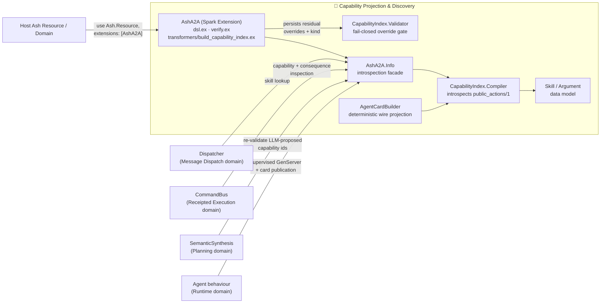
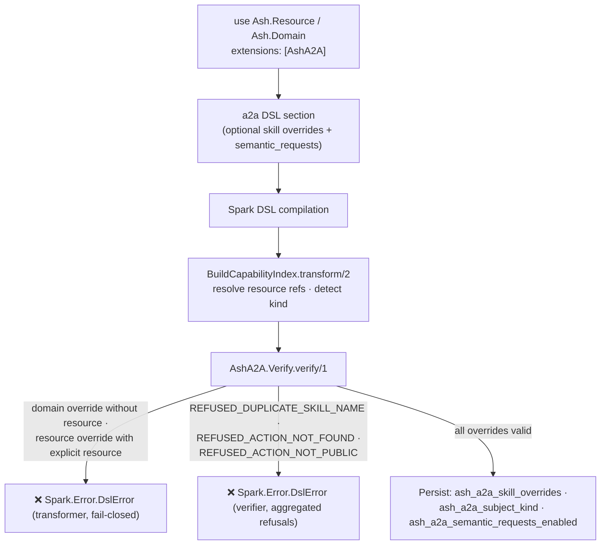
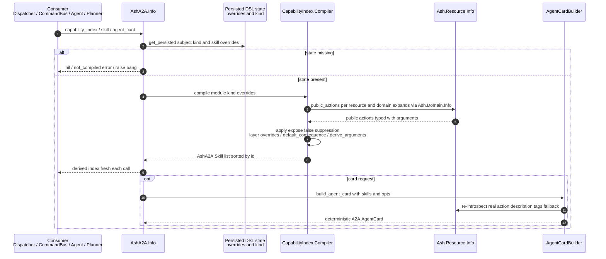

# Capability Projection & Discovery — Technical Documentation

**Project:** `ash_a2a` v26.9.14 — Spark DSL extension for the Ash Framework
**Domain:** Capability Projection & Discovery (Core Business Domain, importance 9.5/10)
**Source basis:** `lib/ash_a2a.ex`, `lib/ash_a2a/dsl.ex`, `lib/ash_a2a/argument.ex`, `lib/ash_a2a/verify.ex`, `lib/ash_a2a/transformers/build_capability_index.ex`, `lib/ash_a2a/capability_index.ex`, `lib/ash_a2a/capability_index/compiler.ex`, `lib/ash_a2a/capability_index/validator.ex`, `lib/ash_a2a/capability_index/agent_card_builder.ex`, `lib/ash_a2a/info.ex`, `lib/ash_a2a/skill.ex`

---

## 1. Overview

Capability Projection & Discovery is the domain that turns public Ash resource actions into A2A (Agent-to-Agent) protocol skills **with zero hand-written protocol glue**. It hosts the Spark DSL extension, the capability index compiler, the fail-closed override validator, and the deterministic AgentCard builder.

The domain is governed by a single central invariant:

> **The advertised agent surface (A2A `AgentCard`) and the executed behavior (Ash action dispatch) are both deterministic projections of one canonical source: `Ash.Resource.Info.public_actions/1`.**

Two corollaries follow directly from the implementation:

1. **Overrides can describe or suppress, but never invent.** An `a2a do skill ... end` declaration may attach A2A-only metadata (display name, description, tags), explicitly classify consequence, or remove an otherwise-public action from projection (`expose?: false`). It cannot create an action, alter action arguments, or promote a private action to the wire.
2. **The index is a projection, not a second business model.** Nothing resembling a capability catalog is persisted at compile time. Only *residual overrides* plus two flags are persisted into Spark DSL state; the full skill list is derived **on demand** at runtime from live Ash introspection. This guarantees the advertised surface can never drift from the resources as they actually exist.

---

## 2. Position in the System Architecture



Every consumer that must know *what the agent can do* — the Dispatcher (skill resolution), the CommandBus (consequence/authority admission), the Planner (re-validation of LLM-proposed capability ids), and the Agent behaviour (card publication) — reads exclusively through `AshA2A.Info`. None of them walk raw DSL entities. This is the structural mechanism that makes "advertised ≠ executed" divergence impossible rather than merely tested against.

---

## 3. Design Principles

| # | Principle | Where Enforced |
|---|---|---|
| P-1 | **Deterministic derivation over generation** — capabilities are compiled from real Ash introspection, never declared into existence | `Compiler.compile/3` (input set is exactly `public_actions/1`) |
| P-2 | **Fail-closed validation** — invalid override declarations abort compilation with structured refusals; they never degrade silently | `Validator.validate/1`, `Verify.verify/1`, transformer `resolve_resource/4` |
| P-3 | **Projection, not persistence** — the index is derived on demand; only residual overrides survive compile time | `BuildCapabilityIndex.transform/2`, `AshA2A.Info` moduledoc |
| P-4 | **Canonical identity** — every skill is keyed by `{resource, action}`; the A2A id is a pure function of that pair | `Compiler.capability_id/2` |
| P-5 | **Consequence computed once** — consequence classification is derived at compile time and carried as capability truth, never recomputed from `action.type` by consumers | `Compiler.project/3`, `default_consequence/1` |
| P-6 | **Determinism on the wire** — skill lists are sorted by id; card fields have fixed defaults | `Compiler` (`Enum.sort_by(& &1.id)`), `AgentCardBuilder.build_agent_card/2` |

---

## 4. Module Map

| Module | Role | Type |
|---|---|---|
| `AshA2A` | Top-level Spark extension: wires sections, transformer, verifier | Extension entry point |
| `AshA2A.Dsl` | Declares the `a2a` section, `skill` entity, `semantic_requests` option, inert `argument` entity | DSL definition |
| `AshA2A.Transformers.BuildCapabilityIndex` | Compile-time transformer; persists residual overrides + subject kind + semantic flag | Transformer |
| `AshA2A.Verify` | Compile-time verifier; fail-closed on bad overrides | Verifier |
| `AshA2A.CapabilityIndex` | Public facade (`build_agent_card/2`, `validate/1` defdelegates) | Facade |
| `AshA2A.CapabilityIndex.Compiler` | Derives the skill list from `public_actions/1` ⊕ overrides | Core compiler |
| `AshA2A.CapabilityIndex.Validator` | Fail-closed validation of overrides, structured refusals | Safety gate |
| `AshA2A.CapabilityIndex.AgentCardBuilder` | Deterministic projection to `A2A.AgentCard.t()` | Wire projection |
| `AshA2A.Info` | Runtime introspection API (`capability_index*`, `skill/2`, `agent_card/2`, `semantic_requests_enabled?/1`) | Introspection facade |
| `AshA2A.Skill` | Skill struct + consequence semantics documentation | Data model |
| `AshA2A.Argument` | Inert DSL entity kept for pre-v26.9.12 source compatibility | Compatibility shim |

---

## 5. The DSL Surface

### 5.1 Attaching the Extension

```elixir
use Ash.Resource, extensions: [AshA2A]
```

`AshA2A` is declared as:

```elixir
use Spark.Dsl.Extension,
  sections: AshA2A.Dsl.sections(),
  transformers: [AshA2A.Transformers.BuildCapabilityIndex],
  verifiers: [AshA2A.Verify]
```

Attachment alone is sufficient for discovery: **every action returned by `Ash.Resource.Info.public_actions/1` is projected automatically**. The `a2a` block is strictly optional and exists only to override A2A-specific metadata or suppress projection.

### 5.2 The `a2a` Section

The section carries one entity (`skill`) and one option (`semantic_requests`):

| Key | Type | Default | Purpose |
|---|---|---|---|
| `name` (entity arg) | `atom` | required | A2A display/selector name override for the referenced public action |
| `resource` (entity arg, optional) | `{:spark, Ash.Resource}` | — | Target resource; **required on a domain**, **implicit on a resource** |
| `action` (entity arg) | `atom` | required | Canonical public Ash action to override |
| `description` | `string` | — | A2A-only description override |
| `tags` | `{:list, :string}` | — | A2A-only tags override |
| `expose?` | `boolean` | `true` | Whether the otherwise-public action is exposed through A2A (`false` = suppress) |
| `consequence` | `{:one_of, [:observe, :change, :external_do, :unknown]}` | — | Explicit consequence classification (see §7.4) |
| `semantic_requests` (section option) | `boolean` | `false` | Opts the subject into the semantic-compilation A2A surface |

Example on a resource:

```elixir
a2a do
  skill :search, :read do
    description "Search the catalog"
    tags ["catalog", "search"]
  end

  skill :purge_cache, :action do
    consequence :external_do   # required to lift a generic :action off :unknown
  end

  skill :internal_import, :create do
    expose? false              # suppress an otherwise-public action
  end

  semantic_requests true       # opt in to the semantic-compilation A2A surface
end
```

Example on a domain (resource must be named explicitly):

```elixir
a2a do
  skill :search, MyApp.Catalog, :read do
    description "Search the catalog"
  end
end
```

### 5.3 The Inert `argument` Entity

The nested `argument` entity (target `AshA2A.Argument`) is a **structural prerequisite only**: `Spark.Dsl.Entity` requires an `entities:` list on a parent entity before it will accept child blocks at all. It is accepted for **source compatibility with pre-v26.9.12 declarations** and is **deliberately ignored** by capability compilation. Argument truth always comes from Ash introspection, never from declarations. `AshA2A.Argument` performs no validation of its own.

---

## 6. Compile-Time Pipeline

### 6.1 Transformer: `BuildCapabilityIndex.transform/2`

Despite its historical name, **the transformer does not build or persist a capability index** — its own moduledoc states this explicitly. It performs three jobs:

1. **Subject-kind detection.** Determines whether the attached module is a resource or a domain by inspecting `Module.get_attribute(module, :spark_is) == Ash.Resource`, persisting `:ash_a2a_subject_kind` as `:resource` or `:domain`.

2. **Resource-reference resolution** (per override, fail-closed):

| Situation | Result |
|---|---|
| Resource-level override with `resource: nil` | `{:ok, ...}` — resource is filled with the enclosing module; `domain` filled with the module's persisted `:domain` |
| Resource-level override with explicit `resource:` | ❌ `Spark.Error.DslError` — *"resource-level skill overrides cannot set `resource`"* |
| Domain-level override with `resource: nil` | ❌ `Spark.Error.DslError` — *"domain-level skill overrides must declare a resource: `skill :name, Resource, :action`"* |
| Domain-level override with explicit `resource:` | `{:ok, ...}` — `domain` filled from `Ash.Resource.Info.domain/1` |

3. **Residual persistence.** Persists exactly three keys into DSL state — nothing else:

```elixir
Transformer.persist(dsl, :ash_a2a_skill_overrides, overrides)        # residual Skill entities
Transformer.persist(dsl, :ash_a2a_subject_kind, subject_kind)        # :resource | :domain
Transformer.persist(dsl, :ash_a2a_semantic_requests_enabled, flag)   # from the a2a option
```

### 6.2 Verifier: `AshA2A.Verify.verify/1`

The verifier is the second fail-closed gate:

- If `:ash_a2a_skill_overrides` is **absent** from persisted state (i.e., the transformer never ran to completion), it raises a `Spark.Error.DslError`: *"AshA2A residual override compilation did not complete."* This detects a broken transformer chain rather than silently treating the extension as absent.
- Otherwise it delegates to `AshA2A.CapabilityIndex.validate/1`. Any refusals are joined (`"CODE: detail; CODE: detail"`) into a single `Spark.Error.DslError`, located at the offending override's source annotation (falling back to the `[:a2a]` section annotation when the list is empty).

Because the verifier runs as part of Spark compilation, an invalid `a2a` block **fails the build** — the misconfiguration can never reach a running agent.

---

## 7. Runtime Derivation: `CapabilityIndex.Compiler`

`Compiler.compile/3` is the heart of the domain:

```elixir
@spec compile(module(), :resource | :domain, [Skill.t()]) :: [Skill.t()]
```

Its moduledoc states the contract plainly: *"The compiler never creates business semantics. Its input set is exactly `Ash.Resource.Info.public_actions/1`; optional `a2a skill` declarations are residual projection overrides keyed by `{resource, action}`."*

### 7.1 Resource Compilation

`compile_resource/2` per resource:

1. Filters the override list down to those whose `resource` equals the target, and indexes them by `action` name.
2. Introspects `Ash.Resource.Info.public_actions(resource)`.
3. For each action:
   - If an override exists with `expose? == false` → **the skill is omitted** (suppression).
   - Otherwise → `project/3` builds the `AshA2A.Skill` struct, layering the override (if any) over introspected defaults.
4. The result is sorted by `id` (`Enum.sort_by(& &1.id)`) for deterministic ordering.

### 7.2 Domain Compilation

`compile(subject, :domain, overrides)` expands to the domain's resources via `Ash.Domain.Info.resources/1`, then compiles each resource with **its own resource-level overrides plus the domain-level overrides concatenated** (`resource_overrides(resource) ++ domain_overrides`). Results are flattened and sorted globally by `id`. This lets a domain attach cross-resource metadata (e.g., a unified display name) in one place.

### 7.3 Canonical Capability Identity

```elixir
def capability_id(resource, action), do: "#{inspect(resource)}.#{action}"
```

The id is a **pure, stable function of the canonical `{resource, action}` pair** (e.g., `"MyApp.Catalog.Search"`) — never of the override display name. This is what allows the Dispatcher, CommandBus, and Planner to refer to capabilities unambiguously, and what allows a display-name override to change without breaking callers that target the id.

### 7.4 Consequence Classification (Computed Once)

`project/3` sets `consequence` from the override if declared, else from `default_consequence/1`:

| Ash action type | Default consequence | Rationale |
|---|---|---|
| `:read` | `:observe` | Unambiguously non-consequence-bearing |
| `:create` | `:change` | Consequence-bearing via the canonical Ash data layer |
| `:update` | `:change` | Same |
| `:destroy` | `:change` | Same |
| generic `:action` (any other type) | `:unknown` | `action.type` alone cannot distinguish a pure calculation from a mutating/externally-effecting operation |

`AshA2A.Skill`'s moduledoc formalizes the semantics:

- **`:observe`** — never consequence-bearing; never requires CommandBus admission/authority; never produces a Receipt.
- **`:change`** — consequence-bearing via the Ash data layer.
- **`:external_do`** — consequence-bearing via effects outside the Ash data layer; **no action type defaults here** — a resource author must declare it explicitly.
- **`:unknown`** — unclassified. `CommandBus`/`Agent` **fail it closed** (`:consequence_unclassified`) rather than treating it as safe-to-skip or safe-to-execute; an unclassified generic action must never be a route around the CommandBus DO boundary.

Consequence is computed **once at compile time** by the compiler and carried on the `Skill` struct as capability truth. Consumers (`Agent`, `CommandBus`) read the precomputed value instead of re-deriving it from `action.type` — a single classification point keeps admission semantics consistent everywhere.

### 7.5 Argument Derivation

`derive_arguments/2` builds the per-skill `arguments` list from **two real Ash introspection surfaces** — never from DSL declarations:

1. **Declared arguments** — `action.arguments` (`Ash.Resource.Actions.Argument.t()`), filtered to `public?: true` (defaulting to public when the field is absent). Non-public arguments are excluded, mirroring the wire projection's treatment of inputs.
2. **Accepted attributes** — for `:create`/`:update` actions, the `action.accept` list. A stated design decision (documented at length in the compiler source): accepted attributes **are** represented as `AshA2A.Argument` entries, because `AgentCardBuilder.input_names/1` already folds accept names into the wire card's inputs, and an in-process caller of `AshA2A.Info.skill/2` cannot distinguish "declared argument" from "accepted attribute" from the outside. Each accepted attribute's type comes from `Ash.Resource.Info.attribute(resource, name).type` — real typed data, never guessed.

Edge-case handling:

- If `action.accept` names an attribute that introspection cannot resolve (e.g., a stale accept list after an attribute rename), the name is **silently skipped** rather than raised — the code comment states a capability-index derivation step "must never crash resource compilation over a residual accept-list mismatch."
- Declared arguments precede accept-derived entries; the combined list is **de-duplicated by name** (first occurrence wins).

---

## 8. Fail-Closed Validation: `CapabilityIndex.Validator`

The validator is the safety gate protecting the advertised surface's integrity. `validate/1` accepts either `AshA2A.Skill.t()` structs or plain maps (both occur in practice: persisted DSL entities and test fixtures) and aggregates two check families:

| Refusal code | Trigger | Detail semantics |
|---|---|---|
| `:REFUSED_DUPLICATE_SKILL_NAME` | Two or more overrides share a `name` (via `Enum.frequencies_by/2`) | Names must be unique — they serve as A2A selectors |
| `:REFUSED_ACTION_NOT_FOUND` | `Ash.Resource.Info.action/2` returns `nil` for the override's `{resource, action}` | The referenced action does not exist |
| `:REFUSED_ACTION_NOT_PUBLIC` | The action exists but has `public?: false` | *"AshA2A only projects `Ash.Resource.Info.public_actions/1`"* — private actions remain internal **even when explicitly named** in the DSL |

The return contract is deliberately non-exceptional — `:ok | {:error, [refusal()]}` where a refusal is `%{code: atom(), detail: String.t()}` — so callers (the `Verify` verifier) can aggregate all refusals into one structured compile error rather than failing on the first. **Nothing partially passes**: one bad override fails the whole verification.

---

## 9. Introspection Facade: `AshA2A.Info`

`AshA2A.Info` is the single canonical read path for the derived index. Its derivation contract (from the moduledoc): the extension persists only residual overrides plus the subject-kind flag; **every `capability_index*` call re-derives the current index** from `Ash.Resource.Info.public_actions/1` through the Compiler.

| Function | Signature | Behavior |
|---|---|---|
| `capability_index/1` | `(module) -> [Skill.t()] \| nil` | Derived index, or `nil` when the extension state is missing |
| `capability_index_result/1` | `(module) -> {:ok, [Skill.t()]} \| {:error, :not_compiled}` | Typed result form; reads persisted `:ash_a2a_subject_kind` and `:ash_a2a_skill_overrides` and delegates to `Compiler.compile/3`; returns `{:error, :not_compiled}` unless kind ∈ `[:resource, :domain]` and overrides is a list |
| `capability_index!/1` | `(module) -> [Skill.t()]` | Bang variant; raises `ArgumentError` with an actionable message ("add the `AshA2A` extension and ensure the module has compiled") |
| `capability_index?/1` | `(module) -> boolean` | Extension attached and derivable? |
| `skill/2` | `(module, atom() \| String.t()) -> {:ok, Skill.t()} \| {:error, :skill_not_found}` | Looks up one skill matching **id**, **name**, or the **stringified name** — this is the lookup the Dispatcher uses |
| `agent_card/2` | `(module, opts) -> A2A.AgentCard.t()` | `capability_index/1` → `CapabilityIndex.build_agent_card/2` |
| `semantic_requests_enabled?/1` | `(module) -> boolean` | Reads persisted `:ash_a2a_semantic_requests_enabled`; documented as "real capability truth, not a runtime message-content sniff" |

The `AshA2A.CapabilityIndex` module is the **public facade** over the same machinery, kept deliberately narrow: `build_agent_card/2` (defdelegate to `AgentCardBuilder`) and `validate/1` (defdelegate to `Validator`). Its moduledoc states the separation goal explicitly — *"keeps wire projection and residual-override validation separate."*

---

## 10. Wire Projection: `AgentCardBuilder`

`AgentCardBuilder.build_agent_card/2` converts a derived skill list into a real `A2A.AgentCard.t()` for A2A-client discovery.

**Determinism guarantees:**

- Skills are re-sorted by id (`Enum.sort_by(skills, &skill_id/1)`) regardless of input order.
- All card fields have fixed defaults; identical inputs always produce identical cards.

**Card defaults:**

| Field | Default |
|---|---|
| `name` | `"ash_a2a_agent"` |
| `description` | `"Ash-backed A2A agent exposing N skill(s)."` |
| `url` | `"http://localhost:4000"` |
| `version` | `"0.1.0"` |
| `supported_interfaces` | `[%{url: url, protocol_binding: "JSONRPC", protocol_version: "0.3.0"}]` |
| `provider` / `security_schemes` / `security` | `nil` / `%{}` / `[]` (all overridable via opts) |

**Per-skill projection** (`build_agent_card_skill/1`):

- `id` — the canonical capability id (or regenerated via `capability_id/2` when the struct lacks one).
- `name` — `to_string(skill.name || action)`: the residual display override, else the action name.
- `description` — override first; otherwise derived from the **real action** re-introspected at build time (`Ash.Resource.Info.action/2`): the action's own `description` if present, else `"{type} action {inspect(name)} on {inspect(resource)}"`, always suffixed with an inputs clause (`"arguments: a, b, c"` or `"no arguments"`). If the real action cannot be re-resolved, the fallback is `"Dispatches to {resource}.{action}/*"`.
- `tags` — override first; otherwise `[action-type string] ++ input names`, de-duplicated.

**`input_names/1`** = public declared-argument names ++ `accept` names — the same public-only filter and accept-folding rule the compiler's `derive_arguments/2` applies to the in-process projection, keeping the wire and in-process views consistent by construction.

---

## 11. Data Model

### 11.1 `AshA2A.Skill`

The struct dual-purposes as (a) the compiled capability record and (b) the target of the residual override DSL entity. Its moduledoc is emphatic: *"AshA2A.Skill is not a second action model"* — the `{resource, action}` pair points back to the canonical Ash action; `id`/`name`/`description`/`tags` are A2A projection data. Fields like `arguments` and Spark metadata may be populated on a raw DSL entity, but are **never copied into the canonical capability index**.

```elixir
%AshA2A.Skill{
  id: "MyApp.Catalog.search",       # capability_id(resource, action)
  name: :search,                    # override display/selector name or action name
  resource: MyApp.Catalog,
  domain: MyApp.Domain,
  action: :read,
  description: "Search the catalog",  # override or nil (card derives fallback)
  tags: ["catalog", "search"],        # override or nil
  expose?: true,
  consequence: :observe,              # override or default_consequence(action.type)
  arguments: [%AshA2A.Argument{...}]  # always derived from Ash introspection
}
```

### 11.2 `AshA2A.Argument`

```elixir
%AshA2A.Argument{name: :query, type: :string}
```

A minimal typed pair (`name`, `type`) plus Spark metadata. It appears in two unrelated roles: (1) the inert DSL child entity (compatibility shim, §5.3) and (2) the derived argument records populated by `Compiler.derive_arguments/2`.

---

## 12. End-to-End Flows

### 12.1 Compile-Time Pipeline



### 12.2 Runtime Derivation → Discovery



The critical property: **derivation happens at call time against live introspection**. If a resource's actions change, the next `capability_index/1` call reflects reality — the advertised surface cannot go stale relative to the code.

---

## 13. Design Decisions & Trade-offs

| Decision | Rationale (as documented in source) | Trade-off accepted |
|---|---|---|
| Transformer named `BuildCapabilityIndex` but persists no index | Historical name; v26.9.12 removed index manufacturing to honor "projection, not second business model" | Slight naming confusion, acknowledged in the module's own moduledoc |
| Index derived on demand rather than memoized | Guarantees freshness against live introspection; keeps DSL state minimal (3 keys) | Repeated derivation cost on hot paths; noted as a safe memoization candidate since derivation is deterministic |
| `accept` attributes included in derived `arguments` | Wire projection already folds them into inputs; in-process callers need equal completeness | Type lookup can miss on stale accept lists → silently skipped rather than raised (compilation must never crash on residual mismatch) |
| Generic `:action` defaults to `:unknown` | `action.type` cannot classify side effects; fail-closed beats guessing | Authors of safe pure actions must explicitly declare `consequence: :observe` (or equivalent) to route them off CommandBus admission |
| Inert `argument` DSL entity retained | Pre-v26.9.12 source compatibility | Users can still write ignored declarations; moduledoc flags the deprecation |
| Refusal aggregation, not fail-fast | One compile shows every invalid override at once | Slightly more complex error assembly in `Verify` |
| Suppress via `expose? false` rather than making the action private | A2A-specific hiding without touching Ash visibility semantics | Two suppression mechanisms exist (`public?: false` and `expose?: false`); only the former is Ash-canonical, the latter is projection-local |

---

## 14. Consumer Contracts (Downstream Coupling)

| Consumer | Contract with this domain |
|---|---|
| **Dispatcher** (Message Dispatch) | Resolves inbound skill selectors **only** via `AshA2A.Info.skill/2` against the derived index — never raw DSL entities. This is the strongest coupling in the system (strength 9.0) and the mechanism guaranteeing advertised/executed alignment. |
| **CommandBus** (Receipted Execution) | Reads `consequence` from the derived skill to decide admission: `:observe` passes without authority; `:change`/`:external_do` require authority; `:unknown` is refused with `:consequence_unclassified`. |
| **Planning Synthesis** | Re-validates every LLM-proposed capability id through `AshA2A.Info` against the real index — fabricated capabilities are rejected. |
| **Agent behaviour** (Runtime) | Compiles the index into a supervised GenServer and publishes its AgentCard via `AshA2A.Info.agent_card/2`. |
| **Semantic surface gate** | `semantic_requests_enabled?/1` is the first of the two mandatory gates (the second being `metadata[:semantic_request]` on the inbound message) before any dispatch may reach `Semantic.Compiler` — semantic compilation is an explicit, opted-in A2A surface, never a surprise LLM invocation. |

---

## 15. Summary

Capability Projection & Discovery realizes the framework's central architectural bet: that an agent's advertised surface should be **compiled from what the code can actually do**, not authored alongside it. The implementation enforces this through layered fail-closed gates — the transformer (resource-reference resolution), the verifier (public-action existence + name uniqueness), and the compiler (public-actions-only input set, public-arguments-only derivation) — while keeping the persisted footprint minimal (three DSL keys) and the derivation deterministic (canonical ids, consequence computed once, sorted skill lists, fixed card defaults). Every downstream consumer funnels through `AshA2A.Info`, making divergence between the AgentCard and dispatch behavior structurally impossible.