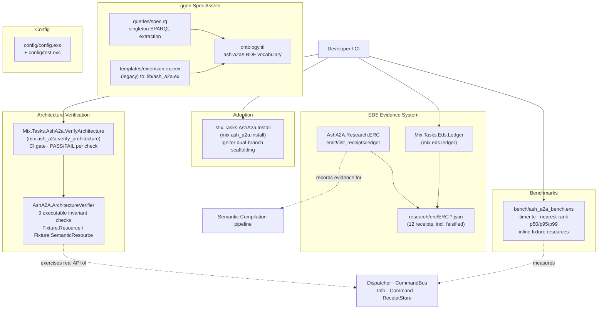
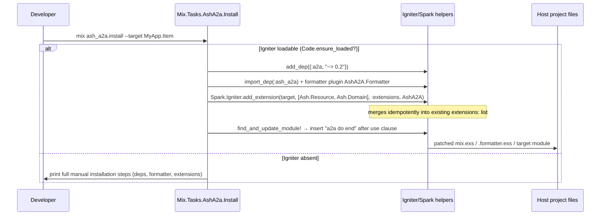
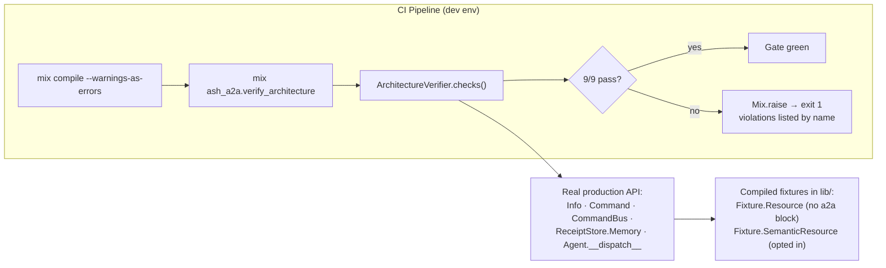
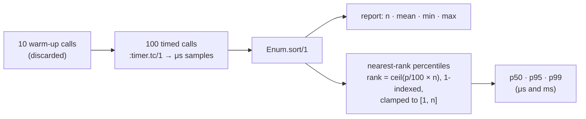

# Developer Tooling & Governance — Technical Documentation

**Project:** `ash_a2a` v26.9.14 — Elixir/Spark DSL extension projecting Ash actions into A2A protocol skills
**Domain:** Developer Tooling & Governance (Tool Support Domain)
**Primary code paths:** `lib/mix/tasks/`, `lib/ash_a2a/architecture_verifier.ex`, `lib/ash_a2a/research/erc.ex`, `research/erc/`, `priv/ggen/ash_a2a/`, `bench/`, `config/`

---

## 1. Purpose and Role in the Architecture

The Developer Tooling & Governance domain is the **mechanized governance layer** of AshA2A. The framework's core invariants — capability truth derived from `Ash.Resource.Info.public_actions/1`, fail-closed admission in the `CommandBus`, fingerprint-based replay safety, and the candidate-then-admit contract for LLM output — are not merely documented prose. This domain makes them **executable, measurable, and auditable**:

| Governance Concern | Mechanism | Entry Point |
|---|---|---|
| **Adoption** | Igniter-driven scaffolding of the extension into host applications | `mix ash_a2a.install` |
| **Invariant enforcement** | Real, executable architecture checks run against compiled production code | `mix ash_a2a.verify_architecture` |
| **Research evidence** | Machine-readable ERC (Executable Research Claim) receipts with git/environment provenance | `AshA2A.Research.ERC` + `mix eds.ledger` |
| **Specification assets** | RDF ontology, SPARQL extraction query, and EEx scaffolding template for the DSL surface | `priv/ggen/ash_a2a/` |
| **Performance evidence** | Dependency-free wall-clock benchmarks of dispatcher and CommandBus hot paths | `bench/ash_a2a_bench.exs` |
| **Baseline configuration** | Codepoint-based string semantics and environment-scoped config imports | `config/config.exs`, `config/test.exs` |

The domain's governing philosophy is **"governance as code"**: a claim that the architecture holds is only credible if a machine can re-verify it, and a research result is only credible if it is receipted with provenance — including when the result is a *falsified* hypothesis. This mirrors the framework-wide pattern of receipts-and-fingerprints as universal evidence, applied to the development process itself.

---

## 2. Component Map



---

## 3. Mix Tasks & Architecture Verification

### 3.1 `mix ash_a2a.install` — Igniter-Based Installer

**Module:** `Mix.Tasks.AshA2a.Install` (`lib/mix/tasks/ash_a2a.install.ex`)

The installer scaffolds AshA2A into a host application using the Igniter patching framework. Its defining structural feature is a **whole-file dual branch** gated by `Code.ensure_loaded?(Igniter)`:

- **Igniter branch** (`use Igniter.Mix.Task`): performs real code generation when Igniter is a loadable dependency.
- **Fallback branch** (`use Mix.Task`): when Igniter is absent, prints complete manual installation instructions instead of failing. The task never silently degrades into doing nothing — it always produces actionable guidance.

**What the Igniter branch does** (via `igniter/1`):

1. **Adds the runtime dependency** — `Igniter.Project.Deps.add_dep({:a2a, "~> 0.2"})`. This is a deliberate deviation from the sibling-installer template (`ash_r2rml.install.ex`): because `ash_a2a` wraps the real `:a2a` runtime, installing the extension must also wire in its protocol dependency.
2. **Registers the formatter plugin** — `Igniter.Project.Formatter.import_dep(:ash_a2a)` plus `add_formatter_plugin(AshA2A.Formatter)` so Spark DSL sections format correctly in host projects.
3. **Optionally patches a target module** — controlled by CLI options:

   | Option | Type | Default | Purpose |
   |---|---|---|---|
   | `--target` | string | none | Module to patch (e.g. `MyApp.SomeResource`) |
   | `--type` | `resource` \| `domain` | `resource` | Selects the DSL shape (`skill :name, :action` on a resource vs. `skill :name, Resource, :action` on a domain) |

4. **Idempotent extension merging** — `add_extension/2` delegates to `Spark.Igniter.add_extension/5`, searching the target's `use Ash.Resource` *or* `use Ash.Domain` clause (the single `AshA2A` module serves both target kinds). The helper merges `AshA2A` into an existing `extensions:` list (deduped by AST equality), adds a new `extensions: [AshA2A]` option alongside other `use` options, or appends it as the `use` call's second argument — so re-running the installer never duplicates the extension.
5. **Starter DSL block** — `add_starter_dsl_block/2` locates the target's `use` clause via `Igniter.Code.Module.move_to_use/2` and inserts a minimal, compiling `a2a do end` block immediately after it.
6. **Disclosed fallback notice** — when no `--target` is given, dependency/formatter wiring still happens, but a printed notice instructs the developer how to attach the extension manually or re-run with a target. The installer never guesses which module to patch.



### 3.2 `mix ash_a2a.verify_architecture` — CI Gate

**Module:** `Mix.Tasks.AshA2a.VerifyArchitecture` (`lib/mix/tasks/ash_a2a.verify_architecture.ex`)

This task is the project's **repeatable architecture-invariant gate**. Its contract:

1. Runs `Mix.Task.run("app.start")` to boot the application.
2. Invokes `AshA2A.ArchitectureVerifier.checks()` — a pure function returning a list of `%{name, status: :pass | :fail, detail}` maps.
3. Prints one indented `PASS`/`FAIL` line per check with explanatory detail.
4. Prints a summary line (`N/M architecture checks passed.`).
5. On any failure, calls `Mix.raise/1`, which the Mix CLI converts to `System.halt(1)` — a real non-zero exit for CI pipelines.

The moduledoc is explicit about the task's epistemic stance: *"This is not documentation of an intended invariant — every check below calls the real, current, unmodified `AshA2A.Info`/`AshA2A.Command`/`AshA2A.CommandBus` public API against a real compiled `Ash.Resource`."* A change to `CommandBus` admission logic, to `Command.fingerprint/1`'s hashed field set, or to the capability compiler's default consequence classification **makes the task fail for real**, rather than leaving stale documentation behind.

The task is deliberately kept thin: all I/O (shell printing, raising) lives in the Mix task; the verifier module itself prints nothing and halts nothing, so it stays directly callable and assertable from `test/ash_a2a_architecture_verifier_test.exs`.

### 3.3 `AshA2A.ArchitectureVerifier` — Executable Invariant Checks

**Module:** `lib/ash_a2a/architecture_verifier.ex`

#### 3.3.1 Always-Compiled Fixtures

The repo's usual test fixtures (`test/support/fixture.ex`) are compiled only under `elixirc_paths(:test)` — `mix.exs` adds `test/support` solely for `Mix.env() == :test`. A plain `mix ash_a2a.verify_architecture` runs under `:dev`, where `elixirc_paths` is just `["lib"]`. The verifier therefore defines **its own private, always-compiled fixtures inside `lib/`**:

| Fixture | Contents | Purpose |
|---|---|---|
| `Fixture.Resource` | Default `:create` action (compiled consequence `:change`) + generic `:action :probe` (compiled consequence `:unknown`); no explicit `a2a` block | Proves the `a2a` section persists correctly with zero explicit entities and that both actions derive from `public_actions/1` alone |
| `Fixture.SemanticResource` | `:read` default + `a2a do semantic_requests(true); skill(:probe, :read, consequence: :observe) end` | The opt-in counterpart for the semantic-surface gate checks |
| `Fixture.Domain` / `Fixture.SemanticDomain` | Companion `Ash.Domain` modules with `extensions: [AshA2A]` | Real domain-extension wiring; uses `validate_config_inclusion?: false` so they compile warning-free under `:dev` (where no `ash_domains` config lists them) |

Both fixture resources use `data_layer: Ash.DataLayer.Ets` — real storage, no mocks.

#### 3.3.2 The Nine Checks

`checks/0` returns results "most-important first":

| # | Check | Invariant Proven | Failure Mode Caught |
|---|---|---|---|
| 1 | `check_capability_index_derivable/0` | `AshA2A.Info.capability_index/1` returns a non-empty skill list for a compiled resource | Capability truth stops being derivable from Ash introspection alone |
| 2 | `check_unknown_consequence_refused/0` | An `:unknown`-consequence skill (`:probe`) is refused by `CommandBus.run/4` with `{:error, %{code: :consequence_unclassified}}` | Unclassified actions being silently dispatched (fail-closed regression) |
| 3 | `check_change_requires_authority/0` | A `:change`-consequence skill with no `Authority` is refused with `:authority_required` | Consequence-bearing execution without authorization |
| 4 | `check_fingerprint_invariants/0` | `Command.fingerprint/1` is stable for identical semantic content and divergent for changed `input` under a constant `command_id` | Replay detection or conflict detection breaking |
| 5 | `check_fingerprint_excludes_transport_timestamp/0` | Fingerprints hold stable across an *explicit* ~2-hour `submitted_at` gap (built deliberately: check 4's two commands default `submitted_at` at call time, so its timestamp exclusion was previously only implied) | Transport timestamps leaking into the intent fingerprint, misclassifying genuine retries as new commands |
| 6 | `check_change_consequence_succeeds_with_matching_authority/0` | A correctly-authorized `:change` command is really admitted, really dispatched, and really committed to `ReceiptStore.Memory` with `status: :completed` | The happy path breaking while refusal paths still pass — the positive-admission counterpart to check 3 |
| 7 | `check_command_bus_conflict_refused_on_reused_command_id/0` | Two real `CommandBus.run/4` calls with the same `command_id` but different `input`: first commits, second is refused with `:command_conflict` — exercising the receipt store's real conflict branch end-to-end | Conflict refusal existing only in isolated fingerprint comparison, not in the actual store pipeline |
| 8 | `check_semantic_requests_gate_compiles/0` | `Info.semantic_requests_enabled?/1` is `true` for `SemanticResource` and `false` for `Resource` — the DSL gate is real compiled truth that **defaults closed** | The semantic surface becoming silently available to unopted-in resources |
| 9 | `check_unopted_semantic_request_falls_through/0` | A message carrying `metadata: %{semantic_request: true, skill: "probe"}` dispatched against the unopted-in `Resource` falls through `Agent.__dispatch__/3` to ordinary skill resolution (proven by reaching `:probe`'s genuine `:consequence_unclassified` refusal, not a semantic-compiler error shape) | A caller-supplied flag alone bypassing the resource's compiled opt-in — which would turn the explicit semantic surface into exactly the silent-LLM-invocation behavior v26.9.14 was designed to prevent |

Checks 8–9 establish the **two-gate semantic surface** as a machine-verified invariant: both the resource's compiled `semantic_requests true` opt-in *and* the caller's message flag are required before `Semantic.Compiler.compile/3` is ever reachable from dispatch.

#### 3.3.3 Governance-in-Action: The Blocked-Dependency Account

The verifier's moduledoc records a notable governance practice: the original brief specified checks against the `semantic_requests` surface, which **did not exist on this worktree's branch**. Rather than fabricating passing checks or cherry-picking the missing commit (`95ce672`, which landed on the shared `v26.9.14/release-closure` branch after this worktree forked), the situation was *verified* (`git merge-base` comparison, `grep -rn "semantic_requests" lib/ test/` returning zero hits), declared **BLOCKED**, documented in full, and substituted with three self-contained real checks (5–7) in the interim. After the merge brought both lineages together, the two originally-briefed checks were added as checks 8–9, closing the named gaps. This is evidence-led governance applied to the tooling's own development: every deviation is named, proven, and eventually closed — never silently papered over.



---

## 4. Research & Evidence Ledger (EDS / ERC)

### 4.1 Executable Design Science Model

`AshA2A.Research.ERC` (`lib/ash_a2a/research/erc.ex`) is the concrete, minimal implementation of the **EDSResult nine-element tuple** from the Executable Design Science charter: *Claim, Artifact, Experiment, Environment, Execution, Evidence, Falsifier, Analysis, Reproduction*. Its two charter invariants are enforced structurally:

- **"IMPLEMENTED ≠ VERIFIED"** — `emit!/1` is only ever called from inside an already-executed test, after real assertions have passed or failed. It records what *did* happen, never what *should* happen.
- **Claim recording ≠ claim evaluation** — the module never decides whether a claim holds; it only persists the caller-supplied verdict with provenance.

### 4.2 Receipt Emitter API

| Function | Contract |
|---|---|
| `emit!(map)` | Writes one receipt to `research/erc/<id>-<unix_ts>.json`. Required keys: `:id`, `:claim`, `:falsifier`, `:state`, `:evidence`. Optional: `:notes`, `:depends_on`. Raises `ArgumentError` for a state outside the evidence enum. Returns `{:ok, path}`. |
| `list_receipts/0` | Reads and decodes every `.json` under `research/erc/`, newest-write-first (mtime sort). Returns `[]` when the directory doesn't exist — *no receipts yet is a real, valid state, not an error*. |
| `ledger/0` | Deduplicates by claim `id`, keeping the **latest** receipt per id (current standing, not history) and sorting by id. Full history remains available via `list_receipts/0`. |

The evidence-state enum is the **full** charter set, deliberately broader than what the repo has used so far:

```
:proposed :implemented :executable :observed :verified
:reproducible :reproduced :falsified :blocked :unsupported :unknown
```

The moduledoc explains why: an emitter that only ever accepted `:verified` would itself be the *state collapse* EDS exists to prevent. Falsified and blocked results must be first-class representable outcomes.

### 4.3 Receipt JSON Schema

Every receipt is a self-contained provenance record:

```json
{
  "id": "ERC-004",
  "claim": "45+ of 50 genuinely concurrent Z.AI dispatches complete successfully ...",
  "falsifier": "Fewer than 45/50 concurrent dispatches complete successfully.",
  "state": "falsified",
  "evidence": { "attempted": 50, "completed": 2, "min_required": 45,
                "failure_reasons": { "{:error, {:execution, ... 429 ...}}": 48 } },
  "depends_on": ["ERC-003"],
  "notes": "Real 429 (\"Rate limit reached\") responses ... an external provider constraint, not a defect in this repo's dispatch/telemetry path",
  "artifact": { "repo": "ash_a2a",
                "git_sha": "faa86055591cdf2bda867a4c033b8b6f18b79780",
                "git_dirty?": false },
  "environment": { "elixir": "1.19.5", "otp": "28", "hostname": "Mac" },
  "execution": { "emitted_at": "2026-09-13T12:16:43.779839Z" }
}
```

Provenance capture details:
- **`git_sha`** via `System.cmd("git", ["rev-parse", "HEAD"])`, degrading to `"unknown"` on failure.
- **`git_dirty?`** via `git status --porcelain` — distinguishing clean-tree results (e.g. ERC-001 at commit `faa86055`) from work-in-progress runs.
- **Environment block**: Elixir version, OTP release, hostname — sufficient to reason about run-to-run variance (ERC-003/004 ran under OTP 27 while ERC-001 ran under OTP 28).

### 4.4 The Live Ledger

The repository currently holds 12 receipts across three claim families, demonstrating both halves of honest reporting:

| Claim | State | Dependency | Content |
|---|---|---|---|
| **ERC-001** | `verified` | — | A real HDDL-planned facilitator dispatched over real A2A produces OCEL v2 events accepted (HTTP 201) by beam4pm's out-of-process ingest endpoint for every phase transition (18/18 reference events, 5/5 deviant events). |
| **ERC-003** | `verified` | — | 45+ live A2A dispatches genuinely in flight concurrently; overlap computed by a real +1/−1 sweep over measured monotonic start/finish timestamps — not inferred from `max_concurrency`. |
| **ERC-004** | **`falsified`** | `ERC-003` | Completion rate of 45+/50 concurrent dispatches. Falsified with captured evidence: 2 completed, 48 failed with real 429 rate-limit responses from the Z.AI provider — recorded as an external constraint, explicitly *not* a dispatch-path defect, while ERC-003's concurrency claim stands independently. |

The `depends_on` mechanism encodes claim topology: ERC-004's standing is meaningful only relative to ERC-003's, and the ledger renders this linkage.

### 4.5 `mix eds.ledger`

**Module:** `Mix.Tasks.Eds.Ledger` (`lib/mix/tasks/eds.ledger.ex`)

A small, honest renderer over `AshA2A.Research.ERC.ledger/0`:

- Prints an auto-width-aligned table with columns **ID / STATE / DEPENDS_ON / CLAIM** (claims truncated to 70 characters with an ellipsis).
- On an empty ledger, prints `"No ERC receipts found under research/erc/."` — a real notice rather than a silently empty table.
- The moduledoc states the contract directly: *"Reads real receipt files under `research/erc/`; prints nothing fabricated."*

---

## 5. ggen Specification Assets

`priv/ggen/ash_a2a/` carries the generated-specification material that models the DSL surface declaratively. All three assets carry an explicit **LEGACY DISCLOSURE** (v26.9.10 finish-all pass) stating they predate ggen_igniter's admitted "GeneratorCapability" pattern (ontology fact + admission envelope → composed `Igniter.Mix.Task` → real Ash/Igniter generators). They are retained as **unexecuted input material** — never run through `mix ggen_igniter.sync` per the disclosed blocker in `MANUFACTURING_RECEIPT.md` — and are marked "MUST NOT be copied as a template" for new consumers. This disclosure practice itself is governance: superseded material is labeled at the point of use rather than deleted or silently left to mislead.

### 5.1 `ontology.ttl` — The `ash-a2a#` Vocabulary

A Turtle ontology binding `@prefix ash_a2a: <http://seanchatmangpt.github.io/packs/ash-a2a#>`, standalone (namespaced `ash_a2a:`, explicitly *not* a fork of the sibling pack's generic `aex:` IRIs). It models the Spark DSL extension's shape as RDF classes and properties:

| Vocabulary Group | Classes / Properties | Models |
|---|---|---|
| Extension spec | `AshExtensionSpec`, `packageName`, `moduleName` | The one Spark extension to manufacture |
| Skill entity | `SkillEntity`, `skillOf`, `entityName`, `entityStruct`, `SkillArg` (`argOrder`/`argName`/`argOptional`), `SkillSchemaField` (`fieldOrder`/`fieldName`/`fieldType`/`fieldRequired`/`fieldDoc`) | The `:skill` entity with positional args `[:name, {:optional, :resource}, :action]` (mirroring ash_ai's `@tool` shape) and its closed-set field types |
| Nested argument entity | `ArgumentEntity`, `nestedOf`, `nestedFieldName`, `argumentEntityName/Struct`, `ArgumentArg`, `ArgumentSchemaField` (including `argumentFieldDefault`) | The `:argument` entity nested under `:skill` via `entities: [arguments: [...]]` |
| Context normalization | `contextNormalize`, `contextTargetEntity`, `contextTargetField` | The ash_ai `ResourceTools` pattern: detect resource-vs-domain via `spark_is`, fill the optional `resource` field at resource level, raise `Spark.Error.DslError` when required at domain level |
| Delegation knobs | `afterTransformer`, `validateDelegateModule`/`Function`, `legacyAdapterModule`/`Function`, `dualLevelFixture` | After-transformer ordering, Verify-module delegation to an external `validate/1`, Info-module rescue adapter, and dual resource+domain-level composition fixtures |

A fully worked instance (`ash_a2a:AshA2ASpec`, `AshA2ASkillEntity`, argument/schema field individuals) instantiates the vocabulary with the extension's real values: `packageName "ash_a2a"`, `moduleName "AshA2A"`, `validateDelegateModule "AshA2A.CapabilityIndex"` with `validateDelegateFunction "validate"`, `dualLevelFixture true`, and an empty `afterTransformer` set.

### 5.2 `queries/spec.rq` — SPARQL Extraction

A corrected (Zach-Daniel-review-driven, v26.9.10) SPARQL query performing a **singleton-row SELECT** of the `AshExtensionSpec` plus its nested entity shape. Its header documents its own fix history: the prior version bound a generic `aex:` prefix and a `DslSection/DslEntity/sectionOf/entityOf` shape written before the ontology existed; the rewrite binds against the real authored vocabulary — `ash_a2a:SkillEntity` linked via `ash_a2a:skillOf`, the nested argument via `ash_a2a:nestedOf`.

Mechanically, the query projects `?package_name`/`?module_name` directly and aggregates entity/struct names with `SAMPLE(...)` over optional graph patterns, grouping by package and module — extracting, in one row, the `:skill` entity's name and backing struct (`AshA2A.Dsl.Skill`) and the nested `:argument` entity's name and struct (`AshA2A.Dsl.Skill.Argument`).

### 5.3 `templates/extension.ex.eex` — Legacy Scaffolding Template

An EEx template with `to: "lib/ash_a2a.ex"` frontmatter (the ggen output-mapping convention). It hand-renders the full extension module: the `AshA2A.Dsl.Skill` and `AshA2A.Dsl.Skill.Argument` defstructs, the two `%Spark.Dsl.Entity{}` module attributes (the argument nested under the skill via `entities: [arguments: [@argument]]`), one `%Spark.Dsl.Section{}` named `:a2a`, and the `use Spark.Dsl.Extension` wiring with `Persist` transformer and `Verify` verifier. Both its own disclosure header and the ontology's state that this hand-emission pattern is superseded by the GeneratorCapability doctrine and has never been executed through sync.

---

## 6. Benchmarking (`bench/ash_a2a_bench.exs`)

### 6.1 Design Constraints

The benchmark script is **dependency-free and self-contained**, run as `mix run bench/ash_a2a_bench.exs` under the `:dev` environment. Two constraints shape its structure:

1. **No Benchee** — timing uses only `:timer.tc/1` from the stdlib, keeping the script's dependency footprint at zero.
2. **Inline fixtures** — since `test/support` is not on `elixirc_paths` outside `:test`, the script declares its own real `Ash.Resource`/`Ash.Domain` fixtures inline:
   - `Bench.Fixture.Echo` — mirrors the test fixture (ETS data layer, single `skill(:echo, :read)`).
   - `Bench.Fixture.Item` — mirrors the test `Item` with `:create`/`:update`/`:destroy` plus a generic `:ping` action carrying an explicit `consequence: :observe` override, giving the classifier benchmarks multiple distinct action types.
   - Both fixture domains use the real, documented `validate_config_inclusion?: false` option to opt out of app-wide `ash_domains` inclusion for their script lifetime.

### 6.2 Benchmark Matrix

Each operation runs **10 discarded warm-up calls** (absorbing Spark persisted-term lookups, ETS warm access, and code loading) followed by **100 timed iterations**:

| Operation | Path Exercised |
|---|---|
| `AshA2A.Info.capability_index/1` | On-demand index derivation from persisted overrides + introspection |
| `Semantic.Compiler.compile/3` (1 text) | Full pipeline with injected deterministic `generate_object`/`plan_generate_object` closures |
| `Semantic.Compiler.compile_many/3` (50 texts) | Batch semantic compilation; the injected closure recovers each text by matching the real prompt string (same technique as the multi-text test closures) |
| `Command.fingerprint/1` | Content-derived fingerprint hashing |
| `Receipt.from_reply/4` | Receipt construction from a dispatch reply |
| `CommandBus.run/4` — `:observe` | End-to-end admit → claim → real dispatch (ETS) → receipt → commit against a dedicated `ReceiptStore.Memory`; every timed call builds a fresh `Command` (fresh `command_id` via `Command.new/2`'s default `Ash.UUIDv7.generate()`) so each is a genuine first-time `:execute` claim — never a `:replay` short-circuit or `:command_conflict` refusal |
| `CommandBus.run/4` — `:change` | Same path through `Item.create` with a real synthesized `Authority` (`Authority.new/3`, built once outside the loop since `Authority.admits?/2` checks only subject/capability/expiry), reaching real `Ash.Changeset.for_create`/`Ash.create` — exercising the authority-admission branch the `:observe` benchmark never touches |
| `CapabilityIndex.Compiler.compile/3` (Item) | Consequence classification cost across `:read`/`:create`/`:update`/`:destroy`/`:action` types; the persisted `subject_kind`/`skill_overrides` terms are fetched once via `Spark.Dsl.Extension.get_persisted/3` outside the loop so the timed closure isolates `compile/3` itself |

The script also demonstrates a real configuration extension point: because `mix run` never loads `config/test.exs`, it calls `Application.put_env(:ash_a2a, :llm_profiles, semantic_reasoner: [...])` before benchmarking — satisfying `AshA2A.LLMProfiles`' fail-closed `ArgumentError` for an unconfigured `:semantic_reasoner` role through the documented provider-switching seam, not by mocking the module.

### 6.3 Statistics Methodology



Percentiles use the **nearest-rank method** over the sorted real sample list — no interpolation, no simulation. The header comment states the stance plainly: *"nothing here is simulated."* The scripts affirm the framework's broader evidence doctrine at the performance layer: measurements are receipts of what ran, with every expected result pattern-matched inside the loop so a regression fails loudly rather than skewing the statistics silently.

---

## 7. Configuration

### 7.1 `config/config.exs` (all environments)

Minimal root configuration:

```elixir
config :ash, default_string_length_count: :codepoints

if config_env() == :test do
  import_config "test.exs"
end
```

The single cross-environment decision pins Ash's string-length semantics to **codepoints** (rather than graphemes or bytes), making string validation deterministic across Elixir/OTP versions. The test config import is environment-gated — `:dev` and `:prod` never see test-only wiring, which is precisely why the architecture verifier and benchmark script cannot rely on it (see §3.3.1 and §6.1).

### 7.2 `config/test.exs` (test environment only)

Aggregates the qualification-surface configuration:

| Setting | Purpose |
|---|---|
| `config :ash_a2a, ash_domains: [AshA2A.Test.Fixture.Domain]` | App-wide domain inclusion for the real test fixture domain |
| Presence fixture config | Real `Phoenix.Presence` host mapping for `AshA2A.Topology.Presence` against a real PubSub |
| `config :req_llm, stream_pool_size: 60, stream_pool_count: 4` | Finch pool tuning diagnosed from a *real* NimblePool checkout timeout during the 50-way concurrent Z.AI qualification (ERC-003/004), raised so the suite can validate real HTTP-level concurrency |
| `config :ash_a2a, :llm_profiles, semantic_reasoner: [provider: :zai_coder, model: "glm-5.3-flash", max_tokens: 4096]` | The only place a real provider/model string is named; Ash actions reference the role (`:semantic_reasoner`), never the provider details — role-based resolution |
| `ecto_repos` + repo config (port 55432) | GAP D Oban delivery qualification against a real local Postgres; `setup_all` checks reachability before starting the repo rather than assuming it |

---

## 8. Interaction with Other Domains

The domain's external relationships are intentionally **read-only with respect to production behavior** — tooling verifies and measures, never mutates:

| Relationship | Type | Mechanism |
|---|---|---|
| → **Message Dispatch & Trust Boundary / Receipted Command Execution** | Governance Verification (strength ≈ 4.0) | `ArchitectureVerifier` calls the real `Info`/`Command`/`CommandBus`/`ReceiptStore.Memory`/`Agent.__dispatch__` APIs; the benchmark scripts measure the same hot paths. No production module depends on any tooling module, so the dependency arrow is strictly tooling → runtime. |
| → **Semantic Compilation** | Data Dependency (strength ≈ 3.0) | `spec.rq` queries over the ontology modeling the DSL surface; ERC receipts record pipeline evidence (ERC-001 covers the HDDL→OCEL flow end to end). |
| → **Capability Projection & Discovery** | Adoption surface | The installer attaches the `AshA2A` extension (the entry point of capability projection) into host modules; verifier fixtures prove the `a2a` section persists with zero explicit entities and that default consequence classification holds. |
| ← **All domains** | Verified substrate | Every framework invariant listed in the architecture documentation has (or is scheduled for) a corresponding executable check here, converting documented invariants into CI-enforced facts. |

---

## 9. Governance Model Summary

The domain operationalizes five governance principles, each visible in code:

1. **Invariants are executed, not asserted.** Nine machine-checkable probes call unmodified production APIs against always-compiled fixtures; a behavioral regression fails the CI gate by name.
2. **Fail-closed extends to tooling.** The installer without a target prints disclosed manual steps rather than guessing; the verifier raises on any failure; the benchmark pattern-matches every expected result inside timed loops; `semantic_requests_enabled?/1` defaulting open is itself a checkable failure.
3. **Evidence carries provenance.** ERC receipts bind every claim to a git SHA, dirty flag, Elixir/OTP versions, hostname, and ISO-8601 emission time — with an eleven-state enum that makes `falsified`, `blocked`, and `unsupported` legitimate recorded outcomes (the ledger currently holds a genuinely falsified claim).
4. **Superseded material is disclosed, not hidden.** The ggen assets' legacy disclosures and the verifier's BLOCKED-dependency account apply the same honesty contract to the tooling's own history that receipts apply to experiments.
5. **Measurement is real.** The benchmark uses stdlib-only timing, real inline fixtures, real ETS data layers, real receipt-store round trips, and fresh command identities per iteration — producing p50/p95/p99 figures that describe actual dispatch and CommandBus behavior, not estimates.

Together these mechanisms close the loop the rest of the framework opens: AshA2A's advertised invariants are enforced at compile time (Spark validators), at runtime (trust boundary and CommandBus), and — through this domain — at development time, in CI, and across research history.

---

## 10. Quick Reference

| Task / Entry Point | Command | Environment Requirements |
|---|---|---|
| Scaffold into host app | `mix ash_a2a.install [--target Module] [--type resource\|domain]` | Igniter present for code generation; otherwise manual instructions |
| Architecture CI gate | `mix ash_a2a.verify_architecture` | Plain `:dev`; boots app; non-zero exit on any failed check |
| Evidence ledger | `mix eds.ledger` | Receipt files under `research/erc/`; honest empty-state output |
| Performance benchmark | `mix run bench/ash_a2a_bench.exs` | `:dev` env; self-contained inline fixtures; configures LLM profile itself |
| Emit a research receipt | `AshA2A.Research.ERC.emit!(%{id:, claim:, falsifier:, state:, evidence:})` | Called only from within an executed test; validates state enum |
| Spec extraction | SPARQL `priv/ggen/ash_a2a/queries/spec.rq` over `ontology.ttl` | Any SPARQL engine binding the `ash-a2a#` namespace |