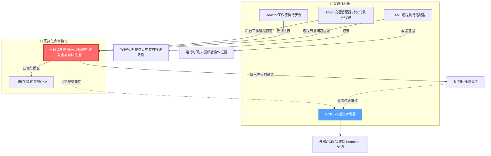
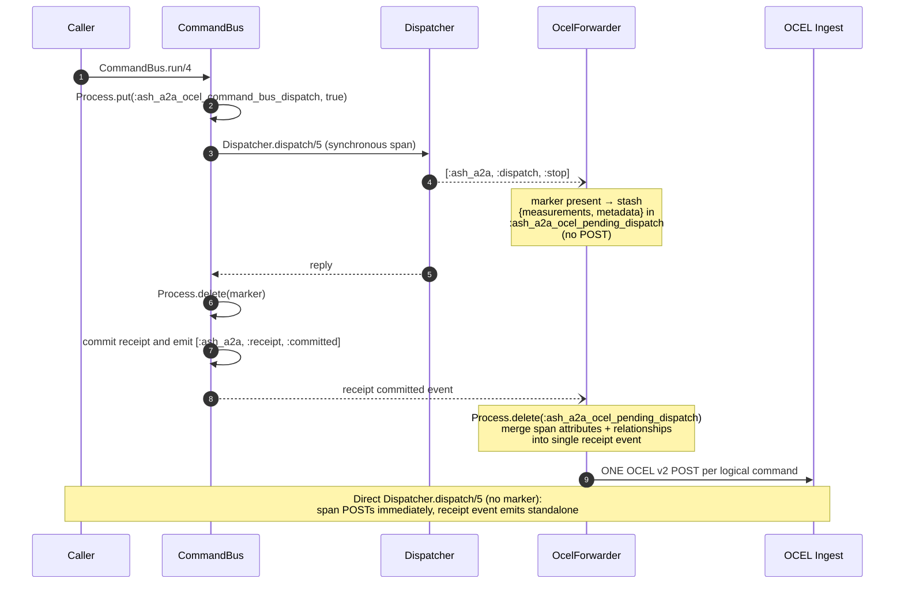
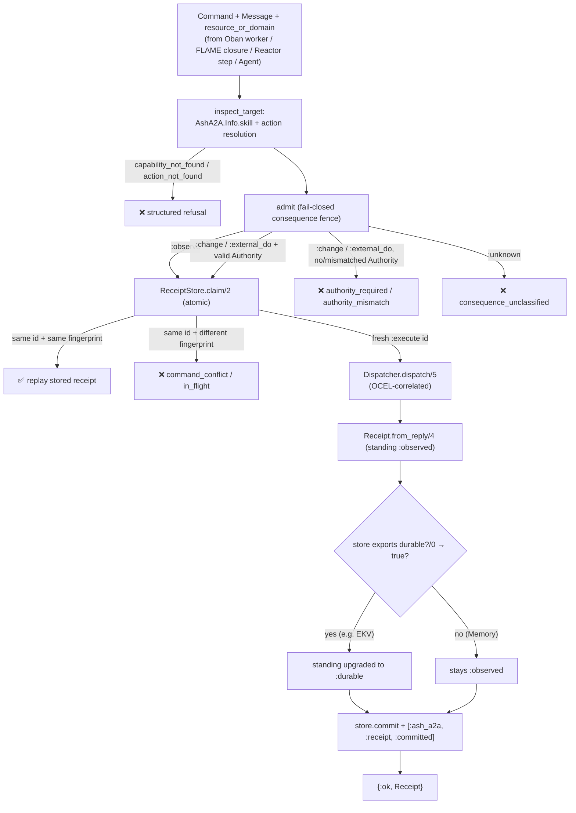
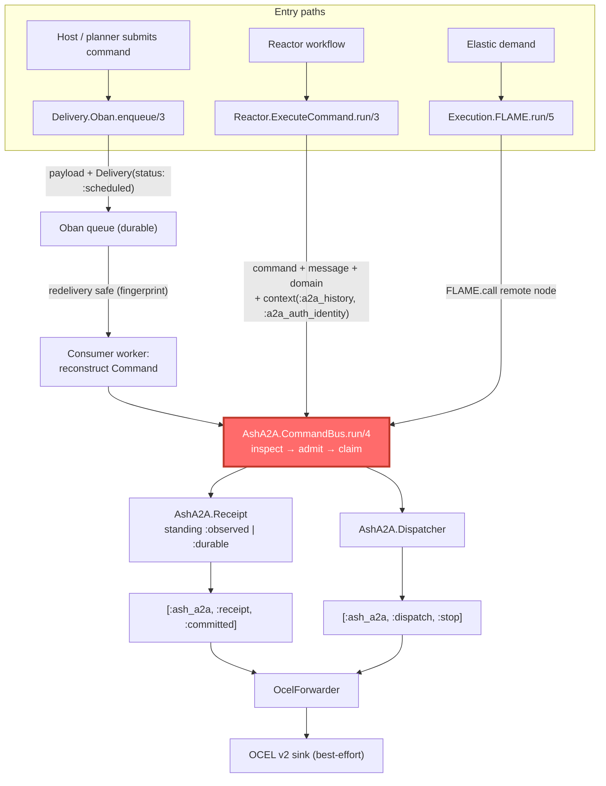
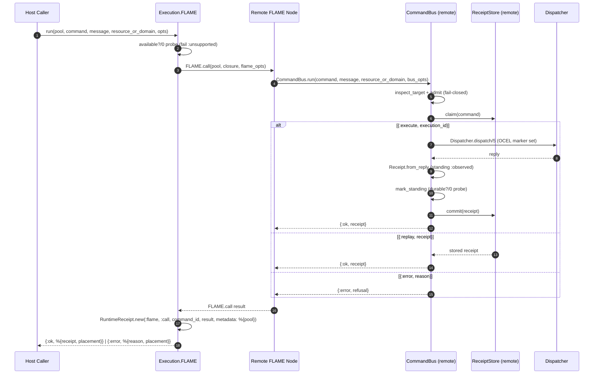

# Integration Adapters — Technical Documentation

**Project:** `ash_a2a` v26.9.14 — Spark DSL extension for the Ash Framework
**Domain:** Infrastructure — pluggable adapters bridging the receipted command pipeline to external runtimes
**Source files:** `lib/ash_a2a/delivery.ex`, `lib/ash_a2a/delivery/oban.ex`, `lib/ash_a2a/execution/flame.ex`, `lib/ash_a2a/reactor/execute_command.ex`, `lib/ash_a2a/telemetry/ocel_forwarder.ex`
**Analysis basis:** Direct code-level inspection of all adapter modules and their integration contracts (`command_bus.ex`, `runtime_receipt.ex`, `receipt.ex`, `application.ex`, `command.ex`, `authority.ex`, `semantic_projection.ex`, `mix.exs`)

---

## 1. Overview

The Integration Adapters domain is the infrastructure layer that connects the receipted command pipeline of AshA2A to the outside world. It provides four pluggable surfaces, each addressing a distinct operational concern:

| Adapter | Concern | Integration Style |
|---|---|---|
| `AshA2A.Delivery.Oban` | Durable, queued command **delivery** | Optional job-queue adapter + `AshA2A.Delivery` observation struct |
| `AshA2A.Execution.FLAME` | Elastic **off-node execution** | Optional FLAME placement adapter |
| `AshA2A.Reactor.ExecuteCommand` | **Workflow-step execution** | `Reactor.Step` behaviour implementation |
| `AshA2A.Telemetry.OcelForwarder` | **Observability egress** | `:telemetry` handlers exporting OCEL v2 events |

The defining architectural property of this domain is stated in every adapter's documentation and enforced in every code path:

> **Adapters coordinate and transport; they never execute independently.** Every consequence-bearing action — whether it arrives via an Oban job, runs on a remote FLAME node, or is a step inside a Reactor workflow — is routed through `AshA2A.CommandBus`, and therefore passes through the same capability, authority, and replay/receipt checks as a directly dispatched message.

The moduledocs codify this doctrine with strikingly specific refusals of power:

- **Oban** — *"an Oban job id is never promoted to A2A TaskID or to an execution receipt."*
- **FLAME** — *"FLAME chooses where the closure runs; it never gains independent capability, authority, or dispatch semantics."*
- **Reactor** — *"Reactor coordinates the step; it does not gain independent authority or call `AshA2A.Dispatcher` directly."*
- **OcelForwarder** — *"Both are observational only."* (forwarding never changes command behavior)

This is a textbook **ports-and-adapters** realization: the adapters are interchangeable infrastructure ports, and the `CommandBus` is the invariant-enforcing port through which all of them must pass.

---

## 2. Architectural Position and Invariants

### 2.1 Position in the System



### 2.2 Domain Invariants

**INV-A1 — The CommandBus is unbypassable.** All three execution-adjacent adapters (Oban worker contract, FLAME closure, Reactor step) terminate in `AshA2A.CommandBus.run/4`. No adapter invokes `AshA2A.Dispatcher` directly, and none invokes an Ash action itself.

**INV-A2 — Provider identities never masquerade as canonical evidence.** An Oban job id is stored only as `Delivery.provider_ref`; a FLAME placement is recorded only as a `RuntimeReceipt`. Neither id ever becomes an A2A TaskID, a command receipt, or a proof of execution.

**INV-A3 — Optional dependencies are capability-probed, not assumed.** Both `Delivery.Oban` and `Execution.FLAME` expose `available?/0`, implemented with the codebase-wide idiom `Code.ensure_loaded?/1` (+ `function_exported?/3` where a specific function is required). There are no hardcoded module allowlists; the same idiom is used by `CommandBus.mark_standing/2` when detecting durable receipt stores.

**INV-A4 — Delivery recording is decoupled from execution.** `Delivery.Oban.enqueue/3` records only that a command was *handed to* the queue (`status: :scheduled`). The actual execution happens later, in a background worker that must reconstruct the command and call the `CommandBus`.

**INV-A5 — Telemetry forwarding is best-effort and side-effect-free with respect to commands.** The OcelForwarder never raises into the emitting process; every failure mode (unconfigured URL, non-2xx response, transport error, unexpected exception) degrades to a `Logger.warning` and `:ok`.

---

## 3. Module Inventory

| Module | File | Type | Public Surface |
|---|---|---|---|
| `AshA2A.Delivery` | `lib/ash_a2a/delivery.ex` | Data contract | `new/3`, `task_key/1`, struct + `t/0` |
| `AshA2A.Delivery.Oban` | `lib/ash_a2a/delivery/oban.ex` | Delivery adapter | `available?/0`, `payload/1`, `enqueue/3` |
| `AshA2A.Execution.FLAME` | `lib/ash_a2a/execution/flame.ex` | Execution adapter | `available?/0`, `run/5` |
| `AshA2A.Reactor.ExecuteCommand` | `lib/ash_a2a/reactor/execute_command.ex` | Execution adapter | `run/3` (`Reactor.Step` callback) |
| `AshA2A.Telemetry.OcelForwarder` | `lib/ash_a2a/telemetry/ocel_forwarder.ex` | Telemetry adapter | `attach!/0`, `detach/0`, `handle_event/4` |

Supporting contracts consumed by the adapters (defined in other domains but part of the integration surface): `AshA2A.Command` (command envelope with content-derived fingerprint), `AshA2A.Authority` (verified authority evidence), `AshA2A.Identity` (typed machine identities), `AshA2A.Receipt` (execution receipt), `AshA2A.RuntimeReceipt` (provider-operation evidence), `AshA2A.SemanticProjection.ocel_event/1` (receipt → OCEL event projection).

---

## 4. Data Contracts

### 4.1 `AshA2A.Delivery` — Provider-Neutral Delivery Observation

`Delivery` is a struct recording that a command was **handed to an async delivery substrate**. Its moduledoc draws the critical boundary explicitly: *"A delivery is not an execution receipt and provider ids are not A2A task ids."*

| Field | Kind | Source | Notes |
|---|---|---|---|
| `delivery_id` | enforced | `Ash.UUIDv7.generate()` | Fresh per delivery; a new observation identity |
| `command_id` | enforced | `command.command_id` | Links back to the canonical `Command` |
| `provider` | enforced | atom (e.g. `:oban`) | Which substrate accepted the command |
| `status` | enforced | default `:accepted`; Oban uses `:scheduled` | **Delivery-substrate status**, not execution status |
| `recorded_at` | enforced | default `DateTime.utc_now()` | Observation time |
| `task_id` | optional | `command.task_id` | Canonical task identity, if the command carries one |
| `provider_ref` | optional | e.g. Oban job `id` | Provider-native reference — never promoted further |
| `metadata` | optional | default `%{}` | e.g. `%{worker: WorkerModule}` for Oban |

Two helpers complete the contract:

- `new/3` — constructs a delivery for a given provider atom and `Command`, normalizing `metadata` through `Map.new/1`.
- `task_key/1` — returns the external string form of the command's task identity (`Identity.external/1`) or `nil` when the command carries no `task_id`. This gives consumers a stable cross-reference key *into the canonical task namespace* without ever letting a provider id substitute for one.

**Key distinction:** `Delivery.status` values (`:accepted`, `:scheduled`) describe queue acceptance. Execution outcomes live exclusively on `AshA2A.Receipt.status` (`:completed`, `:input_required`, `:stream_opened`, `:failed`, `:unknown`).

### 4.2 `AshA2A.RuntimeReceipt` — Provider Operation Evidence

`RuntimeReceipt` records evidence of a consequence-bearing *runtime/provider* operation — for this domain, a FLAME placement. It is deliberately separated from the command-domain `Receipt` (which gates execution replay):

- Fields: `receipt_id` (runtime-namespaced identity over a UUIDv7), `provider` (`:flame`), `operation` (`:call`), `subject` (the command id, externalized if it is an `Identity`), `status`, `result`, `recorded_at`, `standing`, `metadata`.
- `status` is derived from the operation result: `:ok` / `{:ok, _}` → `:completed`; `{:error, _}` → `:failed`; anything else → `:observed`.
- `standing` is **always `:observed`**. Per its moduledoc: runtime receipts *"do not confer Ash domain standing, A2A task completion, command execution, or authority."*
- PID-bearing results are summarized as `inspect(pid)` strings so the evidence remains serializable and leak-free.

### 4.3 The Oban Job Payload

`Delivery.Oban.payload/1` serializes a `Command` into a flat map with **string keys** and externalized identities — precisely the data a worker needs to *reconstruct* the command:

| Key | Content |
|---|---|
| `"command_id"`, `"agent_id"`, `"principal_id"`, `"task_id"` | Externalized `Identity` strings (`task_id` → `nil` when absent) |
| `"capability_id"` | Canonical capability id (binary) |
| `"fingerprint"` | The command's content-derived SHA-256 fingerprint |
| `"input"` | Admitted command input |
| `"authority_token_id"` | Externalized `authority.token_id`, or `nil` when no authority is bound |
| `"metadata"` | Command metadata map |

Because the fingerprint is derived **only from semantic command content** (agent, principal, task, capability, input, authority token, semantic subject — never from transport timestamps), a payload that round-trips through a durable queue preserves the exact intent evidence that `CommandBus` replay detection relies on.

---

## 5. Delivery Adapter: `AshA2A.Delivery.Oban`

### 5.1 Contract

The moduledoc fixes the adapter's scope in one sentence: *"Queue insertion records delivery only. The Oban worker that eventually receives this payload must reconstruct an admitted command and call `AshA2A.CommandBus`."*

### 5.2 API

**`available?/0` → `boolean()`**
Returns true only when both `Oban` and `Oban.Job` are loadable via `Code.ensure_loaded?/1`. This gates all adapter behavior: calling `enqueue/3` on a host without the dependency deterministically returns `{:error, {:unsupported, :oban}}` rather than crashing on a missing module.

**`payload/1` → `map()`**
Pure serialization of a `Command` per the table in §4.3. It is exposed publicly so the producing side and the consuming worker can share one canonical payload shape.

**`enqueue/3` → `{:ok, Delivery.t()} | {:error, term()}`**
Accepts a worker module (atom), a `Command`, and options:

1. Probes `available?/0`; fails closed with `{:error, {:unsupported, :oban}}` when Oban is absent.
2. Builds an `Oban.Job` changeset from `payload(command)` merged with `:job_opts` (the worker is force-inserted into the job opts).
3. Inserts via `Oban.insert/1`, or `Oban.insert/2` when an `:name` opt names a specific Oban instance — supporting hosts running multiple Oban supervisors.
4. On `{:ok, job}`, returns `Delivery.new(:oban, command, provider_ref: job.id, status: :scheduled, metadata: %{worker: worker})` — a delivery observation whose `provider_ref` is the Oban job id, held strictly as a provider reference.
5. On `{:error, reason}`, propagates the insertion failure unchanged.

Notably, the adapter calls Oban **dynamically through `apply/3`** (`apply(Oban.Job, :new, …)`, `apply(Oban, :insert, …)`) rather than through direct remote calls, keeping the module loadable and analyzable even in environments where the optional dependency is not present.

### 5.3 Worker Obligations (Derived from the Adapter's Doctrine)

The `enqueue/3` + `payload/1` pair defines a split responsibility:

| Party | Responsibility | Explicitly forbidden |
|---|---|---|
| `Delivery.Oban` | Serialize the command; record `Delivery` observation with `provider_ref` = job id, `status: :scheduled` | Claim execution happened; treat the job id as a TaskID or receipt |
| Consumer worker | Deserialize the payload, reconstruct the command (identities, fingerprint, authority token reference), and submit it to `AshA2A.CommandBus.run/4` | Execute the Ash action directly; bypass admission/replay checks |

This structure is what makes retries safe end-to-end: because the payload carries the original fingerprint and authority token reference, a redelivered job resolves through the same `ReceiptStore.claim/2` fingerprint comparison as any other retry — same fingerprint replays the stored receipt, a conflicting fingerprint is refused.

---

## 6. Execution Adapter: `AshA2A.Execution.FLAME`

### 6.1 Contract

FLAME provides elastic placement: the closure runs on a remote node from a configured pool. The adapter's doctrine: *"FLAME chooses where the closure runs; it never gains independent capability, authority, or dispatch semantics. The remotely placed closure calls `AshA2A.CommandBus`, so the same admission/replay/receipt fence applies on every node. Placement itself is also represented by `AshA2A.RuntimeReceipt`."*

### 6.2 API

**`available?/0` → `boolean()`**
Typed probe: `Code.ensure_loaded?(FLAME)` **and** `function_exported?(FLAME, :call, 3)` — verifying not just the module's presence but the specific entry point the adapter needs.

**`run/5`** — `run(pool, %Command{}, %A2A.Message{}, resource_or_domain, opts \\ [])`

The complete placement lifecycle is wrapped in one function:

1. **Gate:** when FLAME is unavailable, returns `{:error, {:unsupported, :flame}}` — no partial work.
2. **Options:** extracts `:flame_opts` (passed to `FLAME.call/3`) and `:command_bus_opts` (threaded into the remote `CommandBus.run/4` call, e.g. `:store`, `:store_opts`, `:history`, `:auth_identity`).
3. **Placement:** invokes `FLAME.call/3` with a closure that executes `AshA2A.CommandBus.run(command, message, resource_or_domain, bus_opts)` **on the remote node**. This is the invariant-critical step: the fence travels with the closure.
4. **Exception containment:** the `FLAME.call` is wrapped in `try/rescue/catch`, mapping:
   - raised exceptions → `{:error, {:exception, exception.__struct__, Exception.message(exception)}}`
   - thrown values → `{:error, {kind, reason}}`
5. **Placement evidence:** regardless of outcome, constructs `RuntimeReceipt.new(:flame, :call, command.command_id, result, metadata: %{pool: inspect(pool)})` — the placement is *itself* recorded as observed provider evidence, but this receipt never confers authority.
6. **Result normalization:**

| Remote outcome | Returned shape |
|---|---|
| `{:ok, %Receipt{}}` | `{:ok, %{receipt: receipt, placement: placement}}` |
| `{:error, reason}` | `{:error, %{reason: reason, placement: placement}}` |
| anything else | `{:error, %{reason: {:unexpected_flame_result, other}, placement: placement}}` |

The success tuple is deliberately widened to a map pairing the **canonical execution receipt** with the **placement receipt**, keeping the two evidence kinds distinct — exactly the command-evidence vs. lifecycle-evidence split the codebase maintains elsewhere.

### 6.3 Operational Consequence

Because the fence runs on the remote node, the `ReceiptStore` that performs the atomic claim/commit is the store resolved on **that node** (`CommandBus.default_store/0` unless `:store` is passed in `:command_bus_opts`). In a standard deployment the FLAME pool runs the same release and thus the same configured store; hosts with heterogeneous topologies must be aware that receipt durability is a property of the executing node's store.

---

## 7. Execution Adapter: `AshA2A.Reactor.ExecuteCommand`

### 7.1 Contract

A `Reactor.Step` that lets AshA2A command execution participate in Reactor workflows. Doctrine: *"Reactor coordinates the step; it does not gain independent authority or call `AshA2A.Dispatcher` directly. All command execution remains routed through `AshA2A.CommandBus`."*

### 7.2 Implementation

The module is a thin, strictly delegating step:

```elixir
use Reactor.Step

@impl true
def run(arguments, context, options)
```

**Step arguments** (all required, fetched with `Map.fetch!/2` so a malformed composition fails loudly):

| Argument | Content |
|---|---|
| `:command` | The `AshA2A.Command` to execute |
| `:message` | The originating `A2A.Message` |
| `:resource_or_domain` | Target resource or domain module |

**Options:** `:command_bus_opts` — forwarded verbatim to `CommandBus.run/4`.

**Context bridging:** the step reads two well-known Reactor context keys and merges them into the bus options with `Keyword.put_new/3`:

- `context[:a2a_history]` → `:history` (multi-turn conversation context; defaults to `[]`)
- `context[:a2a_auth_identity]` → `:auth_identity` (the transport-verified identity that flows through to `ContextResolver` at the trust boundary)

Using `put_new` means explicit values already present in `:command_bus_opts` take precedence; context values fill the gaps. This is the mechanism by which verified auth identity reaches the `CommandBus` in a workflow context — through the step's context plumbing, **never** through message metadata.

**Result passthrough:** `{:ok, receipt}` and `{:error, reason}` from the bus are returned unchanged, preserving Reactor's native step semantics (including its retry/compensation interplay, which host workflows layer on top).

The design keeps the step under 30 lines: Reactor supplies orchestration (composition, undo, retries at the workflow layer), while the `CommandBus` retains sole execution authority — orchestration retry, if configured, is itself safe because the bus's fingerprint-claim semantics collapse identical re-executions into replays.

---

## 8. Telemetry Forwarder: `AshA2A.Telemetry.OcelForwarder`

### 8.1 Purpose

Best-effort export of two telemetry streams to an external OCEL (Object-Centric Event Log) v2 ingest sink:

- `[:ash_a2a, :dispatch, :stop]` — raw dispatcher execution spans (preserves existing low-level visibility)
- `[:ash_a2a, :receipt, :committed]` — committed command receipts from the `CommandBus` (adds replay/identity/standing evidence)

Per the moduledoc, *"Both are observational only"* — forwarding never alters command behavior.

### 8.2 Lifecycle

**`attach!/0`** registers both handlers under unique, module-namespaced ids (`{__MODULE__, :dispatch_stop}`, `{__MODULE__, :receipt_committed}`). Attachment is **idempotent**: `{:error, :already_exists}` is normalized to `:ok`. Crucially, `AshA2A.Application` calls `attach!/0` at startup, making the forwarder *live-by-default*: a host merely configures an ingest URL and forwarding begins — no explicit attach call required. When no URL is configured, every handler short-circuits to `:ok`, making the always-on attachment a genuine no-op cost.

**`detach/0`** detaches both handlers; returns `:ok` if either detached, `{:error, :not_found}` otherwise.

### 8.3 Dispatch/Receipt Event Coalescing

A single CommandBus-routed command would naively produce **two** OCEL events (the internal dispatch span + the receipt commit). The forwarder eliminates the duplicate with a process-dictionary handshake, documented at length in both `ocel_forwarder.ex` and `command_bus.ex`:



Correctness properties of this mechanism, as documented in code:

- The marker is set/removed with `try/after` in `CommandBus`, so it never leaks past the dispatch call.
- The pending span is consumed with `Process.delete/1` — read-and-clear semantics, *"never left stale across calls."*
- The merge reuses the same `dispatch_attributes/2` and `relationships/1` helpers a direct dispatch event uses, so **no evidence is lost** (duration, reply type, object relationships) — only the duplicate POST is eliminated.
- The plain process-dictionary flag (rather than a signature change to `Dispatcher.dispatch/5`) is safe because `:telemetry.span/3` executes synchronously in the calling process and `run/4` is not reentrant — a documented constraint to revisit if either assumption changes.

### 8.4 Event Shapes

**Receipt event** — built from `AshA2A.SemanticProjection.ocel_event/1`:

```json
{
  "event_id":   "<receipt_id>",
  "event_type": "ash_a2a.receipt.<status>",
  "event_time": "<receipt.recorded_at ISO8601>",
  "attributes": {
    "command_id": "...", "execution_id": "...", "task_id": "...",
    "agent_id": "...", "principal_id": "...", "capability_id": "...",
    "fingerprint": "...", "consequence": "...", "status": "...",
    "standing": "...", "replayed": true|false
  }
}
```

**Dispatch event** — `event_type` = `"ash_a2a.dispatch.<ResourceShortName>.<skill>"`, with attributes `skill_name`, `resource_or_domain`, `reply_type`, `duration_native`, plus `stage`/`error` when the span carries a failure stage.

**Relationships** — real E2O relationships only: a single `{"qualifier" => "acted_on", "object_id" => ...}` entry **exactly when** the dispatcher resolved a real object identity (a persisted Ash record's primary key, or, for a generic `:action` skill, a real `plan_name` argument naming a stateful instance). Empty list — *"never a fabricated id"* — when no real object exists. Field names (`"qualifier"`/`"object_id"`, snake_case) match the beam4pm `BeamPM.OcelIngest.Router` wire contract precisely.

### 8.5 Egress Semantics

`post_event/2` issues `Req.post(url <> "/ocel/events", json: %{"events" => [event]}, receive_timeout: …)`:

| Condition | Behavior |
|---|---|
| `:ocel_ingest_url` unset | Handler short-circuits to `:ok` before any work |
| 2xx response | `:ok` |
| Non-2xx response | `Logger.warning` with status and body; `:ok` |
| Transport error | `Logger.warning` with reason; `:ok` |
| Unexpected exception | Rescued, `Logger.warning`; `:ok` |

This is the essence of **best-effort**: telemetry can never fail the command that produced the evidence. The HTTP client is `Req`, promoted to a direct dependency in `mix.exs` precisely because this module calls it explicitly.

---

## 9. The CommandBus Funnel — Shared Execution Semantics

All execution-adjacent adapters converge on `AshA2A.CommandBus.run/4`, whose pipeline guarantees uniform treatment regardless of ingress:



Key contract points relevant to adapter authors:

1. **Consequence is compile-time capability truth** (`skill.consequence`), never recomputed from `action.type`. Unclassified generic `:action` skills fail closed with `:consequence_unclassified`.
2. **Authority is verified, not manufactured.** `Authority.admits?/2` checks subject match, capability match, and expiry. For transport-verified identities, `Authority.from_verified_identity/2` mints a *deterministic* token id (SHA-256 of subject+capability) so that fingerprints stay stable across retries — a replay-detection regression fix documented in `authority.ex`.
3. **Replay is the safety net for every adapter's retry story.** Oban redeliveries, Reactor step retries, and FLAME re-invocations that carry identical semantic content resolve to the stored receipt — duplicate Ash executions are structurally impossible, not merely discouraged.
4. **The store seam is injectable.** `run/4` accepts `:store` and `:store_opts`, enabling in-memory testing without mocks; durability is detected by capability probing (`durable?/0`), never by allowlist.

---

## 10. Configuration and Dependencies

### 10.1 Application Environment

| Key | Default | Consumed By | Effect |
|---|---|---|---|
| `:ash_a2a, :ocel_ingest_url` | `nil` (forwarding disabled) | `OcelForwarder` | Base URL of the OCEL ingest sink; events POST to `<url>/ocel/events`. `nil` short-circuits all handlers to `:ok`. |
| `:ash_a2a, :ocel_ingest_timeout_ms` | `2_000` | `OcelForwarder` | Per-POST receive timeout. |
| `:ash_a2a, :receipt_store` | `AshA2A.ReceiptStore.Memory` | `CommandBus` (via `default_store/0`) | Which receipt store adapters' commands resolve against. `Ekv` commits yield `standing: :durable` receipts. |
| `:ash_a2a, :receipt_store_ekv_opts` | `[]` → name/data_dir/cluster_size defaults | `Application.receipt_store_children/0` | EKV instance options; default `data_dir` lives under the OS tmp dir (documented as unsuitable for production durability guarantees). |
| `:ash_a2a, :agents` | `[]` | `Application` | Agents supervised under `A2A.AgentSupervisor`. |

`AshA2A.Application.start/2` attaches the OcelForwarder idempotently at boot (see §8.2) and wires the configured receipt store's supervision automatically (Memory's GenServer, or an EKV instance with defaulted options; custom stores own their own lifecycle).

### 10.2 Optional Dependencies

| Dependency | Version | Adapter | Gating Probe |
|---|---|---|---|
| `oban` | `~> 2.24` | `Delivery.Oban` | `Code.ensure_loaded?(Oban)` and `Code.ensure_loaded?(Oban.Job)` |
| `flame` | `~> 0.5` | `Execution.FLAME` | `Code.ensure_loaded?(FLAME)` and `function_exported?(FLAME, :call, 3)` |
| `req` | `~> 0.5` | `OcelForwarder` | Direct dependency (explicit `Req.post/2` usage) |
| `ekv` | `~> 0.4` | (receipt durability, indirectly) | `durable?/0` capability probe on the store module |

Per `mix.exs`, the adapters "remain authority-free regardless — they never gain independent DO capability, only observed provider evidence via RuntimeReceipt," and "queue acceptance is not an execution receipt; a state transition is not a DO — both still funnel any real consequence through `AshA2A.CommandBus`."

---

## 11. End-to-End Flows

### 11.1 Adapter Convergence (Component View)



### 11.2 Detailed Sequence: FLAME-Placed Receipted Execution



---

## 12. Failure Modes and Reliability Posture

| Adapter | Failure Condition | Behavior | Rationale |
|---|---|---|---|
| `Delivery.Oban` | Oban not loaded | `{:error, {:unsupported, :oban}}` from `enqueue/3` | Fail closed; never assume the dependency |
| `Delivery.Oban` | Queue insertion fails | `{:error, reason}` propagated from Oban | Delivery recording reflects reality — nothing is claimed as delivered |
| `Execution.FLAME` | FLAME not loaded / `:call/3` absent | `{:error, {:unsupported, :flame}}` before any placement | Fail closed before side effects |
| `Execution.FLAME` | Raised exception in placement | `{:error, {:exception, module, message}}` + placement receipt (`:failed`) | Exceptions contained; placement still evidenced |
| `Execution.FLAME` | Thrown value | `{:error, {kind, reason}}` + placement receipt | Same containment for throws |
| `Execution.FLAME` | Unexpected result shape | `{:error, %{reason: {:unexpected_flame_result, other}, placement: …}}` | Refuse to interpret unknown results as success |
| `Reactor.ExecuteCommand` | Missing step argument | `Map.fetch!` raises `KeyError` | Malformed composition fails loudly at the step boundary |
| `OcelForwarder` | No ingest URL | Silent `:ok` short-circuit | Zero-cost when unconfigured |
| `OcelForwarder` | Non-2xx / transport error / exception | `Logger.warning`; `:ok` | Telemetry must never fail the emitting command |

A notable reliability property spans the execution adapters: because the `CommandBus` claim is keyed on the content-derived fingerprint, **retry storms are idempotent by construction**. A redelivered Oban job, a retried Reactor step, or a re-run FLAME closure that carries identical semantic content receives the stored receipt (`{:replay, …}`) rather than re-executing the Ash action; only a genuine conflict (same command id, different fingerprint) is refused.

---

## 13. Design Rationale

1. **Authority-free by construction.** Adapters are given exactly the power their name implies — *to adapt* — and nothing more. Every moduledoc denies the adapter independent capability/authority/dispatch semantics, and the code matches: there is no code path from any adapter to an Ash action that does not pass through `CommandBus.admit/2`. This converts a documentation-level security claim into a structural impossibility.

2. **Two receipt kinds, deliberately separated.** `Receipt` (command evidence: gates replay, carries standing `:observed | :durable`) and `RuntimeReceipt` (provider evidence: always `:observed`, never confers authority) are kept in distinct namespaces. The FLAME adapter's return shape — `%{receipt:, placement:}` — makes the separation visible at every call site, preventing conflation of "FLAME ran the closure" with "the command executed."

3. **Delivery ≠ execution.** By recording delivery as a separate `Delivery` observation (`:accepted`/`:scheduled`) and requiring the worker to reconstruct and resubmit the command, the design avoids the classic queue-adapter trap of treating enqueue success as execution success. The queue's role is durability of *intent*; the receipt store's role is durability of *evidence*.

4. **Capability probing over configuration.** `available?/0` probes and `durable?/0` probing avoid two failure classes: crashing on absent optional dependencies, and mis-marking receipt durability based on a hardcoded module list. Behavior follows from what the runtime can actually do.

5. **Observability without observability-induced failures.** The OcelForwarder's every failure path terminates in a warning log; the CommandBus/fowarder coalescing handshake removes duplicate evidence POSTs without dropping any span data; and the events carry only *real* object relationships — the forwarder would rather emit `[]` than fabricate an id, preserving the log's forensic value.

6. **Governance closure.** The adapters' layering invariants ("all adapters funnel through CommandBus") are among the rules checked by the project's mechanized governance (`mix ash_a2a.verify_architecture`), so the invariant that matters most in this domain is not merely conventional — it is continuously verified.

---

## 14. Extensibility Guidance

Teams adding a new adapter should preserve the domain's contract shape:

1. **Probe first.** Expose `available?/0` using `Code.ensure_loaded?/1` (+ `function_exported?/3` for the specific entry point), and fail with `{:error, {:unsupported, provider}}` before any side effect.
2. **Record observations, never outcomes.** Emit a `Delivery` (for handoff to a substrate) or a `RuntimeReceipt` (for provider operations). Do not mint receipts, task ids, or authority.
3. **Terminate in the CommandBus.** Route all consequence-bearing work through `AshA2A.CommandBus.run/4`, threading `:command_bus_opts` for store/history/auth-identity as the existing adapters do, and relying on fingerprint claims for retry idempotency.
4. **Stay observational on the telemetry side.** New forwarders should follow the best-effort posture: idempotent attach, short-circuit when unconfigured, warn-and-continue on every error, and never fabricate relationship targets.
5. **Keep identities in their lanes.** Provider refs stay provider refs (`provider_ref`); canonical identities (`command_id`, `task_id`, `execution_id`) come only from the framework's `Identity` types — the single most repeated rule in this domain's code comments, and the one that keeps audit trails trustworthy across every transport an adapter may introduce.