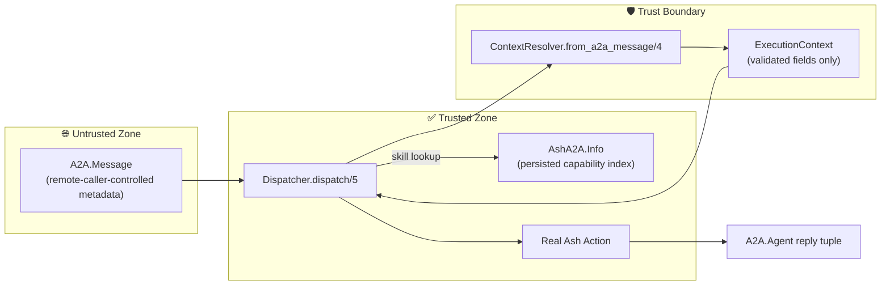
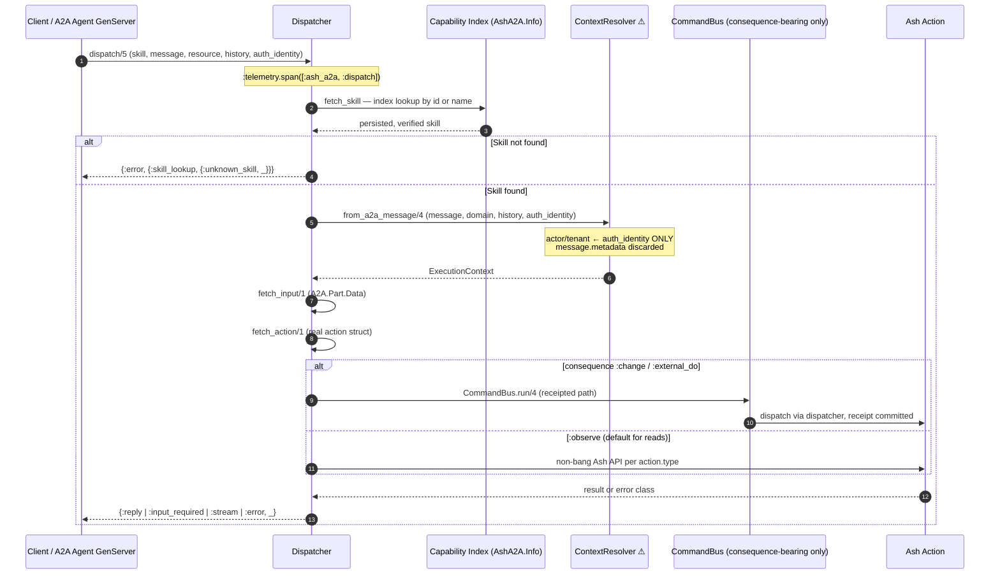

The documentation below is grounded in direct source inspection of `dispatcher.ex`, `context_resolver.ex`, `execution_context.ex`, `identity.ex`, `authority.ex`, and the adjacent modules (`agent.ex`, `command_bus.ex`, `command.ex`, `skill.ex`, `info.ex`, `metadata_key.ex`) that the domain interacts with.

---

# Message Dispatch & Trust Boundary

**Domain:** `ash_a2a` — Core Runtime Domain
**Source files:** `lib/ash_a2a/dispatcher.ex`, `lib/ash_a2a/context_resolver.ex`, `lib/ash_a2a/execution_context.ex`, `lib/ash_a2a/identity.ex`, `lib/ash_a2a/authority.ex`
**Domain importance:** 9.5 / 10 · **Complexity:** 8.0 / 10

---

## 1. Overview and Architectural Role

The **Message Dispatch & Trust Boundary** domain is the runtime heart of `ash_a2a`. It implements the pipeline that converts an inbound `A2A.Message` — arbitrary, unauthenticated, remote-caller-controlled wire input — into a real Ash framework action invocation, while enforcing two load-bearing architectural invariants (PRD/ARD §3.2 and §3.5):

1. **Advertised = Executed.** Dispatchable skills are resolved *exclusively* through the persisted, verified capability index via `AshA2A.Info`. Raw DSL entities are never consulted, so a skill this domain can dispatch is structurally guaranteed to be one the published `AgentCard` advertises. Divergence between advertisement and execution is impossible by construction, not merely tested against.

2. **A named trust boundary sits between the wire and Ash.** Raw A2A message metadata never reaches an Ash call directly. Every dispatch path passes through `AshA2A.ContextResolver.from_a2a_message/4` — the mandatory passage point — which extracts exactly the fields Ash actions accept (`actor`, `tenant`, `context`, `domain`, `history`), validates their provenance, and discards everything else.

The domain's downstream consumer is the **Receipted Command Execution** domain: consequence-bearing dispatches (`:change` / `:external_do`) are routed through `AshA2A.CommandBus`, which cannot be bypassed and whose authority checks are built on this domain's `Identity` and `Authority` models.



---

## 2. Module Inventory

| Module | File | Responsibility |
|---|---|---|
| `AshA2A.Dispatcher` | `lib/ash_a2a/dispatcher.ex` | Entry engine: staged dispatch pipeline, skill lookup, Ash invocation, reply shaping, telemetry |
| `AshA2A.ContextResolver` | `lib/ash_a2a/context_resolver.ex` | **The trust boundary.** Converts raw message metadata into a validated `ExecutionContext`; refuses raw passthrough |
| `AshA2A.ExecutionContext` | `lib/ash_a2a/execution_context.ex` | Value struct carrying exactly the fields Ash actions accept, post-boundary |
| `AshA2A.Identity` | `lib/ash_a2a/identity.ex` | Tagged, deliberately non-interchangeable machine identities (`:principal`, `:agent`, `:task`, `:command`, `:execution`, `:runtime`) |
| `AshA2A.Authority` | `lib/ash_a2a/authority.ex` | Explicit authority evidence bound to one principal and one capability; consumed by `CommandBus.admit/2` |

Supporting collaborator: `AshA2A.MetadataKey` (`lib/ash_a2a/metadata_key.ex`) — the shared atom-then-string map lookup used consistently across all metadata reads in the domain.

---

## 3. The Dispatch Pipeline

`AshA2A.Dispatcher.dispatch/5` is the public entry point:

```elixir
dispatch(skill_name, %A2A.Message{} = a2a_message, resource_or_domain,
         history \\ [], auth_identity \\ nil) :: reply()
```

where `reply()` matches `A2A.Agent`'s wire contract exactly:

```elixir
@type reply ::
        {:reply, [A2A.Part.t()]}
        | {:input_required, [A2A.Part.t()]}
        | {:stream, Enumerable.t()}
        | {:error, term()}
```

The entire call is wrapped in `:telemetry.span([:ash_a2a, :dispatch], ...)`, which is synchronous in the calling process and produces start/stop events consumed by the OCEL telemetry forwarder.

### 3.1 Staged Execution

`do_dispatch/5` runs the pipeline as a `with` chain, with each failure annotated by its originating stage via `tag_stage/2` (errors surface as `{:error, {stage, reason}}` without changing the reason term existing callers match on):

| Stage | Operation | Failure shape |
|---|---|---|
| `:skill_lookup` | Resolve the skill **only** through `AshA2A.Info.capability_index/1` | `{:error, {:skill_lookup, {:unknown_skill, name}}}` |
| *(context)* | `ContextResolver.from_a2a_message/4` builds the `ExecutionContext` | message rejected rather than passed through |
| *(input)* | `fetch_input/1` extracts the `A2A.Part.Data` payload (empty map for text-only messages) | — |
| `:action_resolution` | `Ash.Resource.Info.action/2` resolves the bare action-name atom to the real `%Ash.Resource.Actions.*{}` struct | `{:error, {:action_resolution, {:unknown_action, resource, action}}}` |
| `:execution` | `run_skill/4` invokes the mapped action and shapes the result | action-type-specific `{:error, reason}` |



### 3.2 Skill Resolution: The Persisted Index Only

`fetch_skill/2` reads the compiled index (`AshA2A.Info.capability_index/1`, itself derived from `Ash.Resource.Info.public_actions/1` plus validated residual overrides) and matches each entry on **either** the canonical A2A wire `id` (`"{inspect(resource)}.#{action}"`) or its residual display `name`. Two documented design decisions live here:

- **No atom conversion.** An earlier implementation converted string skill names with `String.to_existing_atom/1`. That conversion is *fail-open*: it only succeeds if some unrelated code path has already interned the atom, so a real, compiled skill addressed by its wire string could nondeterministically raise `ArgumentError` depending on VM atom-table state. The fix matches the string directly against the compiled entries and fails closed (`{:unknown_skill, _}`) for non-string/non-atom selectors instead of ever raising.
- **Name *or* id matching** was deliberately aligned with `AshA2A.Info.skill/2` (the lookup path `CommandBus` uses), eliminating a real selector-matching inconsistency between the two canonical lookup paths. Note the failure mode is always fail-closed — an unmatched selector can never admit an undispatchable skill.

Skill-name selection upstream (`AshA2A.Agent.resolve_skill_name/2`) reads `metadata[:skill]` — attacker-controlled — but because resolution happens against the verified index, a spoofed name can only ever produce a typed refusal, never an unintended execution.

---

## 4. The Trust Boundary: `ContextResolver`

`AshA2A.ContextResolver.from_a2a_message/4` is the single sanctioned conversion point between the wire and the domain:

```elixir
from_a2a_message(%A2A.Message{} = message, domain, history \\ [], auth_identity \\ nil)
  :: ExecutionContext.t()
```

### 4.1 Threat Model

The module's design is a direct response to a concrete, previously-real vulnerability class. `A2A.Message.metadata` is parsed straight from the caller's JSON-RPC request body: an arbitrary object with no schema and nothing tying its keys to who is actually sending the message. Ash policy authorizers (`actor_attribute_equals`, `relates_to_actor_via`) and multitenancy strategies gate on exactly two fields — `actor` and `tenant`. Treating message metadata as their source is a full **actor-impersonation / tenant-isolation bypass** (a remote client can freely assert `metadata["actor"] = %{"role" => "admin"}`).

Crucially, the verified identity lives somewhere else *structurally*: `A2A.Plug.Auth` verifies real credentials and stores the result in `conn.private[:a2a][:auth]`, which `A2A.Plug` merges into the **call-level metadata opt** as `"a2a.auth"`. That opt flows through `GenServer.call` → `A2A.Agent.Runtime.process_message/5` → `Task.new(metadata:)` → `context().metadata` — the **second argument** of `handle_message/2`, never the inbound `A2A.Message`'s own `:metadata` field, which the plug never touches. A lookup keyed on `message.metadata["a2a.auth"]` could never observe the real identity (it structurally is not there) and would merely invite the same spoofing one key over.

Therefore the verified identity enters as an explicit, out-of-band `auth_identity` argument, sourced by the generated agent from `A2A.Agent.context().metadata["a2a.auth"][:identity]` via `AshA2A.Agent.verified_auth_identity/1`.

### 4.2 Field Provenance Contract

| Field | Source | Never sourced from |
|---|---|---|
| `:actor` | The explicit `auth_identity` argument, verbatim (it *is* the already-verified identity map produced by the caller's `A2A.Plug.Auth` verify callback) | `message.metadata` |
| `:tenant` | `auth_identity[:tenant]` (or string-keyed form) when `auth_identity` is a map; `nil` otherwise | `message.metadata` — no fallback to caller-supplied `metadata[:tenant]` |
| `:context` | `metadata[:context]` (atom-or-string via `MetadataKey`), defaulting to `%{}` | — (intentionally still from metadata; see §4.4) |
| `:domain` | The dispatcher's own second argument — the caller that already knows which Ash domain owns the skill | `message.metadata` (a message may not name its own domain) |
| `:history` | The dispatcher's third argument — the `A2A.Agent.context().history` transcript the runtime builds | `message.metadata` (history cannot be fabricated by the caller) |

### 4.3 Fail-Closed Default

Both `history` and `auth_identity` default to `nil`/`[]`. An unauthenticated dispatch path — a caller that never wired `A2A.Plug.Auth`, or a direct unit-test call — resolves both `actor` and `tenant` to `nil` rather than silently trusting any value read from the message. There is no code path by which an unverified value becomes an actor or tenant claim.

### 4.4 Deliberate Exception: `:context`

The `:context` key passes through from raw metadata *by design*, mirroring `AshAi.Tool.Execution.build_opts/2`. It is not privilege-bearing: it never determines authorization or row visibility on its own. This carve-out is documented and bounded — any future privilege-bearing context key must be moved behind the auth gate (tracked as risk R-5 in the architecture risk register).

---

## 5. The Execution Context Model

`AshA2A.ExecutionContext` is the typed product of the trust boundary:

```elixir
%AshA2A.ExecutionContext{
  actor: term(),                    # verified identity, or nil
  tenant: term(),                   # verified tenant claim, or nil
  context: map(),                   # non-privilege-bearing pass-through, default %{}
  domain: module(),                 # dispatcher-supplied, never message-derived
  history: [A2A.Message.t()]        # prior-turn transcript, default []
}
```

Its moduledoc states the construction rule flatly: it is *built exclusively by `ContextResolver.from_a2a_message/3`* — never constructed directly from raw `A2A.Message` metadata at a call site. Downstream, `Dispatcher.build_opts/2` projects it into the Ash call opts:

```elixir
[
  domain: Map.get(skill, :domain) || exec_context.domain,
  actor: exec_context.actor,
  tenant: exec_context.tenant,
  context: Map.put(exec_context.context || %{}, :a2a_history, exec_context.history || [])
]
```

Two details matter here:

- **Domain resolution prefers capability truth**: the skill's own persisted `domain` field (resolved at compile time via `Ash.Resource.Info.domain/1`), falling back to the dispatcher's `resource_or_domain` argument only for domain-less resources.
- **Multi-turn history is never discarded.** The prior-turn transcript is folded into the Ash `context:` opt under `:a2a_history`, so resource actions can read prior turns via `changeset.context[:a2a_history]` / `query.context[:a2a_history]` / `input.context[:a2a_history]` — the second dispatch of a continued task no longer looks identical to a fresh one.

Ash receives *exactly* the validated fields and nothing else; the shape mirrors `AshAi.Tool.Execution.build_opts/2`, sourced from the resolved context rather than a raw map.

---

## 6. Identity and Authority Models

### 6.1 `AshA2A.Identity` — Non-Interchangeable Machine Identities

Identity kinds are deliberately tagged and disjoint: `@kinds [:principal, :agent, :task, :command, :execution, :runtime]`. The struct enforces both keys at construction; `new/2` raises `ArgumentError` for unknown kinds or nil values, and per-kind constructors (`Identity.principal/1`, `Identity.command/1`, ...) are generated at compile time. Values are normalized to strings (binary, atom, integer, or `inspect/1` fallback), and `external/1` renders the canonical `"#{kind}:#{value}"` form used inside command fingerprints and receipts.

The design intent is that a task id is not an agent id, a command id is not an execution id, and none of them imply a principal — the tagged value is small enough to pass through A2A metadata, Oban arguments, Reactor context, topology providers, and receipts *without manufacturing a second identity system*. This matters concretely downstream: `CommandBus.claim/2` returns an `Identity` with `kind: :execution`, and `ReceiptStore` lookups key on `Identity.command/1` values.

### 6.2 `AshA2A.Authority` — Authority Distinct from Identity

`Authority` binds explicit authority evidence to exactly one principal and one capability:

```elixir
@enforce_keys [:token_id, :subject, :capability_id, :source, :issued_at]
# plus optional: :expires_at, evidence (default %{}), constraints (default %{})
```

Key properties:

- **It never manufactures trust.** Construction is only legitimate *after* a transport or host authority broker has admitted the caller; `source: :transport_verified` marks the identity already verified by `A2A.Plug.Auth`.
- **`new/3` requires a `:principal`-kind subject** — authority cannot be bound to a task, command, or agent identity.
- **`admits?/2`** is a pure three-way check: `authority.subject == command.principal_id and authority.capability_id == command.capability_id and not expired?(authority)`. Anything else — including a `nil` authority — refuses.
- **Deterministic token synthesis** (`from_verified_identity/2`): when deriving an authority from an already-verified transport identity, the `token_id` is a SHA-256 of `{subject.value, capability_id}`, **not** a fresh UUID. This is a documented, reproduced regression fix: a random per-call token would leak into `Command.fingerprint/1` (which hashes the authority token), making every retry of an identical command fingerprint differently and defeating `CommandBus` replay detection — real client retries were hitting `:command_conflict` instead of replaying. The synthesized authority is a *standing* claim ("this verified principal may act with this capability"), so it must be idempotent per `(subject, capability_id)` pair.

This model is the admission substrate for the **Receipted Command Execution** domain: `CommandBus.admit/2` demands an `Authority` for any `:change`/`:external_do` consequence, refusing with `:authority_required` (no authority) or `:authority_mismatch` (wrong principal/capability/expired). The synthesized authority always admits for its own principal/capability pair — it does not replace Ash's own actor/policy authorization, which still runs inside the wrapped dispatch; it adds a receipted gate ahead of it.

---

## 7. Action Invocation

`run_skill/4` branches on the **real resolved action struct's** `type`, invoking Ash exclusively through non-bang APIs — a deliberate deviation from `ash_ai`'s bang-then-rescue style (PRD §3.5). One caller's malformed request can therefore never crash the shared `A2A.Agent` GenServer, which would terminate every other in-flight task that process manages.

| Action type | Invocation | Notable behavior |
|---|---|---|
| `:read` | `Ash.Query.for_read/3` → `Ash.read/2` | Optional streaming (§7.1) |
| `:create` | `Ash.Changeset.for_create/3` → `Ash.create/2` | Straightforward |
| `:update` | `Ash.get/3` → `Ash.Changeset.for_update/3` → `Ash.update/2` | Record identity via real primary key; pk fields dropped from update input (§7.2) |
| `:destroy` | `Ash.get/3` → `Ash.Changeset.for_destroy/4` (empty input) | Hard destroys accept no attribute input (§7.2) |
| `:action` | `Ash.ActionInput.for_action/3` → `Ash.run_action/2` | Generic actions |

### 7.1 Opt-In Streaming for Reads

`"stream" => true` (or `:stream => true`) in the inbound `A2A.Part.Data` input map is the caller's explicit per-call opt-in to streaming (PRD §3.7). Branching on `action.pagination` was explicitly rejected as a signal: every default Ash `:read` action carries a non-nil pagination struct, so virtually every read would match. The `stream` flag is popped from the input before reaching `Ash.Query.for_read/3` (it is a dispatch directive, not an action argument). Streaming drives the real `Ash.stream!/2` with `allow_stream_with: :full_read` so any read action can stream; the eager part (query building) is wrapped in `try/rescue` to preserve the non-raising contract.

**Documented limitation:** errors raised *lazily* while the caller drains the returned `Enumerable.t()` cannot be intercepted — the same scope limitation `A2A.Agent.Runtime.wrap_stream/3` has (risk R-3).

### 7.2 Primary-Key-Correct Record Resolution

Update and destroy resolve the target record via the resource's *actual* `Ash.Resource.Info.primary_key/1` — never a hardcoded `:id` — accepting single keys as string-or-atom input and composite keys as maps of all key fields (matching `Ash.Filter.get_filter/2`'s generic identity resolution). Missing key input yields a typed `{:error, {:missing_argument, field(s)}}` (→ `:input_required`), not a raise. Two related correctness fixes are documented in-source:

- Updates **drop the primary-key fields from the attribute input** after record resolution, so an update action whose `accept` list excludes the pk no longer receives spurious unrecognized input (`NoSuchInput` previously mis-mapped to a misleading `:input_required`).
- Hard (non-soft) destroys pass `%{}` as changeset input, because Ash's `DefaultAccept` transformer forces `accept: []` for every hard destroy regardless of author declarations.

---

## 8. Result Shaping and Error Mapping

`to_reply/1` maps every non-bang Ash outcome to the exact `A2A.Agent.reply()` shapes, with caller-actionability as the organizing principle:

| Ash outcome | Reply | Rationale |
|---|---|---|
| `{:ok, record}` | `{:reply, [Part.Data.new(map)]}` | Encoded via **public attributes only** (`encode_result/1`) |
| `{:ok, list}` (non-`get?` read) | `{:reply, [%{results: [...]}]}` | Wrapped: `Part.Data.new/2` requires a map |
| `{:ok, scalar}` (generic action) | `{:reply, [%{result: scalar}]}` | Same wrapping rule |
| `:ok` | `{:reply, [%{}]}` | — |
| `{:stream_ok, enumerable}` | `{:stream, Stream.map(...)}` | Per-record encoding identical to the materialized path |
| `{:error, {:missing_argument, name(s)}}` | `{:input_required, [Part.Text.new("missing required argument(s): ...")]}` | Caller-fixable: "supply more input" |
| `{:error, %{class: :invalid}}` (generic) | `{:input_required, [Part.Text.new(msg)]}` | Caller-fixable validation failure |
| `TenantRequired` / `NoPrimaryAction` | `{:error, "invalid_config: ..."}` | **Carved out**: server-side wiring problems; no client input could fix them, so `:input_required` would mislead. The carve-out also walks nested `errors:` lists to catch the `InvalidChanges` shape create/update/destroy produce for missing tenants |
| `{:error, %{class: :forbidden}}` | `{:error, "forbidden: ..."}` | Class folded into a legible string — the real A2A runtime renders `{:error, reason}` via `inspect/1`, and a tagged tuple would reach the wire as unparseable Elixir syntax |
| `{:error, %{class: :framework}}` / `:unknown` | `{:error, "framework: ..."}` / `"unknown: ..."` | Server-side faults, not caller-fixable |

**Real object identity for observability:** for record-producing actions, `object_id/2` extracts the actual persisted primary-key value and threads it into the dispatch stop telemetry as `metadata.object_id`, so the OCEL forwarder emits a real non-empty `relationships` entry. For generic `:action` skills with no data-layer record, the caller-supplied `plan_name` argument serves when it names a real stateful instance. When no real identity exists, `nil` is passed and the forwarder emits `relationships: []` — **ids are never fabricated**.

---

## 9. Integration with the CommandBus: Consequence-Routed Dispatch

The dispatcher itself is consequence-agnostic; routing is performed by `AshA2A.Agent.__dispatch__/3` using `skill.consequence` — computed **once at compile time** by `CapabilityIndex.Compiler` and carried as capability truth, never re-derived from `action.type` at dispatch (a generic `:action` cannot be classified by its type alone):

| Consequence | Route | Behavior |
|---|---|---|
| `:observe` (default for `:read`) | Direct `Dispatcher.dispatch/5` | No admission, no receipt — also deliberately covers streaming reads, whose enumerable reply a receipt summary would collapse |
| `:change` / `:external_do` (defaults for `:create`/`:update`/`:destroy`) | `AshA2A.CommandBus.run/4` | Authority admission (`:authority_required` / `:authority_mismatch` refusals for unauthenticated/unbound callers), atomic receipt-store claim, replay/conflict detection, committed `Receipt` |
| `:unknown` (unclassified generic `:action`) | **Refused before any dispatch** | `{:error, %{code: :consequence_unclassified, ...}}` — never silently treated as safe-to-skip or safe-to-execute (defense in depth; `CommandBus.admit/2` independently refuses `:unknown`) |

Two trust-boundary-relevant details in the command path:

- **`command_id` is the protocol-native `A2A.Message.message_id`.** A genuine client retry resends the same `message_id` (standard idempotency-key convention), so same-id + same-fingerprint replays the stored receipt instead of re-executing; same-id + different-fingerprint is a `:command_conflict` refusal. The command fingerprint hashes only semantic content (`agent_id`, `principal_id`, `task_id`, `capability_id`, `input`, authority token, semantic subject) — never transport timestamps.
- **`Dispatcher.fetch_input/1` is public (`@doc false`) by design**: `build_command/4` reuses the *same* input extraction for fingerprinting that the action will actually receive, so the fingerprinted input is identical to executed input rather than a placeholder that would collapse distinct requests onto one fingerprint.

---

## 10. Observability

- **`[:ash_a2a, :dispatch, :start | :stop]`** — span events carrying `resource_or_domain`, `skill_name`, `reply_type`, and, on failure, the tagged `stage` + `error` (via `stop_meta/1`).
- **`[:ash_a2a, :receipt, :committed]`** — emitted by `CommandBus` after committing a receipt.
- **OCEL correlation** — `CommandBus.dispatch_with_ocel_correlation/4` sets a process-dictionary flag around the synchronous inner dispatch so the OCEL forwarder emits **one** OCEL v2 event per logical command (dispatch span + receipt coalesced) instead of two. This is safe solely because `:telemetry.span/3` executes synchronously in the calling process and `run/4` is not reentrant (documented constraint, risk R-4).
- **`[:ash_a2a, :agent, :cancel]`** — task cancellation re-enters the trust boundary: `__cancel__/2` builds a synthetic message solely to reuse `ContextResolver`'s `:context` extraction, sources `actor`/`tenant` from `verified_auth_identity/1` (never cancel-request metadata), and emits a telemetry hook a resource author can subscribe to for Ash-side compensation. No fabricated cancellation semantics exist.

---

## 11. Security Invariants Summary

| # | Invariant | Enforcement point |
|---|---|---|
| INV-3.1 | `actor`/`tenant` never originate from `message.metadata`; verified identity enters only via the explicit `auth_identity` argument | `ContextResolver.from_a2a_message/4`; `Agent.verified_auth_identity/1` |
| INV-3.2 | Unauthenticated dispatch fails closed (`nil` actor/tenant), never silently trusting the message | Default arguments; `Authority.admits?/2` refusing `nil` |
| INV-3.3 | Dispatch resolves skills only through the persisted, verified capability index — advertised = executed | `Dispatcher.fetch_skill/2` → `AshA2A.Info` |
| INV-3.4 | Raw metadata passthrough is impossible; only allowlisted, provenance-checked fields cross the boundary | `ExecutionContext` construction rule (resolver-exclusive) |
| INV-3.5 | Unclassified consequences fail closed (`:consequence_unclassified`), never default to safe | `Agent.dispatch_skill/4` + `CommandBus.admit/2` (defense in depth) |
| INV-3.6 | Authority is carried separately from identity and bound to one principal + one capability; deterministic token ids preserve replay idempotency | `Authority` struct; `from_verified_identity/2` |
| INV-3.7 | Dispatch never raises into the shared agent process; all Ash calls use non-bang APIs with eager-failure interception | `run_skill/4`, `run_read_stream/4` |
| INV-3.8 | Telemetry object identity is real or absent — never fabricated | `object_id/2` |

---

## 12. Known Limitations and Operational Considerations

1. **Lazy stream failures escape the fail-closed contract** (R-3). Errors raised while the caller drains a `{:stream, enumerable}` reply surface outside dispatch's `try/rescue`, matching `A2A.Agent.Runtime`'s own scope. Inherent to lazy enumerables.
2. **Single-agent mailbox serialization** (R-1). One `AshA2A.Agent` GenServer serializes all calls; a slow dispatch blocks the instance. Mitigation: run multiple named instances per resource/tenant behind `A2A.AgentSupervisor`.
3. **`:context` passes through unfiltered** (R-5). Deliberate, mirroring `ash_ai`, because it is non-privilege-bearing. Any future privilege-bearing context key must migrate behind the auth gate.
4. **Process-dictionary OCEL correlation** (R-4). Valid only while `run/4` remains synchronous and non-reentrant; revisit if dispatch goes async.
5. **Skill-name selection metadata is attacker-controlled.** `metadata[:skill]` arrives unverified by design (it selects among *verified* skills), which is safe only because resolution is index-backed and every miss fails closed — a property that must be preserved in any future selector extension.

---

## 13. Summary

This domain operationalizes the framework's central claim — that an A2A agent's advertised surface and its executed behavior are one and the same — and makes protocol trust a *named, auditable construction* rather than an ad-hoc convention. The `ContextResolver` gives raw wire input exactly one way to influence an Ash call: through a typed, provenance-checked `ExecutionContext` whose privilege-bearing fields can only ever come from out-of-band transport verification. The `Identity`/`Authority` models keep *who you are* strictly separate from *what you may do*, with deterministic authority tokens that preserve — rather than silently break — end-to-end command idempotency. Every path through the domain fails closed: unknown skills refuse, unauthenticated writes refuse, unclassified consequences refuse, and errors map to caller-actionable wire shapes without a single raise reaching the shared agent process.