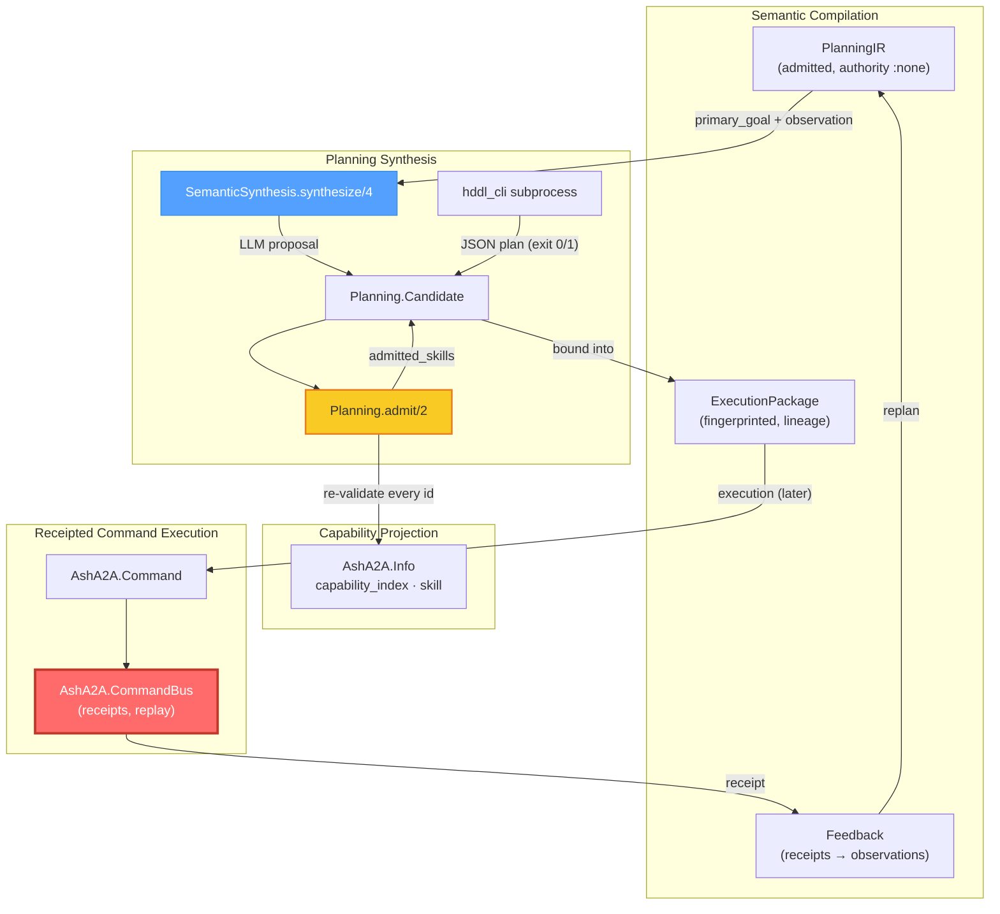
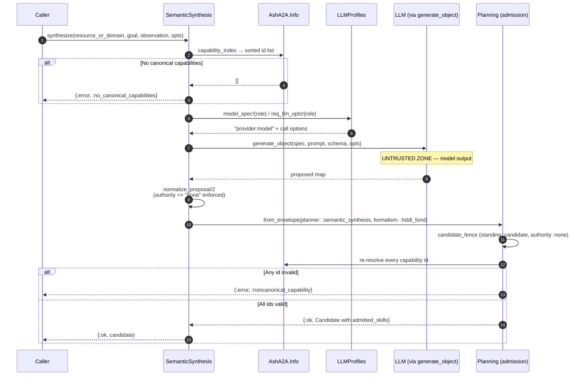

# Planning Synthesis Domain — Technical Documentation

**Project:** `ash_a2a` — Elixir/Spark DSL extension for the Ash Framework
**Domain:** Planning Synthesis (Supporting Domain)
**Primary Source Files:**

| Layer | File | Role |
|---|---|---|
| Elixir | `lib/ash_a2a/planning.ex` | `AshA2A.Planning.Candidate` struct + candidate admission over canonical capabilities |
| Elixir | `lib/ash_a2a/planning/semantic_synthesis.ex` | LLM-driven HDDL/FOND synthesis for unknown boundaries |
| Elixir | `lib/ash_a2a/llm_profiles.ex` | Role-based LLM provider resolution (config-owned, fail-closed) |
| Native | `native/hddl_cli/Cargo.toml` | Rust binary-crate manifest with pinned ferroplan dependency |
| Native | `native/hddl_cli/src/main.rs` | Subprocess CLI around the ferroplan `solve_hddl` FOND HTN solver |

**Analysis Basis:** Direct code-level reading of all five files plus their integration surfaces (`AshA2A.Info`, `AshA2A.CommandBus`, `AshA2A.Command`, `AshA2A.Skill`, `AshA2A.Authority`, `AshA2A.Receipt`, `AshA2A.Semantic.*`, `AshA2A.Agent`).
**Confidence:** High — every claim below is verified against source.

---

## 1. Overview

The Planning Synthesis domain provides **AI-assisted formal planning over capability boundaries that the deterministic pipeline cannot resolve**. It exists for a specific operational situation: the planning boundary is asked to achieve a goal, but no known plan covers it. In that case, a configured LLM role is allowed to *propose* HDDL/FOND planning artifacts and a set of A2A capability ids — but only ever as **untrusted candidates**.

The domain is built as two cooperating layers with a deliberately asymmetric trust posture:

1. **The Elixir layer** performs candidate *synthesis* and *admission*. It never executes anything. Its output type — `AshA2A.Planning.Candidate` — is structurally incapable of carrying execution authority: `standing` is pinned to `:candidate` and `authority` to `:none`, and any attempt to smuggle in a different standing is refused with a typed error (`:planner_authority_ceiling_violated`).
2. **The native layer** is a standalone Rust binary (`hddl_cli`) that wraps the real ferroplan FOND HTN solver behind a strict subprocess contract: two file paths in, one JSON document out, exit code 0 or 1. It has no runtime coupling to the BEAM — no NIF, no port protocol beyond stdout, no ambient sibling checkouts.

Two invariants govern everything in this domain, and both are enforced in code, not by convention:

> **INV-P1 — Authority ceiling:** No planner output (LLM or solver) ever carries authority. Every consequence-bearing step proposed by a planner must later be re-projected as an `AshA2A.Command` and enter through `AshA2A.CommandBus` — the single receipted execution route — before anything happens.

> **INV-P2 — Canonical re-validation:** Every capability id a planner proposes is re-resolved through `AshA2A.Info` against the *real* capability index (derived from `Ash.Resource.Info.public_actions/1`). The closed-set schema constraint in the prompt and the JSON schema are *advisory* to the model; the re-validation pass is the actual security control. A hallucinated capability id produces a `:noncanonical_capability` refusal, not an execution.

These mirror the framework-wide "candidate-then-admit" pattern (INV-5 of the system architecture) applied to a new kind of untrusted input: *planners*.

---

## 2. Position in the System Architecture

Planning Synthesis is a **supporting domain** that spans three other domains, making it the connective tissue of the system's only true closed loop:



Relationships to adjacent domains (with measured coupling strength from the domain-relation model):

| From → To | Type | Strength | Mechanism |
|---|---|---|---|
| Planning Synthesis → Receipted Command Execution | Service Call | 7.0 | LLM-proposed consequence-bearing actions must be constructed as commands and enter via `AshA2A.CommandBus`; never executed directly |
| Planning Synthesis → Capability Projection & Discovery | Data Dependency | 6.0 | Every proposed capability id is re-resolved via `AshA2A.Info.skill/2` / `capability_index/1` |
| Planning Synthesis → Semantic Compilation | Data Dependency | 7.0 | Synthesis consumes fingerprinted `PlanningIR` / `ExecutionPackage` artifacts as candidate inputs |
| Semantic Compilation → Planning Synthesis | Data Dependency | 5.0 | `PlanningIR` flows into `hddl_cli`/ferroplan via **file handoff** for formal plan candidates |

---

## 3. The Candidate Model: `AshA2A.Planning.Candidate`

Defined in `lib/ash_a2a/planning.ex` as the domain's single output shape. Its moduledoc states the contract plainly: *"Planner output with candidate-only standing and no DO authority."*

### 3.1 Struct Definition

```elixir
@enforce_keys [:planner, :plan, :capability_ids, :fingerprint]
defstruct [
  :planner,        # atom identifying the proposing planner (e.g. :semantic_synthesis, :ferroplan, :external)
  :planner_ref,    # optional correlation ref (e.g. envelope "request_id" / "plan_id")
  :formalism,      # :hddl_fond | :pddl | :unknown | ...
  :plan,           # the raw plan map as proposed
  :capability_ids, # proposed A2A capability ids, normalized to strings
  :fingerprint,    # content-addressed SHA-256 of the candidate
  standing: :candidate,
  authority: :none,
  admitted_skills: []
]
```

### 3.2 Constructor: `new/4`

```elixir
@spec new(atom(), map(), [String.t()], keyword()) :: t()
```

The constructor enforces four properties at birth:

1. **Guarded shape** — `is_atom(planner) and is_map(plan) and is_list(capability_ids)`; anything else cannot construct a Candidate.
2. **Id normalization** — every capability id is coerced with `to_string/1`, so mixed atom/string proposals from any planner converge on a uniform string representation.
3. **Defaulted safety fields** — `standing: :candidate`, `authority: :none`, `admitted_skills: []` are the only defaults; they are not caller-overridable.
4. **Content fingerprint** — SHA-256 (hex, lowercase) over the `{planner, formalism, capability_ids, plan}` tuple serialized with `:erlang.term_to_binary/1`. The fingerprint is derived purely from semantic content, so an identical proposal always produces an identical, replayable identity.

### 3.3 `admitted_skills`

This field is populated **only** by `AshA2A.Planning.admit/2` after successful re-validation, and holds the real `AshA2A.Skill` structs resolved from the live capability index. A Candidate that has not been through admission carries `[]` — the empty list is the "this proposal has never been checked against reality" marker.

---

## 4. Candidate Admission: `AshA2A.Planning`

The `AshA2A.Planning` module's moduledoc establishes the domain's core doctrine:

> *"Planners may propose PDDL/HDDL/FOND/HTN/temporal candidates, but every consequence-bearing step must project a canonical capability id that resolves through `AshA2A.Info`. This module has no execution function. Admitted candidates still require `AshA2A.CommandBus` for any later DO."*

The phrase **"no execution function"** is literal: the module exports no function that invokes an Ash action. Execution is structurally out of its vocabulary.

### 4.1 The Authority Fence: `admit/2`

```elixir
@spec admit(module(), Candidate.t()) :: {:ok, Candidate.t()} | {:error, map()}
```

Admission is a two-step `with` pipeline:

**Step 1 — `candidate_fence/1`.** The candidate must still be in its factory state:

```elixir
defp candidate_fence(%Candidate{standing: :candidate, authority: :none}), do: :ok
defp candidate_fence(_candidate), do: {:error, refusal(:planner_authority_ceiling_violated)}
```

This fence means a Candidate *cannot be re-admitted once its standing has been altered by anyone*. It is a structural guard against any future code path that might "promote" a candidate before validation.

**Step 2 — `resolve_all/2`.** Every capability id is re-resolved against the canonical index:

```elixir
case AshA2A.Info.skill(resource_or_domain, capability_id) do
  {:ok, skill}              -> accumulate
  {:error, :skill_not_found} -> halt with {:error, %{code: :noncanonical_capability, ...}}
end
```

Validation is **all-or-nothing**: a single invalid id refuses the entire candidate (via `Enum.reduce_while/3` halt), and the refusal names the offending id in `detail`. On success the candidate is returned with `admitted_skills` populated in stable id order. Note that `AshA2A.Info.skill/2` looks up the *derived, on-demand* index — the same source the dispatcher and AgentCard builder use — so a plan candidate and the dispatch surface can never disagree about what capabilities exist.

### 4.2 Envelope Ingestion: `from_envelope/3`

Planners rarely emit Candidates natively; they emit arbitrary maps. `from_envelope/3` is the tolerance layer:

```elixir
@spec from_envelope(module(), map(), keyword()) :: {:ok, Candidate.t()} | {:error, map()}
```

1. **Recursive capability-id extraction** (`extract_capability_ids/1`): walks the whole envelope structure, collecting every `"capability_id"`/`:capability_id` key holding a binary, and every `"capability_ids"`/`:capability_ids` key holding a list of binaries — then deduplicates. This accepts both string and atom key conventions and finds ids at any nesting depth, making the extractor planner-agnostic.
2. **Fail-closed on emptiness:** zero extracted ids → `{:error, %{code: :planner_capability_projection_missing}}`. A plan that proposes no capabilities is not "a plan with no side effects" — it is an unprojectable plan, and it is refused.
3. **Wrap + admit:** builds a Candidate (`planner` defaulting to `:external`, `planner_ref` pulled from envelope `request_id`/`plan_id`, `formalism` from opts) and immediately runs `admit/2`. There is no "ingest now, validate later" state.

### 4.3 Formal Solver Integration: `plan_with_ferroplan/4`

```elixir
@spec plan_with_ferroplan(module(), String.t(), String.t(), keyword()) ::
        {:ok, Candidate.t()} | {:error, term()}
```

This function bridges the domain to a BEAM-side production planning pipeline (`BeamPM.Ferroplan.plan_production/4`) **without a compile-time dependency on it**, using the same capability-probing idiom used elsewhere in the framework (`CommandBus` durability detection, `Execution.FLAME.available?/0`):

```elixir
if Code.ensure_loaded?(planner) and function_exported?(planner, :plan_production, 4) do
  apply(planner, :plan_production, [domain, problem, extra, planner_opts])
else
  {:error, refusal(:unsupported_planner, :ferroplan)}
end
```

Contract handling is exhaustive and fail-closed:

| Solver outcome | Result |
|---|---|
| `{:ok, envelope}` (map) | Routed through `from_envelope/3` with `planner: :ferroplan`, formalism defaulting to `:pddl` — i.e., even a *real* solver's output gets the full capability re-validation |
| `{:error, _}` | Passed through unchanged |
| Anything else | `{:error, %{code: :unexpected_planner_result, detail: other}}` |
| Planner module absent | `{:error, %{code: :unsupported_planner, detail: :ferroplan}}` |

---

## 5. LLM-Driven Synthesis: `AshA2A.Planning.SemanticSynthesis`

This module implements the workflow for **UNKNOWN planning boundaries** — goals that known plans cannot resolve. Its moduledoc is the trust-boundary statement for the entire domain:

> *"A configured LLM role may propose HDDL/FOND artifacts and canonical A2A capability ids, but the result is only a `AshA2A.Planning.Candidate`. The model cannot grant authority or execute anything: every capability is re-resolved through `AshA2A.Info`, and any later consequence-bearing action must still be constructed as a command and enter through `AshA2A.CommandBus`."*

### 5.1 The `synthesize/4` Pipeline

```elixir
@spec synthesize(module(), String.t(), map(), keyword()) ::
        {:ok, Planning.Candidate.t()} | {:error, map() | term()}
```

The pipeline, in order:



Key verified details of each stage:

1. **Capability inventory gate.** `capability_ids/1` derives the eligible id set from `AshA2A.Info.capability_index/1` (mapped to strings, sorted for determinism). An empty index short-circuits with `{:error, %{code: :no_canonical_capabilities}}` — a surface with no capabilities is refused before any LLM call is paid for.

2. **Role resolution (never provider naming).** The default role is `:surface_planner`. The caller passes a role atom; `LLMProfiles` converts it to a concrete `"provider:model"` spec plus call options. As the module's own doc insists: *"callers never name Z.AI (or any other provider) in the domain model."*

3. **The injectable seam.** `:generate_object` defaults to the real `&ReqLLM.generate_object/4` and is a plain 4-arity function argument — the framework's standard dependency-injection pattern that replaces mocking libraries. Critically, the moduledoc is explicit that the seam *"does not bypass candidate admission or the authority fence"*: tests inject a fixed-output anonymous function, and admission still runs *for real* against whatever the injected function returns.

4. **Closed-set output schema** (`output_schema/1`). The JSON schema given to the model encodes the security posture:
   - `authority`: `{"enum": ["none"]}` — the model is *only offered* the no-authority option;
   - `capability_ids`: `{"items": {"enum": capability_ids}, "uniqueItems": true}` — the model is only offered ids that exist in the canonical index;
   - `required`: `["request_id", "authority", "capability_ids", "hddl", "fond"]` — an incomplete proposal cannot parse.

5. **The prompt** (`build_prompt/3`) embeds the goal, the JSON-encoded observation, and the enumerated canonical id list, and instructs the model in explicitly bounded language: *"Return a structured candidate only. `authority` MUST be `none`. … Do not execute, actuate, click, submit, mutate, or claim that any step ran. The returned capability ids are proposals and will be independently admitted against the canonical AshA2A capability index."*

6. **Normalization** (`normalize_proposal/2`) — the *actual* security control, independent of schema compliance:
   - Non-map proposals → `{:error, %{code: :invalid_semantic_plan_shape, ...}}`;
   - Any `authority` other than the string `"none"` → `{:error, %{code: :planner_authority_ceiling_violated, detail: authority}}` — the model *naming itself an authority* is treated as a violation event, not silently corrected;
   - `capability_ids` must be a non-empty list of binaries and `request_id` a binary, else `:invalid_semantic_plan_shape`;
   - Accepted proposals are re-shaped into the envelope form (with `synthesis.hddl`, `synthesis.fond`, `synthesis.rationale`, `synthesis.role`) and routed into `Planning.from_envelope/3`, which re-runs the full admission fence and id re-validation — a second, independent check after the schema and the normalizer.

This is **defense in depth in three layers**: the schema constrains what the model *may* return; the normalizer constrains what the code *accepts*; admission constrains what the runtime *believes*.

---

## 6. `AshA2A.LLMProfiles` — Role-Based Provider Resolution

`lib/ash_a2a/llm_profiles.ex` is small by design, but it embodies a significant architectural seal:

> **A2ACapabilityIdentity ≠ ModelProviderIdentity**

An Ash action (or synthesis call site) declares an abstract *role* (e.g. `:semantic_reasoner`, `:surface_planner`); runtime configuration maps the role to a concrete model:

```elixir
config :ash_a2a, :llm_profiles,
  semantic_reasoner: [provider: :zai_coder, model: "glm-5.3-flash", max_tokens: 4096]
```

### 6.1 API

| Function | Contract |
|---|---|
| `model_spec!/1` | Returns `"provider:model"` for the role. **Raises `ArgumentError` naming the missing role** if unconfigured — the error message lists the currently configured roles and the exact config line to add. |
| `req_llm_opts!/1` | Returns the role's call options with `:provider` and `:model` keys stripped, so callers receive only what `req_llm_opts:` actually accepts. |

### 6.2 Design Properties

- **Provider switching is a config change, never a source change.** No action's `run(prompt(...))` call, and no synthesis call site, contains a provider string.
- **Pure lookup, no side effects.** The moduledoc certifies: *"No filesystem, network, or shell access happens in this module."*
- **Fail-closed per the `CONFIGURATION_MISSING -> BLOCKED` discipline:** a missing role configuration must never be papered over with a guessed provider. This is why `SemanticSynthesis.synthesize/4` and `Semantic.Compiler.compile/3` (which call `model_spec!/1`) can raise — and why the Agent's semantic dispatch path wraps the compile call in `rescue` to convert that (deliberate) raise into a typed `{:error, ...}` reply rather than crashing the shared agent GenServer.

---

## 7. Native FOND Planner Bridge: `native/hddl_cli`

### 7.1 The CLI Contract

`main.rs` opens with the complete contract in its header comment, and the implementation matches it exactly:

| Aspect | Contract |
|---|---|
| Invocation | `hddl_cli <domain.hddl> <problem.hddl>` — exactly two argv arguments (`args.len() != 3` → usage JSON, exit 1) |
| Input | Two HDDL files read via `fs::read_to_string`; any I/O error produces a JSON error naming the failing path |
| Solve | `ferroplan::solve_hddl(&domain_src, &problem_src, &PlannerLimits::default())` — the real solver, not a reimplementation |
| Success path | `UniversalPlan` serialized with `serde_json` to **stdout**, **exit code 0** |
| Failure path | `{"error": "..."}` JSON on **stdout**, **exit code 1** — covering missing files, HDDL parse, ground, translate, and solve failures, plus plan-serialization failure |

The design consequence: the Elixir host gets a **deterministic success/error protocol** with a single stdout channel and no in-process coupling. Debuggability is total — a failing solve can be reproduced by running the binary by hand on the same two files.

### 7.2 Manifest and Pinning (`Cargo.toml`)

```toml
[package]
name = "hddl_cli"
version = "0.1.0"
edition = "2021"
license = "MIT"

[dependencies]
ferroplan = { git = "https://github.com/seanchatmangpt/ferroplan.git",
              rev = "29134d7bc2c578aa39e05bceeee43a6893f2026b" }
serde_json = "1"
```

The ferroplan dependency is pinned to the **exact commit carried by beam4pm's ferroplan submodule**, and the manifest rationale documents why the dependency is the canonical ferroplan source itself — *"not an ambient sibling checkout and not a reimplementation or mock."*

### 7.3 Why a Subprocess Instead of a NIF

The `Cargo.toml` description carries the full architectural rationale, worth preserving verbatim in spirit: `ash_a2a` is a general-purpose, published Ash extension consumed by arbitrary host applications, and it **must not carry a hard dependency on one specific consumer app's BEAM-side manufacturing pipeline** or its generated Elixir surface. A subprocess boundary delivers:

1. **Dependency isolation** — the heavy Rust/planning toolchain is not linked into the host BEAM VM;
2. **Failure isolation** — a solver crash, panic, or pathological input kills a child process with an exit code, never a BEAM node;
3. **Contract simplicity** — files in, JSON out, exit-code verdict; trivially testable and reproducible independent of Elixir.

The known trade-off (documented in the system workflow analysis): per-invocation process and file-I/O overhead, accepted in exchange for the isolation and debuggability above.

### 7.4 Relationship to the Formal Planning Pipeline

The native bridge is the *downstream consumer* of the semantic pipeline's formal projection. `AshA2A.Semantic.PlanningIR.from_ir/2` manufactures the planner-ready projection — goals, objects, predicates, constraints, task candidates, and crucially **FOND nondeterminism markers** (`nondeterminism` from IR uncertainties) — but only from IR whose `standing: :admitted` and `authority: :none`; anything else is refused with `:planning_ir_requires_admitted_semantics`. PlanningIR artifacts reach the solver via **file handoff** (domain/problem files), and the resulting JSON `UniversalPlan` flows back as a plan candidate that — like every other candidate — is bound into the fingerprinted `ExecutionPackage` only after the package-level authority fence passes.

---

## 8. Trust and Security Model

Planning Synthesis inherits and extends the framework's fail-closed doctrine. The domain-specific controls, in enforcement order:


**The authority handshake at execution time.** When a planning candidate's consequence-bearing step is eventually executed, it is projected as an `AshA2A.Command` (binding principal identity, capability id, admitted input, optional `SemanticSubject` digest triple, and verified `Authority`) and enters `AshA2A.CommandBus.run/4`. There:

- The skill's **compile-time consequence classification** (from `AshA2A.Skill.consequence`, defaulted per action type and fail-closed `:unknown` for generic actions) governs admission — `:change`/`:external_do` require `Authority.admits?/2` (subject match + capability match + not expired), and `:unknown` is refused outright with `:consequence_unclassified`.
- The command's content-derived fingerprint (SHA-256 over semantic content, including the semantic-subject digest token) engages the receipt store's atomic claim: same-fingerprint retries **replay** the stored receipt; conflicting fingerprints are refused. Note the supporting subtlety verified in `AshA2A.Authority.from_verified_identity/2`: the transport-verified authority's `token_id` is a *deterministic* SHA-256 of `{subject, capability_id}` precisely so it does not perturb the command fingerprint across retries — a genuine replay-detection regression this design closes.

The net effect: **the model proposes, the index adjudicates, the bus executes, the receipt remembers** — and no stage of that chain can be skipped or reordered by planner output.

---

## 9. Integration with Adjacent Domains

### 9.1 Semantic Compilation (the closed loop)

`AshA2A.Semantic.Compiler.compile_source/3` is the primary orchestrator that *consumes* this domain: after IR admission → ontology → PlanningIR, it calls `SemanticSynthesis.synthesize/4` with `PlanningIR.primary_goal/1` and `PlanningIR.observation/1`, then binds the returned Candidate into an `ExecutionPackage`. `ExecutionPackage.new/6` runs its own fence — IR must be `:admitted`/`:none`, Ontology and PlanningIR `:none`, Candidate `:candidate`/`:none` — else `:semantic_package_authority_ceiling_violated`.

The loop closes through **`replan/4`**: a committed `AshA2A.Receipt` is converted by `AshA2A.Semantic.Feedback.from_receipt/2` into a typed, fingerprinted observation (standing `:observed`, authority `:none`), folded into the PlanningIR via `with_observation/2` (refingerprinting it), and re-synthesized into a *new* package linked by `parent_fingerprint`. Execution evidence thus becomes authority-free planning input — feedback observes, it never commands.

### 9.2 The A2A Surface (Agent two-gate + continuation)

Planning Synthesis is reachable over A2A only through an explicit, doubly-gated surface (v26.9.14 design decision, verified in `AshA2A.Agent.__dispatch__/3` and `AshA2A.Info.semantic_requests_enabled?/1`):

1. The resource/domain must declare `a2a do semantic_requests true end` (compiled DSL truth);
2. The inbound message must set `semantic_request: true` in its metadata.

A message passing both gates triggers `Compiler.compile/3` (or, with `continuation_fingerprint` metadata, a **replan continuation**): the prior `ExecutionPackage` is fetched from `AshA2A.Semantic.PackageStore` (deliberately a separate store from the ReceiptStore, so a candidate can never be retrieved as if it were receipted evidence), the correlated receipt is fetched from the ReceiptStore via the fingerprint-as-command-id convention, and `replan/4` runs. The reply body — produced by `ExecutionPackage.to_reply/1` — carries `standing: "candidate"`, `authority: "none"`, the *re-admitted* `capability_ids`, the synthesized `hddl`/`fond`/`rationale`, and the package fingerprint. Per its own doc: *"It never claims execution occurred; nothing in this reply can be mistaken for a DO receipt."*

### 9.3 Capability Projection

All capability truth in this domain flows from `AshA2A.Info` — `capability_index/1` (deriving from `Ash.Resource.Info.public_actions/1` through the compiler on every call) and `skill/2`. The synthesis prompt's closed id set, the schema enum, and admission's `resolve_all/2` all read this single source, which is what makes planner divergence from the advertised surface structurally detectable.

---

## 10. Refusal Taxonomy

All refusals are typed maps of the form `%{code: atom, detail: term()}` — never exceptions on the planning path, never silent fallbacks.

| Code | Raised by | Meaning |
|---|---|---|
| `:no_canonical_capabilities` | `SemanticSynthesis.synthesize/4` | Resource/domain exposes zero capabilities; nothing to plan against |
| `:planner_authority_ceiling_violated` | `Planning.candidate_fence/1`; `SemanticSynthesis.normalize_proposal/2` | A candidate claimed a standing other than `:candidate` or an authority other than `:none` |
| `:planner_capability_projection_missing` | `Planning.from_envelope/3` | Envelope contained no extractable capability ids |
| `:noncanonical_capability` | `Planning.resolve_all/2` | A proposed capability id does not resolve in the real index (names the id) |
| `:invalid_semantic_plan_shape` | `SemanticSynthesis.normalize_proposal/2` | Proposal missing `request_id`/`capability_ids`, wrong types, or non-map |
| `:unsupported_planner` | `Planning.plan_with_ferroplan/4` | The BEAM-side planner module is not loaded/exporting `plan_production/4` |
| `:unexpected_planner_result` | `Planning.plan_with_ferroplan/4` | Planner returned neither `{:ok, envelope}` nor `{:error, _}` |
| `:semantic_synthesis_failed` | `SemanticSynthesis.synthesize/4` | Wrapper for non-typed failures from the LLM call or admission chain |
| `:planning_ir_requires_admitted_semantics` | `Semantic.PlanningIR.from_ir/2` | Planning projection attempted on non-admitted IR (upstream guard) |
| `:semantic_package_authority_ceiling_violated` | `ExecutionPackage.new/6`, `to_reply/1` | Package binding attempted with any artifact above the authority ceiling |
| `hddl_cli` exit 1 + `{"error": ...}` | `main.rs` | Usage error, file I/O failure, HDDL parse/ground/translate/solve failure, or plan serialization failure |

---

## 11. Design Decisions and Rationale

| # | Decision | Rationale (from code) |
|---|---|---|
| 1 | **Candidate struct with enforced keys and non-overridable safety defaults** | Makes the authority ceiling a type property, not a convention; `candidate_fence` then re-asserts it at admission |
| 2 | **Three-layer LLM output validation (schema → normalizer → admission)** | The schema and prompt only *advise* the model; only re-validation against `AshA2A.Info` is a security control. Hallucinated ids are caught at the last layer regardless of what the model returned |
| 3 | **Role-based LLM profiles with raising lookup** | Capability semantics and provider identity are sealed apart (`A2ACapabilityIdentity != ModelProviderIdentity`); provider swaps are config-only; a missing role must block, never guess (`CONFIGURATION_MISSING -> BLOCKED`) |
| 4 | **`:generate_object` DI seam instead of mocking libraries** | Real `ReqLLM.generate_object/4` in production; tests inject a real anonymous function with fixed output while admission and the authority fence run for real — no test doubles downstream of the seam |
| 5 | **Subprocess bridge with exit-code contract (no NIF)** | A published general-purpose library must not hard-depend on a consumer app's pipeline; process/file/JSON isolation keeps solver failures out of the BEAM and the contract reproducible by hand |
| 6 | **Git-pinned canonical ferroplan source** | Reproducible builds against the exact solver revision carried by beam4pm's submodule; explicitly not a sibling checkout or a reimplementation |
| 7 | **Capability probing (`Code.ensure_loaded?` + `function_exported?`) for the BEAM planner** | Same idiom as durability/FLAME detection — optional integration without compile-time coupling or hardcoded module allowlists |
| 8 | **Content-derived fingerprints everywhere (Candidate, PlanningIR, Package, Command)** | Identical proposals prove identical intent; enables replay, lineage (`parent_fingerprint`), and evidence-based replanning |
| 9 | **Recursive, key-convention-tolerant capability-id extraction** | Planner envelopes are arbitrary maps by nature; admission remains planner-agnostic without loosening validation |
| 10 | **Separate `PackageStore` from `ReceiptStore`** | Candidates and receipts are different evidence classes (`:candidate`/`:none` vs `:observed`); conflating stores would let a candidate be retrieved as if it were receipted evidence |

---

## 12. Operational Considerations and Limitations

- **LLM latency dominates synthesis.** The `synthesize/4` call is a synchronous `generate_object` round-trip; the semantic compilation workflow analysis identifies batching and content-addressed caching of admitted artifacts as the natural optimization surface (already supported by content-addressed `Source` identity).
- **Solver handoff cost.** Each `plan_with_ferroplan`/`hddl_cli` invocation pays process spawn plus file I/O. For high-frequency planning, a persistent solver process or NIF would reduce overhead — at a direct cost to the isolation the current contract is designed to maximize. The current trade favors isolation and debuggability.
- **Single-node coordination.** Receipt-store claim atomicity is single-node (per the system risk register R-2); multi-node deployments relying on replay semantics for planner-initiated commands should be aware.
- **Config dependency is intentional.** Any synthesis or compilation call requires the relevant role under `config :ash_a2a, :llm_profiles`; unconfigured roles raise (and the Agent's semantic path converts the raise to a typed error reply). This is the documented fail-closed posture, not a defect.
- **The planner seam is test-real.** Because the DI seam only replaces the model call, the entire validation chain (schema compliance is *not* assumed, normalization, fencing, index re-validation) is exercised under test exactly as it runs in production.

---

## 13. Summary

Planning Synthesis is the framework's answer to the hardest planning case — goals no known plan covers — solved without ever relaxing the system's security posture. Its Elixir layer converts untrusted LLM proposals into structurally harmless, fingerprinted Candidates whose every capability reference has been proven against the canonical index; its native layer supplies formal FOND/HTN plan generation through an isolated, exit-code-contracted subprocess around the real ferroplan solver. Every refusal is typed, every boundary is fenced, and every consequence still travels the single receipted road through `AshA2A.CommandBus`. The result is a domain whose outputs can inform, but never enact — the planning counterpart to the framework-wide doctrine of deterministic derivation, fail-closed validation, and receipts-and-fingerprints as universal evidence.