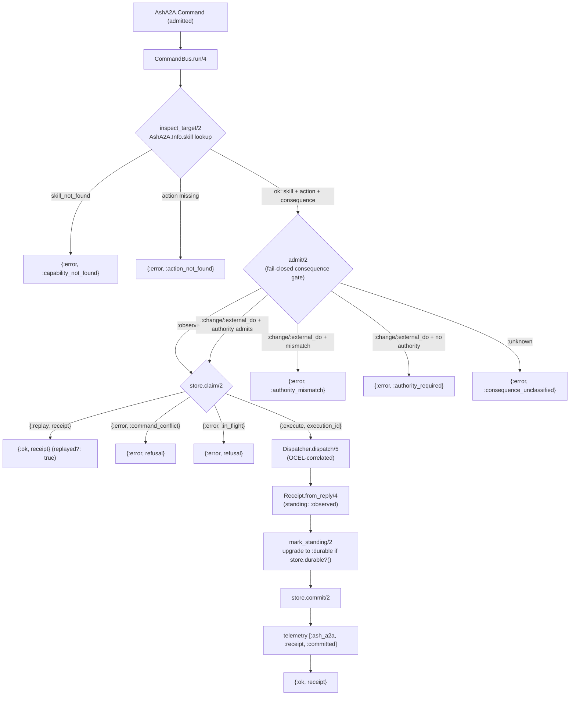
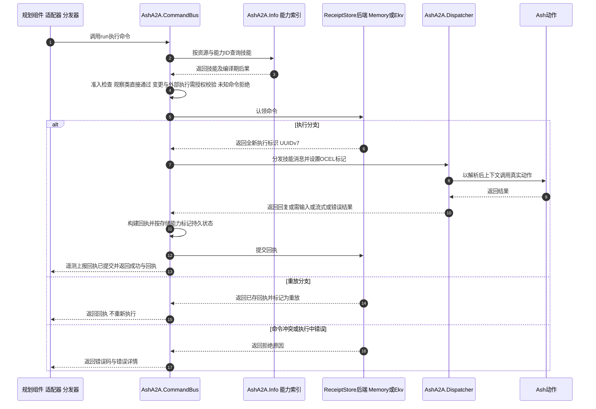

# Receipted Command Execution — Technical Documentation

**Project:** `ash_a2a` — Elixir/Spark DSL extension for the Ash Framework
**Domain:** Receipted Command Execution (Core Business Domain, importance 9.0)
**Primary Source Files:**

| Component | Path | Role |
|---|---|---|
| Command envelope | `lib/ash_a2a/command.ex` | Consequence-bearing command struct with content-derived fingerprint |
| Command Bus | `lib/ash_a2a/command_bus.ex` | The single sanctioned execution path (`run/4`) |
| Receipt model | `lib/ash_a2a/receipt.ex` | Replayable evidence for one command attempt |
| Store contract | `lib/ash_a2a/receipt_store.ex` | Behaviour defining atomic claim/commit/fetch semantics |
| Memory backend | `lib/ash_a2a/receipt_store/memory.ex` | In-process GenServer reference implementation |
| EKV backend | `lib/ash_a2a/receipt_store/ekv.ex` | Durable on-disk implementation |
| Supporting models | `lib/ash_a2a/{identity,authority,semantic_subject}.ex` | Typed identities, authority evidence, semantic subject digests |
| Wiring | `lib/ash_a2a/application.ex` | Receipt-store supervision and configuration resolution |

---

## 1. Overview

The Receipted Command Execution domain implements the **single sanctioned path** from an admitted `AshA2A.Command` to Ash action execution. Its mandate is captured in the `AshA2A.CommandBus` moduledoc:

> *"Canonical receipted route from an admitted `AshA2A.Command` to the existing Ash dispatcher. Planning and provider adapters may call this module; they do not bypass its capability, identity, replay, or evidence checks."*

Every consequence-bearing operation in the framework — whether triggered by an inbound A2A message, an LLM-driven planning synthesis, or an integration adapter (Oban, FLAME, Reactor) — must be wrapped in a `Command` envelope and executed through `CommandBus.run/4`. The bus enforces a fixed pipeline of fail-closed checks, and every attempt (success, replay, or refusal) is reconciled against an atomically claimed **command id** in a `ReceiptStore`, producing a `Receipt` that serves as replay-safe, auditable evidence.

The design rests on three pillars:

1. **Content-derived fingerprints** — a command's identity-of-intent is a SHA-256 hash of its semantic content only, so retries carrying fresh transport timestamps still prove the same intent.
2. **Atomic claim semantics** — the receipt store owns exclusive claim over a command id, deterministically distinguishing *execute*, *replay*, *conflict*, and *in-flight* outcomes.
3. **Durability as declared capability** — receipt standing (`:observed` vs. `:durable`) is upgraded only when the store itself declares real durability via a `durable?/0` function, detected by capability probing rather than a hardcoded module allowlist.

---

## 2. Architectural Position and Invariants

Within the seven-domain architecture of `ash_a2a`, this domain sits between all callers of consequence-bearing work and the Message Dispatch domain:

- **Upstream callers** (Adapter/domain relation strength 8.0–9.0): the Dispatcher (for consequence-bearing skills), Planning Synthesis (LLM-proposed actions), and Integration Adapters (Oban delivery jobs, FLAME remote execution, Reactor steps) all funnel through `AshA2A.CommandBus`.
- **Downstream dependency**: after all checks pass, the bus delegates actual execution to `AshA2A.Dispatcher.dispatch/5`, which invokes the real Ash action.
- **Supervision**: `AshA2A.Application.receipt_store_children/0` composes the store children from configuration.

The following invariants are enforced structurally, not by convention:

| # | Invariant | Enforcement Point |
|---|---|---|
| INV-1 | **Unbypassable route** — all consequence-bearing work flows through `CommandBus.run/4`; adapters never promote their own transport ids (e.g., Oban job ids) to receipts. | Moduledoc doctrine + all adapters calling `AshA2A.CommandBus` |
| INV-2 | **Fail-closed consequence classification** — `:observe` passes without authority; `:change`/`:external_do` require verified authority; `:unknown` is refused with `:consequence_unclassified`, never defaulted. | `CommandBus.admit/2` |
| INV-3 | **Consequence computed once** — classification comes from `skill.consequence`, computed at compile time by `CapabilityIndex.Compiler.project/3`, never recomputed from `action.type` at dispatch. | `CommandBus.inspect_target/2` + `AshA2A.Skill` moduledoc |
| INV-4 | **Atomic claim ownership** — exactly one of `{:execute, execution_id}`, `{:replay, receipt}`, or `{:error, :command_conflict \| :in_flight}` per claim on a command id. | `ReceiptStore` behaviour + both backends |
| INV-5 | **Replay = identical intent** — same id + same fingerprint replays; same id + different fingerprint conflicts; fingerprint includes only semantic content. | `Command.fingerprint/1`, backend `claim` clauses |
| INV-6 | **Only the bus grants `:durable`** — `Receipt.from_reply/4` always sets `standing: :observed`; only `CommandBus.run/4` upgrades it, and only when the store declares `durable?/0 → true`. | `mark_standing/2` capability probe |

A deliberate scope boundary: **command receipts are evidence of command attempts** (`receipt.ex`, `receipt_store/*`) and are distinct from **runtime receipts** (`runtime_receipt.ex`), which record agent lifecycle state for DurableServer/Topology/FLAME. The two receipt types serve different invariants and must not be conflated; command receipts gate replay, runtime receipts never confer authority.

---

## 3. The Command Envelope (`AshA2A.Command`)

The command is the unit of consequence. It binds *who* (identities), *what* (capability), *with what input* (admitted input), *against what subject* (optional semantic subject), and *with what permission* (optional authority) — plus a fingerprint that makes retries provably identical.

### 3.1 Structure

```elixir
@enforce_keys [:command_id, :agent_id, :principal_id, :capability_id,
               :input, :submitted_at, :fingerprint]
defstruct [
  :command_id, :agent_id, :principal_id, :task_id, :capability_id,
  :input, :authority, :semantic_subject, :submitted_at, :fingerprint,
  metadata: %{}
]
```

| Field | Type | Meaning |
|---|---|---|
| `command_id` | `Identity.t()` (kind `:command`) | Unique id of this command; the receipt-store claim key |
| `agent_id` / `principal_id` | `Identity.t()` (kinds `:agent`, `:principal`) | Acting agent and calling principal — deliberately distinct machine identities |
| `task_id` | `Identity.t() \| nil` (kind `:task`) | Optional A2A task linkage |
| `capability_id` | `String.t()` | Canonical skill id resolved against the capability index |
| `input` | `term()` | Admitted command input (defaults to `%{}`) |
| `authority` | `Authority.t() \| nil` | Verified authority evidence (required for `:change`/`:external_do`) |
| `semantic_subject` | `SemanticSubject.t() \| nil` | Exact semantic/manufacture identity for replay scoping |
| `submitted_at` | `DateTime.t()` | Transport timestamp — **excluded from fingerprint** |
| `fingerprint` | `String.t()` | SHA-256 over semantic content only |
| `metadata` | `map()` | Free-form, non-semantic, non-fingerprinted data |

### 3.2 Identity Model (`AshA2A.Identity`)

Identity kinds are deliberately non-interchangeable: `:principal | :agent | :task | :command | :execution | :runtime`. A task id is not an agent id, a command id is not an execution id, and none of them imply a principal. The tagged struct is small enough to pass through A2A metadata, Reactor context, Oban arguments, and receipts without manufacturing a second identity system. `Identity.external/1` renders the canonical string form `"{kind}:{value}"`, which is exactly what receipt stores use as their claim key.

`Command.new/2` enforces kind correctness via `ensure_identity/2`, raising `ArgumentError` on kind mismatch (e.g., passing a `:task` identity where a `:command` identity is required). Default `command_id` is a `Ash.UUIDv7.generate()`; execution ids minted at claim time use kind `:execution`.

### 3.3 Fingerprint Derivation

```elixir
def fingerprint(%__MODULE__{} = command) do
  authority_token =
    case command.authority do
      %Authority{token_id: token_id} -> Identity.external(token_id)
      _ -> nil
    end

  {
    Identity.external(command.agent_id),
    Identity.external(command.principal_id),
    command.task_id && Identity.external(command.task_id),
    command.capability_id,
    command.input,
    authority_token,
    SemanticSubject.fingerprint_token(command.semantic_subject)
  }
  |> :erlang.term_to_binary()
  |> then(&:crypto.hash(:sha256, &1))
  |> Base.encode16(case: :lower)
end
```

**Design consequences:**

- `submitted_at` and `metadata` are excluded — a retry with a fresh transport timestamp hashes identically, which is the precondition for idempotent replay.
- The **authority token id is folded into the fingerprint**. This creates a subtle but critical constraint: any authority synthesis used on the retry path must be deterministic. `Authority.from_verified_identity/2` addresses this explicitly — see §6.3.
- The `SemanticSubject.fingerprint_token/1` tuple (`{graph_digest, projection_digest, manufacturer_digest, ephemeral?}`) scopes replay to the exact semantic graph and generated projection that produced the capability surface in use, so a replay against a *different* manufactured subject is correctly treated as a different command.

### 3.4 Semantic Subject (`AshA2A.SemanticSubject`)

The semantic subject is **evidence identity only** — it grants no capability and no authority. Construction is fail-closed: each of `graph_digest`, `projection_digest`, and `manufacturer_digest` must be a well-formed `"sha256:" <> hex` string with exactly 64 lowercase hex characters, otherwise `new/1` returns `{:error, {:refused_semantic_subject, field}}`. This binds commands originating from the semantic compilation pipeline to fingerprint-verified artifacts rather than free-form labels.

---

## 4. The Command Bus (`AshA2A.CommandBus`)

### 4.1 Public API

```elixir
@type result :: {:ok, Receipt.t()} | {:error, map()}

@spec run(Command.t(), A2A.Message.t(), module(), keyword()) :: result()
@spec default_store() :: module()
```

`run/4` accepts the command, the originating `A2A.Message`, the resource-or-domain under which the capability is indexed, and options. The return type is total: every call terminates in `{:ok, receipt}` (fresh execution or replay) or `{:error, %{code: atom(), detail: String.t()}}` (structured refusal).

`default_store/0` resolves `Application.get_env(:ash_a2a, :receipt_store, AshA2A.ReceiptStore.Memory)` — the exact same resolution `run/4` uses when no `:store` opt is passed. It is exposed so other real callers (e.g., `AshA2A.Agent`'s receipt-driven replanning continuation lookup) resolve the identical store rather than re-deriving and drifting from this single source of truth.

**Options:**

| Opt | Default | Purpose |
|---|---|---|
| `:store` | `default_store()` | Receipt store module implementing the behaviour |
| `:store_opts` | `[]` | Passed through to `claim/2` and `commit/2` (e.g., `name:` for multi-instance stores) |
| `:history` | `[]` | Multi-turn conversation history forwarded to the dispatcher |
| `:auth_identity` | — | Transport-verified identity forwarded to the dispatcher |

### 4.2 Execution Pipeline



The pipeline is written with a `with` chain so every refusal is an early, typed return — no partial success exists.

### 4.3 Step 1 — Capability Resolution (`inspect_target/2`)

The bus resolves the target skill **exclusively through the persisted capability index** via `AshA2A.Info.skill/2`, then confirms the underlying Ash action still exists via `Ash.Resource.Info.action/2`:

- `{:error, :skill_not_found}` → refusal `:capability_not_found`
- action missing → refusal `:action_not_found`

Critically, the consequence used downstream is `skill.consequence` — carried as compile-time capability truth. The source comment makes this explicit: "`action.type` alone cannot distinguish a pure generic `:action` from a real consequence-bearing one." The bus structurally cannot re-derive consequence from the live action and thereby diverge from what was classified and advertised.

### 4.4 Step 2 — Authority Admission (`admit/2`)

The consequence gate is the fail-closed heart of the domain:

| Consequence | Authority present & admits? | Result |
|---|---|---|
| `:observe` | not required | `:ok` |
| `:change` / `:external_do` | yes, `Authority.admits?/2` true | `:ok` |
| `:change` / `:external_do` | yes, but subject/capability/expiry mismatch | `{:error, :authority_mismatch}` |
| `:change` / `:external_do` | no authority bound | `{:error, :authority_required}` |
| `:unknown` | — | `{:error, :consequence_unclassified}` |

The `:unknown` clause deserves emphasis, as its source comment states the rationale: an unclassified generic `:action` skill must never bypass this DO boundary by defaulting to either "safe to skip" (`:observe`) or "safe to execute" (`:change`). It fails closed with a distinct, typed code until a resource author explicitly classifies it via the DSL (`a2a do skill ..., consequence: :observe | :change | :external_do end`).

### 4.5 Step 3 — Claim, Dispatch, Commit

On a fresh `{:execute, execution_id}` claim, the bus:

1. Dispatches via `AshA2A.Dispatcher.dispatch(skill.name, message, resource_or_domain, history, auth_identity)` inside the OCEL-correlation wrapper (§8).
2. Builds the receipt with `Receipt.from_reply(command, execution_id, consequence, reply)` — always `standing: :observed`.
3. Upgrades standing via `mark_standing/2` (§7).
4. Commits with `store.commit(receipt, store_opts)` (matched with `:ok =` — a failed commit is a crash, not a degraded success).
5. Emits telemetry and returns `{:ok, receipt}`.

On `{:replay, receipt}`, the stored receipt is returned verbatim without re-execution — the idempotency guarantee that delivery adapters (Oban redelivery) and client retries rely on.

---

## 5. The Receipt Model (`AshA2A.Receipt`)

The receipt is **replayable evidence for one command attempt**. Its moduledoc draws two sharp boundaries:

- Receipt identity is distinct from command, task, agent, semantic subject, and execution identity.
- The receipt "records what was attempted and what reply shape was observed; it does not infer success beyond the returned outcome."

### 5.1 Fields and Standing

```elixir
@enforce_keys [:receipt_id, :command_id, :execution_id, :agent_id,
               :principal_id, :capability_id, :fingerprint, :consequence,
               :status, :standing, :recorded_at]
```

Optional fields: `task_id`, `semantic_subject`, `reply`, `replayed?: false`, `metadata: %{}`.

```elixir
@type standing :: :observed | :durable
```

- **`:observed`** — set by `from_reply/4` for every receipt regardless of store. Reflects only that a reply was observed; does *not* mean durable storage was reached. Memory-committed receipts always stay `:observed` (an in-process map is lost on restart).
- **`:durable`** — set *only* by `CommandBus.run/4`, and only when the configured store exports `durable?/0 → true`.

Standing is evidence **about the store**, not about the command's consequence or status — an explicit guard against reading receipt durability as a property of the work itself.

### 5.2 Reply Normalization

`from_reply/4` maps the A2A dispatcher reply tuple to a status and a summarized reply shape:

| Reply tuple | `status` | `reply` (summarized) |
|---|---|---|
| `{:reply, parts}` | `:completed` | as-is |
| `{:input_required, parts}` | `:input_required` | as-is |
| `{:stream, enumerable}` | `:stream_opened` | `{:stream, :enumerable}` |
| `{:error, reason}` | `:failed` | as-is |
| anything else | `:unknown` | as-is |

The `{:stream, _enumerable}` → `{:stream, :enumerable}` summarization is deliberate: receipts must not retain a live enumerable (which may be consumed once, tied to a process, or hold resources). The receipt preserves the *shape* of the reply, not its full streaming payload.

`Receipt.replay/1` returns the receipt with `replayed?: true` — backends invoke this when serving a replay claim, so consumers can distinguish "this result was freshly produced" from "this result was served from evidence."

---

## 6. Trust Inputs: Authority and Consequence

### 6.1 Authority Model (`AshA2A.Authority`)

The authority struct binds **explicit authority evidence** to a principal and exactly one capability:

```elixir
@enforce_keys [:token_id, :subject, :capability_id, :source, :issued_at]
```

with optional `expires_at`, `evidence`, and `constraints`. Its moduledoc is unambiguous: *"This struct is not a bearer-token verifier and never manufactures trust. Construct it only after a transport or host authority broker has admitted the caller."* `source: :transport_verified` is reserved for identity already verified by `A2A.Plug.Auth`.

### 6.2 The Admission Predicate

```elixir
def admits?(%__MODULE__{} = authority, %{principal_id: principal, capability_id: capability}) do
  authority.subject == principal and
    authority.capability_id == capability and
    not expired?(authority)
end
def admits?(_authority, _command), do: false
```

Three conditions, all required: subject match, per-capability scope match, and non-expiry (`expired?/1` is false whenever `expires_at` is nil, otherwise strictly time-compared). Authority is therefore **not fungible across capabilities** — a grant for one skill cannot admit a command for another.

### 6.3 Deterministic Token Synthesis — the Fingerprint Coupling

`Authority.from_verified_identity/2` (used by the default `AshA2A.Agent` dispatch path for transport-verified callers) synthesizes a standing authority claim whose `token_id` is **deterministic**:

```elixir
defp deterministic_token_id(%Identity{} = subject, capability_id) do
  {subject.value, capability_id}
  |> :erlang.term_to_binary()
  |> then(&:crypto.hash(:sha256, &1))
  |> Base.encode16(case: :lower)
end
```

The source documents this as the fix for a **real, reproduced regression**: a fresh random `token_id` per call leaks into `Command.fingerprint/1` (which hashes `authority.token_id`), making every retry of an identical command fingerprint differently from the last — an authenticated client retry would hit `:command_conflict` instead of a genuine replay. Because the synthesized authority is a standing claim ("this already-verified principal may act with this capability") rather than a one-time credential grant, it must be idempotent per `(subject, capability_id)` pair. This is a textbook example of the coupling between the fingerprint design and the trust model: any authority field that enters the fingerprint must be reproducible across retries.

---

## 7. Receipt Storage (`AshA2A.ReceiptStore`)

### 7.1 The Behaviour Contract

```elixir
@type claim_result ::
        {:execute, AshA2A.Identity.t()}
        | {:replay, Receipt.t()}
        | {:error, :command_conflict | :in_flight}

@callback claim(Command.t(), keyword()) :: claim_result()
@callback commit(Receipt.t(), keyword()) :: :ok
@callback fetch(AshA2A.Identity.t(), keyword()) :: {:ok, Receipt.t()} | :error
```

The store **owns the atomic command-id claim**. Implementations must distinguish:

- **Replay** — same id, same fingerprint, receipt already committed → return the receipt (flagged `replayed?: true`).
- **In flight** — same id, same fingerprint, claimed but not yet committed → refuse; a concurrent execution holds the claim.
- **Conflict** — same id, different fingerprint → refuse; the id is being reused for different intent, which is always a caller bug or an attack.

`fetch/2` requires a kind-`:command` identity and returns `{:ok, receipt}` or `:error`.

### 7.2 In-Memory Backend (`AshA2A.ReceiptStore.Memory`)

A GenServer whose entire state is a map keyed by external command-id string. `start_link/1` accepts a `:name` option (defaulting to the module itself), enabling multiple independent store instances in one VM — useful for tests and per-tenant composition. Client-side `claim/2`, `commit/2`, and `fetch/2` resolve the target server from opts and delegate via `GenServer.call`, so concurrent claims on one command id are serialized for free by the mailbox.

The claim handler's four clauses encode the full decision table:

```elixir
nil                                  -> {:execute, execution_id}   # fresh claim; entry {fingerprint, execution_id, receipt: nil}
%{fingerprint: fp, receipt: %Receipt{}} when fp == command.fingerprint
                                     -> {:replay, Receipt.replay(receipt)}
%{fingerprint: fp} when fp == command.fingerprint
                                     -> {:error, :in_flight}       # claimed, not yet committed
_                                    -> {:error, :command_conflict}
```

`commit/2` is guarded symmetrically: the entry's claim fingerprint must match the receipt's fingerprint, else `{:error, :unclaimed_command}` — a receipt cannot be grafted onto a claim it doesn't belong to. The store holds no receipts before a claim and no commits before a matching claim; state transitions are total and observable.

### 7.3 Durable Backend (`AshA2A.ReceiptStore.Ekv`)

The EKV backend persists the same entry shape (`%{fingerprint, execution_id, receipt}`) to an on-disk EKV instance (`:ekv`, hex `~> 0.4`), so receipts **survive process and node restarts**. Its claim/commit logic mirrors Memory's clauses exactly (the moduledoc states this as a design commitment), translating operations to `EKV.get/2` and `EKV.put/3-4` against the instance named in opts (`:name`, defaulting to the module).

It declares durability explicitly:

```elixir
@spec durable?() :: boolean()
def durable?, do: true
```

This function is the contract `CommandBus.mark_standing/2` probes for. The moduledoc notes that any custom store module may opt in to `standing: :durable` the same way — there is no hardcoded allowlist of "known-durable" modules.

**Documented scope limitation:** like Memory (whose mailbox serializes claims within one process), Ekv does **not** use EKV's CAS surface (`if_vsn:` / `update/4`) to make claims atomic across concurrent claimants racing on the same command id. It replicates Memory's decision *logic* against durable storage, not a distributed locking protocol. Cross-process/cross-node claim races on one command id are explicitly out of scope; EKV's CAS API is available should a host need it later. Hosts running multi-node deployments against a single EKV instance must treat this as an accepted risk (see §11).

### 7.4 Backend Selection and Supervision (`AshA2A.Application`)

`receipt_store_children/0` composes the supervision children from configuration:

| `config :ash_a2a, :receipt_store` | Children started |
|---|---|
| `AshA2A.ReceiptStore.Memory` (default) | `[{AshA2A.ReceiptStore.Memory, []}]` |
| `AshA2A.ReceiptStore.Ekv` | `[{EKV, receipt_store_ekv_opts()}]` |
| any custom module | `[]` — non-default stores own their own supervision lifecycle |

For EKV, `receipt_store_ekv_opts/0` provides zero-config defaults — `name: AshA2A.ReceiptStore.Ekv`, `data_dir: Path.join(System.tmp_dir!(), "ash_a2a_receipt_store_ekv")`, `cluster_size: 1` — overridable via `config :ash_a2a, receipt_store_ekv_opts: [...]`. The source is explicit that the tmp-dir default suits local/dev (surviving a single BEAM restart); **production durability requires a persistent `:data_dir` outside the OS tmp directory**.

Application start also attaches `AshA2A.Telemetry.OcelForwarder` idempotently, making receipt-event forwarding live the moment a host configures an `:ocel_ingest_url`.

---

## 8. Observability

### 8.1 Receipt Telemetry

Every committed receipt emits:

```elixir
:telemetry.execute([:ash_a2a, :receipt, :committed], %{}, %{receipt: receipt})
```

The receipt (with its `standing`, `status`, `fingerprint`, and full identity chain) is attached as event metadata, giving consumers a complete audit record per logical command.

### 8.2 OCEL Event Correlation

Without coordination, a CommandBus-routed dispatch would produce **two** external OCEL events for one logical command: the dispatcher's own `[:ash_a2a, :dispatch, :stop]` span event, plus the `[:ash_a2a, :receipt, :committed]` event. The bus solves this with a process-dictionary flag:

```elixir
defp dispatch_with_ocel_correlation(skill, message, resource_or_domain, opts) do
  Process.put(:ash_a2a_ocel_command_bus_dispatch, true)
  try do
    AshA2A.Dispatcher.dispatch(skill.name, message, resource_or_domain, ...)
  after
    Process.delete(:ash_a2a_ocel_command_bus_dispatch)
  end
end
```

The `OcelForwarder`'s dispatch-stop handler detects the flag and defers its OCEL POST until the single receipt-committed event fires, which coalesces the two events into one. The source documents why this is safe: `:telemetry.span/3` executes its function synchronously in the calling process (per `:telemetry`'s own contract), and `run/4` is not currently reentrant on the same process. The flag approach was chosen over threading an explicit argument through `Dispatcher.dispatch/5` because that would change the module's public, already-consumed signature. This is a documented, low-severity constraint to revisit if dispatch becomes async or `run/4` reentrant.

---

## 9. End-to-End Sequence



**Adapter flow nuance:** for delivery/execution adapters (Oban job → FLAME worker → Reactor step), the same pipeline applies verbatim — the adapter constructs the `Command` (with a content-derived fingerprint), enqueues or ships it, and the worker-side `run/4` call claims, executes, and commits. A redelivered Oban job carrying the identical command replays the durable receipt instead of re-executing the Ash action. Per framework doctrine, the Oban job id is never promoted to an A2A TaskID or to an execution receipt.

---

## 10. Error and Refusal Reference

| Code | Emitted by | Meaning | Recovery guidance |
|---|---|---|---|
| `:capability_not_found` | `inspect_target/2` | No skill in the index matches `capability_id` | Fix caller's capability id; check `expose?` |
| `:action_not_found` | `inspect_target/2` | Index names an action no longer present on the resource | Recompile/refresh the capability index |
| `:authority_required` | `admit/2` | `:change`/`:external_do` command with no `authority` bound | Attach verified `Authority` (e.g., `from_verified_identity/2`) |
| `:authority_mismatch` | `admit/2` | Authority subject, capability scope, or expiry fails `admits?/2` | Re-issue correct, unexpired grant for this capability |
| `:consequence_unclassified` | `admit/2` | Generic `:action` skill without explicit `consequence:` | Author must classify via `a2a do skill ..., consequence: ... end` |
| `:command_conflict` | store `claim/2` | Same id, different fingerprint | Fix retry logic — never reuse a command id for different intent |
| `:in_flight` | store `claim/2` | Same id, same fingerprint, claimed but not committed | Retry after the in-flight execution commits |
| `:unclaimed_command` | store `commit/2` (internal, crash-matched) | Commit attempted with no matching claim | Bug indicator; commit path is `:ok`-matched in the bus |

All public refusals share the shape `%{code: atom(), detail: String.t()}` returned as `{:error, map()}` — machine-readable, typed, and never a partial success.

---

## 11. Configuration and Usage Guide

**Default (in-memory, zero config):**

```elixir
# Nothing required. AshA2A.Application starts ReceiptStore.Memory;
# CommandBus.default_store() resolves it automatically.
```

**Durable (production):**

```elixir
config :ash_a2a,
  receipt_store: AshA2A.ReceiptStore.Ekv,
  receipt_store_ekv_opts: [
    data_dir: "/var/lib/my_app/ash_a2a_receipts"  # persistent; tmp default is dev-only
    # name: AshA2A.ReceiptStore.Ekv,              # default
    # cluster_size: 1                             # default
  ]
```

**Custom store:** implement the three callbacks, declare `durable?/0 → true` if (and only if) receipts genuinely survive restarts, and supervise it yourself; pass it via the `:store` opt or `:receipt_store` config. The standing upgrade follows automatically through the capability probe.

**Per-instance stores (testing / multi-tenancy):**

```elixir
{:ok, _} = AshA2A.ReceiptStore.Memory.start_link(name: MyApp.TenantAReceipts)
CommandBus.run(command, message, resource, store: AshA2A.ReceiptStore.Memory,
               store_opts: [name: MyApp.TenantAReceipts])
```

**Constructing commands (planning/adapters):**

```elixir
command =
  AshA2A.Command.new("my_resource/create", %{
    agent_id: Identity.agent(agent_value),
    principal_id: Identity.principal(principal_value),
    task_id: task && Identity.task(task),
    input: admitted_input,
    authority: Authority.from_verified_identity(verified_identity, "my_resource/create"),
    semantic_subject: subject   # optional; fail-closed digest validation
  })
```

---

## 12. Design Rationale and Trade-offs

1. **Fingerprint over content, not transport.** Idempotency keys derived from transport artifacts (timestamps, message ids, queue ids) either break replay or collapse distinct intents. Deriving the fingerprint solely from semantic content makes "same intent" a provable property while keeping retry bookkeeping in the caller's control (`command_id` reuse is intentional; `command_id` rotation for genuinely new work).

2. **Consequence as compile-time capability truth.** Recomputing danger from `action.type` at dispatch time would allow generic `:action` skills to drift into the execution path unclassified. Carrying `skill.consequence` from the compiler, and refusing `:unknown` outright, turns classification into a resource-author obligation surfaced at compile time and enforced at every dispatch.

3. **Capability probing over allowlists.** Durability (`durable?/0`) and availability probes use `Code.ensure_loaded?/1` + `function_exported?/3` — the same idiom as `DurableServer` provider dispatch and `Execution.FLAME.available?/0`. This keeps the store abstraction open: any third-party backend can opt into `:durable` standing without patching the bus.

4. **Store owns atomicity of the claim, bus owns the checks.** The behaviour places claim/commit/fetch behind a narrow interface, letting Memory (GenServer serialization) and Ekv (durable get/put) solve persistence their own way while the bus's admit pipeline stays identical regardless of backend. The cost is the documented single-node claim limitation in Ekv (§7.3) — a deliberate scoping decision with a named future path (EKV CAS).

5. **Evidence over status inference.** Receipts record observed reply shapes (with streams summarized to shape-only) and standing-as-store-evidence, never a success verdict beyond the returned outcome. Downstream consumers (e.g., `Semantic.Feedback`) convert receipts into authority-free observations, preserving the framework-wide rule that evidence never confers authority.

6. **Deterministic authority synthesis to protect fingerprints.** The `from_verified_identity/2` token determinism (§6.3) shows the system treating fingerprint stability as an invariant that trust-layer design must accommodate — a real regression was diagnosed and fixed by making the standing authority claim idempotent per `(subject, capability_id)`.

---

## 13. Known Limitations and Risk Register

| # | Limitation | Severity | Status |
|---|---|---|---|
| R-1 | **Ekv claim atomicity is single-node** — decision logic is replicated from Memory without EKV CAS; cross-node races on one command id unsolved. | Medium | Explicitly scoped out in moduledoc; `if_vsn:` CAS noted as the future path. Multi-node hosts must account for this. |
| R-2 | **Process-dictionary OCEL correlation** — valid only because `:telemetry.span` is synchronous and `run/4` is non-reentrant on the same process. | Low | Documented constraint in source; revisit on any move to async/reentrant dispatch. |
| R-3 | **Receipt `:stream` shape is lossy by design** — the enumerable is summarized to `{:stream, :enumerable}`; a replayed stream receipt evidences that a stream was opened, not its contents. | Low | Deliberate; prevents retaining live enumerables in evidence. |
| R-4 | **Tmp-dir default for EKV `data_dir`** survives BEAM restarts but is not guaranteed across host reboots. | Low (dev) / Medium (prod if unconfigured) | Source documents the requirement; production must set a persistent `:data_dir`. |
| R-5 | **`metadata` is not fingerprinted** — non-semantic metadata attached to commands does not affect replay identity. | Low | Intentional: metadata is transport decoration. Privilege-bearing data must ride in `Authority`/`auth_identity`, never metadata. |

---

## 14. Summary

The Receipted Command Execution domain gives `ash_a2a` its execution-integrity backbone: a total function (`CommandBus.run/4`) through which every consequence-bearing action must pass; a fingerprint scheme that makes client and transport retries provably identical to their originals; an atomic claim protocol that converts race-prone re-execution into deterministic replay-or-refuse decisions; and a receipt model that turns every attempt into durable, shape-preserving evidence with an honest durability tier. Its checking pipeline, evidence model, and storage backends are independently swappable behind narrow contracts (`run/4`, `Receipt.from_reply/4`, `ReceiptStore` behaviour + `durable?/0`), while the invariants — fail-closed consequence admission, single sanctioned route, compile-time capability truth, and capability-probed durability — are enforced in code rather than promised in prose.