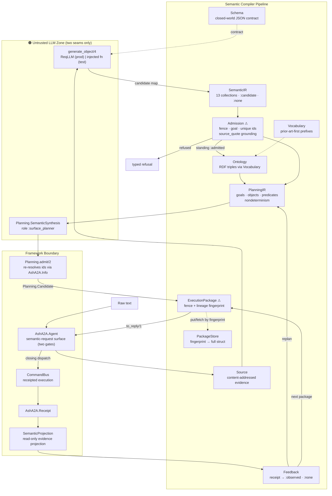
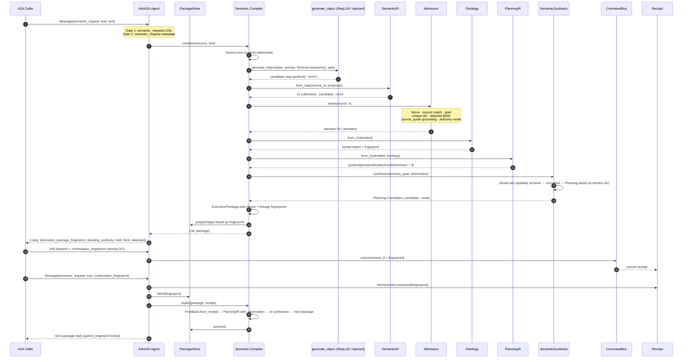

I have now verified every module of the Semantic Compilation domain directly against the source. The research materials align with the code, with one addition (`PackageStore`) the reports missed. Below is the complete technical documentation.

---

# Semantic Compilation Domain — Technical Documentation

**Project:** `ash_a2a` (Elixir/Spark DSL extension for the Ash Framework)
**Domain:** Semantic Compilation (`AshA2A.Semantic.*`)
**Scope of analysis:** `lib/ash_a2a/semantic/` (11 modules), `lib/ash_a2a/semantic_subject.ex`, `lib/ash_a2a/semantic_projection.ex`, `lib/ash_a2a/llm_profiles.ex`, `lib/ash_a2a/planning/semantic_synthesis.ex`, `lib/ash_a2a/planning.ex` (planning admission consumed by the pipeline), and the semantic surface in `lib/ash_a2a/agent.ex`.

---

## 1. Purpose and Positioning

The Semantic Compilation domain turns **raw text into formal planning input without ever letting a language model grant itself authority**. It implements a closed-loop pipeline:

```
raw text → content-addressed Source → LLM candidate extraction →
candidate SemanticIR → deterministic Admission Gate → admitted SemanticIR →
RDF-style Ontology projection → PlanningIR → plan candidate (HDDL/FOND) →
fingerprinted ExecutionPackage → (runtime execution via CommandBus) →
receipt → authority-free Feedback → replan
```

The domain is the mechanism by which `ash_a2a` supports teams that want natural-language goals compiled into formal plans and executed against real capabilities. Its contract with the rest of the framework is deliberately narrow:

- **It consumes** raw text (from the explicit A2A semantic-request surface) and, on the feedback side, committed `AshA2A.Receipt` structures.
- **It produces** candidate-only, authority-free, content-fingerprinted `ExecutionPackage` values consumed by the planning/runtime boundary.

Everything the model proposes is *evidence*, never *authority*. This is not a convention enforced by review — it is structural: every artifact type in the pipeline carries hard-wired defaults (`standing:`, `authority:`), and downstream constructors **pattern-match refuse** anything that violates the ceiling.

---

## 2. Core Design Principles

The domain instantiates four system-wide invariants, each verified in code:

### 2.1 Candidate-then-Admit for All LLM Output (INV-5)

Every model-derived artifact enters the system with `standing: :candidate` and `authority: :none`, and can only progress to `:admitted` by passing a **deterministic, pure-Elixir gate** — never by model self-certification. The gate is `AshA2A.Semantic.Admission`, and it begins with a hard fence:

```elixir
defp fence(%IR{standing: :candidate, authority: :none}), do: :ok
defp fence(_), do: error(:semantic_authority_ceiling_violated)
```

Any artifact that claims to already be admitted, or that arrives with any authority other than `:none`, is refused outright before field validation even begins.

### 2.2 Fail-Closed Validation at Every Boundary

No step "partially succeeds." Every rejection is a typed refusal map (`%{code: atom, detail: term}`) — never an exception on the dispatch path, never a silent default. The admission gate alone defines eight distinct refusal codes covering authority violations, source mismatches, missing goals, duplicate identities, missing fields, ungrounded quotes, and inadmissible authority grants.

### 2.3 Deterministic Derivation over Generation

LLMs are used **only** at two well-defined seams (semantic extraction and plan synthesis). Everything downstream of those seams — normalization, validation, triple projection, planning-IR manufacture, fingerprinting, package binding — is pure, deterministic Elixir over immutable structs. Identical admitted inputs replay to identical fingerprints.

### 2.4 Receipts and Fingerprints as Universal Evidence

Every artifact is content-addressed with SHA-256 over `:erlang.term_to_binary/1`, encoded lowercase hex:

| Artifact | Fingerprint input |
|---|---|
| `Source.id` | `{media_type, provenance, text}` |
| `Ontology.fingerprint` | the sorted triple set |
| `PlanningIR.fingerprint` | struct minus its own `:fingerprint` key |
| `Planning.Candidate.fingerprint` | `{planner, formalism, capability_ids, plan}` |
| `ExecutionPackage.fingerprint` | `{source.id, ontology.fp, planning.fp, candidate.fp}` |
| `Feedback.fingerprint` | `{package.fingerprint, observation}` |

Because package fingerprints are one-way hashes, the domain ships a dedicated `PackageStore` to make full packages retrievable for continuation (§8.3).

---

## 3. Architecture and Module Map



**File inventory (all verified):**

| Module | Responsibility |
|---|---|
| `Semantic.Compiler` | Pipeline orchestrator; `:generate_object` DI seam; batching; `replan/4` |
| `Semantic.Source` | Content-addressed raw-text evidence |
| `Semantic.Schema` | JSON structured-output contract for the LLM |
| `Semantic.IR` | 13-collection typed candidate state; `from_map/2` normalization |
| `Semantic.Admission` | Deterministic admission gate with provenance grounding |
| `Semantic.Vocabulary` | Prior-art-first namespace registry and expansion |
| `Semantic.Ontology` | Deterministic RDF-triple projection of admitted IR |
| `Semantic.PlanningIR` | Formal-planning projection (goals/objects/predicates/FOND) |
| `Semantic.ExecutionPackage` | Fingerprinted, lineage-aware candidate bundle + A2A reply |
| `Semantic.PackageStore` | In-memory fingerprint → package registry for continuations |
| `Semantic.Feedback` | Receipt → typed authority-free observation |
| `SemanticSubject` | Three-digest evidence identity bound to commands |
| `SemanticProjection` | Read-only receipt/capability/OCEL evidence projection |
| `LLMProfiles` | Role → provider/model resolution (fail-closed config) |

---

## 4. The LLM Boundary

### 4.1 Two Seams, Nothing Else

The domain touches a language model in exactly two places, and both are the same injectable seam:

```elixir
generate = Keyword.get(opts, :generate_object, &ReqLLM.generate_object/4)
```

- **Production default:** the real `ReqLLM.generate_object/4` (model spec, prompt, schema, options).
- **Test injection:** an anonymous 4-arity function with fixed, schema-valid output. The compiler's moduledoc is explicit that this is a *dependency-injection seam, not a mocking-library hook* — every step downstream of the seam (IR construction, admission fencing, ontology projection, planning-IR manufacture, package fingerprinting) executes for real in tests. Live network LLM calls are not viable in deterministic CI.

The same seam exists in `Planning.SemanticSynthesis.synthesize/4` and can be set independently for planning via `:plan_generate_object`.

### 4.2 Role-Based Provider Resolution

Neither seam names a provider. `AshA2A.LLMProfiles` maps an abstract role to a concrete model at runtime:

```elixir
config :ash_a2a, :llm_profiles,
  semantic_reasoner: [provider: :zai_coder, model: "glm-5.3-flash", max_tokens: 4096]
```

The compiler's default extraction role is `:semantic_reasoner`; plan synthesis defaults to `:surface_planner`. This module codifies the seal **`A2ACapabilityIdentity != ModelProviderIdentity`**: switching providers is a config change, never a source change, and a missing role configuration **raises** (`ArgumentError` naming the missing role) rather than silently guessing a provider — the `CONFIGURATION_MISSING → BLOCKED` discipline. On the agent's semantic surface, that raise is rescued into a typed `{:error, ...}` reply so a misconfigured role can never crash the shared agent GenServer.

### 4.3 The Structured-Output Contract

`AshA2A.Semantic.Schema.extraction/0` builds the JSON schema every extraction call must satisfy. It is a **closed world**:

- Top level: `"additionalProperties" => false`, and **all thirteen collections plus `authority` are required** — the model cannot omit a collection.
- `authority` is an enum locked to `["none"]` — the model structurally cannot declare authority at the wire level, in addition to the admission fence.
- Each assertion item is closed-world too, with properties `id, kind, label, type, subject, predicate, object, description, scope, mode, source_quote`, required `["id", "kind", "source_quote"]`, and `mode` restricted to the enum `["described", "denied", "unknown"]`.

The extraction prompt reinforces the contract in prose: reuse the public ontology prefixes (which the compiler embeds, sorted, from `Vocabulary.prefixes/0`), attach a **verbatim `source_quote` to every assertion**, preserve uncertainty and exclusions, and never grant execution authority.

---

## 5. Candidate Artifacts

All artifacts are immutable structs with `@enforce_keys`, hard-wired standing/authority defaults, and no write paths that mutate standing except the admission gate itself.

### 5.1 `Semantic.Source` — Anchored Evidence

```elixir
@enforce_keys [:id, :text, :media_type, :provenance]
defstruct [:id, :text, :media_type, :observed_at, :provenance]
```

`Source.new/2` defaults `media_type` to `"text/plain"` and `provenance` to `%{}`, and mints the identity as `SHA-256({media_type, provenance, text})` unless the caller pins an explicit `:id`. The moduledoc states the semantic intent: *a source is evidence, not executable authority; its identity is content-based so the same admitted input can be replayed without manufacturing a new semantic subject*. `uri/1` exposes it as `urn:ash-a2a:source:<id>`, which the ontology uses as the `prov:wasDerivedFrom` object.

### 5.2 `Semantic.IR` — Thirteen Typed Collections

The candidate state extracted from one source is normalized into thirteen collections (module attribute `@fields`):

```
entities, relations, events, goals, constraints, capabilities, authorities,
observations, uncertainties, exclusions, temporal_relations, causal_hypotheses, unresolved
```

`IR.from_map/2` is defensive by construction:

- Reads each collection by its **string** key from the raw LLM map and coerces any non-list to `[]`.
- Enforces only `:source_id`; sets `standing: :candidate` and `authority: :none` as struct defaults.
- Handles the model's `authority` field: the string `"none"` maps to `:none`; **anything else maps to `:invalid`** — which the admission fence will refuse. The IR never fabricates a passing authority value.
- Non-map input is refused with `{:error, %{code: :invalid_semantic_ir, ...}}`.

`IR.items/1` flattens all collections into `{field, item}` tuples — the single traversal primitive consumed by Admission, Ontology, and fingerprinting.

### 5.3 `Semantic.PlanningIR` — Formal-Planning Projection

`PlanningIR.from_ir/2` accepts **only** IR with `standing: :admitted, authority: :none` plus a fingerprinted Ontology; anything else is refused with `:planning_ir_requires_admitted_semantics`. It manufactures:

| Field | Source |
|---|---|
| `ontology_fingerprint` | the admitted ontology's fingerprint (lineage anchor) |
| `goals` | `description` of each admitted goal |
| `objects` | `{id, type, label}` of each entity |
| `predicates` | `{subject, predicate, object}` of each relation |
| `constraints` | constraint descriptions |
| `task_candidates` | capability descriptions |
| `nondeterminism` | uncertainty descriptions (FOND markers) |
| `observations` / `exclusions` | corresponding descriptions |

Its own fingerprint is computed by hashing the struct *minus* the `:fingerprint` key (the field is built with a `"pending"` placeholder, then replaced), so the digest is self-consistent. Helpers: `primary_goal/1` (head of the goal list — this is what plan synthesis receives), `observation/1` (string-keyed map of the whole IR for the synthesis prompt), and `with_observation/2` (appends a feedback observation and re-fingerprints — the replan mutation point).

### 5.4 `Semantic.ExecutionPackage` — The Boundary Bundle

The package binds everything into one lineage-addressed envelope:

```elixir
@enforce_keys [:source, :semantic_ir, :ontology, :planning_ir, :plan_candidate, :fingerprint]
defstruct [..., :parent_fingerprint, feedback: [], standing: :candidate, authority: :none]
```

`new/6` runs a **four-way fence** before fingerprinting — semantic IR admitted, ontology authority `:none`, planning IR authority `:none`, plan candidate `standing: :candidate, authority: :none` — else `:semantic_package_authority_ceiling_violated`. The package fingerprint is `SHA-256({source.id, ontology.fp, planning.fp, candidate.fp})`, and `parent_fingerprint` chains replan descendants, giving each package an auditable lineage.

Two behaviors make the package the framework-boundary citizen:

- **`to_reply/1`** converts an admitted package into a real `AshA2A.Dispatcher.reply()` — `{:reply, [Part.Data.new(body)]}` — the same reply-tuple contract the ordinary CRUD dispatch path returns, so callers see one consistent reply shape. The body carries only candidate evidence: `execution_package_fingerprint`, `standing: "candidate"`, `authority: "none"`, the re-admitted `request_id`/`capability_ids`, and the synthesized `hddl`/`fond`/`rationale` text. Its doc is emphatic: it *never claims execution occurred; nothing in this reply can be mistaken for a DO receipt*. A non-candidate package is refused.
- **Continuation:** because the fingerprint travels to the caller on the wire, the caller can present it back to trigger a replan (§8.3).

---

## 6. The Admission Gate — Deterministic Trust Boundary

`AshA2A.Semantic.Admission.admit/2` is where candidate evidence becomes admitted state, and it is the only place standing transitions from `:candidate` to `:admitted`. The check chain, in order:

1. **Authority fence** — IR must be `standing: :candidate, authority: :none` → else `:semantic_authority_ceiling_violated`.
2. **Source binding** — `ir.source_id` must equal `source.id` → else `:semantic_source_mismatch` (candidates cannot be transplanted across sources).
3. **Goal presence** — at least one goal is mandatory → `:semantic_goal_missing`. A compilation without an objective cannot be planned against, so it is refused rather than admitted as decorative structure.
4. **Global identity uniqueness** — every item across all thirteen collections must carry a binary `id`, and ids must be unique across collections → `:semantic_identity_invalid`.
5. **Per-collection required fields** — a declarative `@required` attribute map:

   | Collection | Required fields |
   |---|---|
   | `entities` | `id, kind, type, label, source_quote` |
   | `relations` | `id, kind, subject, predicate, object, source_quote` |
   | `goals`, `constraints`, `capabilities`, `observations`, `uncertainties`, `exclusions` | `id, kind, description, source_quote` |
   | `authorities` | `id, kind, subject, scope, mode, source_quote` |
   | `events`, `temporal_relations`, `causal_hypotheses`, `unresolved` (default) | `id, kind, source_quote` |

   → `:semantic_fields_missing` with the offending field and missing keys.

6. **Provenance grounding (anti-hallucination check)** — the `source_quote` must literally satisfy `String.contains?(text, quote)` against the anchored source text → else `:ungrounded_assertion` naming the item id. This is the mechanism that makes "full provenance" *verifiable* rather than merely declared: the model must quote the source, and the gate proves the quote exists.
7. **Authority-grant admissibility** — every `authorities` item's `mode` must be one of `"described" | "denied" | "unknown"` → else `:authority_grant_not_admissible`. Even the *description* of authority in the source text can only be recorded as observed/denied/unknown — never as granted.

On full success, the gate returns `{:ok, %{ir | standing: :admitted}}` — a single, auditable standing transition on an otherwise immutable struct.

---

## 7. Deterministic Projections

### 7.1 Ontology Projection

`Semantic.Ontology.from_ir/1` accepts **only** admitted IR (else `:ontology_requires_admitted_semantics`) and produces a deterministic RDF-shaped triple set:

- **Base triples per item:** `rdf:type` → the collection node (`Vocabulary.local/1`), `schema:description` → `description || label || kind`, and `prov:wasDerivedFrom` → `urn:ash-a2a:source:<id>`. Entities additionally get `rdf:type` → their expanded `type` (prior-art class linkage).
- **Relation triples:** subject resolved to `urn:ash-a2a:semantic:node:<id>`, predicate expanded through the vocabulary, object resolved to a node **iff** it references a known id in the item MapSet, otherwise emitted as a literal (relations may legitimately point outside the extracted set).
- **Determinism:** triples are sorted by `{subject, predicate, to_string(object)}` before fingerprinting — projection order is canonical, so identical inputs yield byte-identical fingerprints.

### 7.2 Vocabulary — Prior-Art-First Namespaces

`Semantic.Vocabulary` is the registry that keeps output deterministic and interoperable. `@prefixes` covers `rdf`, `rdfs`, `owl`, `prov`, `time`, `odrl`, `skos`, `schema` (schema.org), `oa` (Web Annotation), and `sosa` (Sensors, Observation, Sample, and Actuations). `expand/1` splits on the first colon: known prefixes expand to their canonical IRI; unknown or unprefixed values are sanitized (`[^A-Za-z0-9_.-]` → `_`) into the private `urn:ash-a2a:semantic:<suffix>` namespace. The compiler surfaces the sorted prefix list in the extraction prompt so the model is nudged toward prior-art predicates when exact semantics fit.

---

## 8. Plan Synthesis and the Closed Loop

### 8.1 `Planning.SemanticSynthesis` — Candidates for Unknown Boundaries

When the primary goal exceeds what known plans cover, `SemanticSynthesis.synthesize/4` asks the configured `:surface_planner` role to manufacture an HDDL/FOND candidate. Its defense-in-depth is layered:

1. **Refuse empty capability spaces:** if the resource/domain's canonical capability index is empty, it refuses immediately with `:no_canonical_capabilities` — synthesis never runs against nothing.
2. **Closed-set constraint at the schema level:** the structured-output schema types `capability_ids` as an array of enums restricted to the *actual* canonical capability ids (`Info.capability_index/1`, sorted), with `uniqueItems: true`, and locks `authority` to `["none"]`.
3. **Prompt-level prohibition:** the synthesis prompt states the candidate must "not execute, actuate, click, submit, mutate, or claim that any step ran," and that capability ids are proposals to be independently admitted.
4. **Normalization:** the returned `authority` must equal `"none"` (`:planner_authority_ceiling_violated` otherwise) and the shape must be well-formed (`:invalid_semantic_plan_shape`).
5. **Canonical re-admission:** the envelope flows through `AshA2A.Planning.from_envelope/3`, which re-resolves **every** proposed capability id through `AshA2A.Info` against the real capability index — a single unresolvable id refuses the whole candidate with `:noncanonical_capability`. The model's own claim is never trusted.

The result is an `AshA2A.Planning.Candidate` — enforced keys `{planner, plan, capability_ids, fingerprint}`, defaults `standing: :candidate, authority: :none`, and an `admitted_skills` list populated only by canonical admission.

### 8.2 The Feedback Loop

Execution closes the loop without granting authority. `Semantic.Feedback.from_receipt/2` takes the committed `AshA2A.Receipt` from a real CommandBus execution, projects it through the read-only `SemanticProjection.receipt/1`, and produces typed observation evidence:

```elixir
observation = %{
  "kind" => "runtime_receipt",
  "receipt_id" => ..., "capability_id" => ..., "status" => ...,
  "standing" => ..., "consequence" => ..., "replayed" => ...
}
```

The Feedback struct enforces `{package_fingerprint, receipt_id, observation, fingerprint}`, defaults `standing: :observed, authority: :none`, and fingerprints over `{package.fingerprint, observation}` — tying the observation cryptographically to the package it observations-of.

`Compiler.replan/4` consumes it:

```elixir
{:ok, feedback}         <- Feedback.from_receipt(package, receipt)
planning_ir             <- PlanningIR.with_observation(package.planning_ir, feedback.observation)
{:ok, candidate}        <- synthesize(...)   # re-synthesis with folded observation
{:ok, next}             <- ExecutionPackage.new(...,
                             parent_fingerprint: package.fingerprint,
                             feedback: package.feedback ++ [feedback])
```

The next package is fenced identically to a fresh compile — replanned candidates are no more able to auto-execute than first-compile candidates — and packages can chain indefinitely (compile → closing dispatch → receipt → replan → closing dispatch → …).

### 8.3 `Semantic.PackageStore` — Fingerprint Continuations

A fingerprint is a one-way hash: a caller holding `execution_package_fingerprint` on the wire cannot reconstruct the full `{source, semantic_ir, ontology, planning_ir, plan_candidate}` tuple that `replan/4` needs. `PackageStore` is the missing half — a GenServer registry keyed by each package's own fingerprint:

- **Deliberately a separate store from `ReceiptStore`,** per its moduledoc: a Receipt records what a real DO attempt observed (`standing: :observed`), while an ExecutionPackage is candidate-only, authority-free output (`standing: :candidate`). Conflating the stores would let a candidate be retrieved as if it were receipted evidence.
- **Write path:** `AshA2A.Agent.dispatch_semantic/2` is the only production writer — every real compile and every real replan stores its resulting package before replying.
- **Read path:** the agent's continuation-replan path is the only production reader.
- **Durability trade-off:** in-memory and best-effort, matching `ReceiptStore.Memory`. Losing pending candidate packages on restart is acceptable because — unlike a committed receipt — nothing of consequence was ever true merely because a candidate package existed.

### 8.4 Supporting Models

- **`SemanticSubject`** binds a command to the exact semantic/manufacture identity that produced the capability surface it uses: three required digests (`graph_digest`, `projection_digest`, `manufacturer_digest`), each validated as `"sha256:" <> 64 lowercase hex` (anything else is refused with `{:refused_semantic_subject, field}`). `ephemeral?` defaults `true`. Its doc is unambiguous: *evidence identity only — grants no capability and no authority*. `fingerprint_token/1` emits the tuple folded into command fingerprints so retries/replays are scoped to the exact semantic graph.
- **`SemanticProjection`** is the read-only evidence projector used by Feedback and telemetry: `receipt/1` flattens a receipt with externalized identity ids; `capability/2` resolves a skill through `AshA2A.Info` and joins an optional `ash_r2rml` mapping result via capability probing (`Code.ensure_loaded?/1` + `function_exported?/3`, exception-safe); `ocel_event/1` shapes receipts as OCEL v2 events. It never executes SPARQL, never mutates RDF, never grants authority.

---

## 9. The A2A Surface — Explicit Two-Gate Opt-In (v26.9.14)

Semantic compilation is **not** an implicit behavior. `AshA2A.Agent.__dispatch__/3` routes a message into the semantic path only if **both** independent gates hold:

1. The target resource/domain declared `a2a do semantic_requests true end` (compiled DSL truth, exposed via `AshA2A.Info.semantic_requests_enabled?/1`); **and**
2. The caller's inbound message sets `:semantic_request`/`"semantic_request"` metadata to `true` (the same `MetadataKey` atom-then-string convention as `:skill`).

There is no content sniffing of unstructured text and no fallback for unrecognized skill names. A message missing either gate falls through to ordinary skill resolution unchanged.

Within the semantic path:

- **Fresh compile:** the message must carry text (`A2A.Message.text/1`); a flagged message without text is refused closed with `:semantic_request_missing_text` rather than compiling an empty string. On success the package is stored in `PackageStore` and answered via `ExecutionPackage.to_reply/1`. The whole branch is wrapped in `rescue` — e.g., the deliberate `ArgumentError` from `LLMProfiles.model_spec!/1` — so every failure is a typed reply (`:semantic_compilation_failed`, `:semantic_replan_failed`) that can never crash the shared agent GenServer.
- **Continuation replan:** a message additionally carrying `:continuation_fingerprint` metadata requires **two real lookups to succeed**, both failing closed with distinct codes:
  - a **committed receipt** must exist under that fingerprint. The correlation mechanism reuses the existing command-id-keyed `ReceiptStore.fetch/2`: when an ordinary skill dispatch carries `continuation_fingerprint` metadata, *that fingerprint becomes the closing command's `command_id`* (and is recorded in `Command.metadata["execution_package_fingerprint"]` for audit). Missing receipt → `:continuation_receipt_not_found`; refused dispatches never reach the store, so the absence *is* the refusal signal.
  - the **full package** must resolve in `PackageStore` → else `:continuation_package_not_found`.

  A useful consequence falls out of the fingerprint-as-command-id choice: two different closing commands sent under the same continuation fingerprint collide on the same `command_id` with different content fingerprints and hit the CommandBus's `:command_conflict` refusal — **only one real closing dispatch may claim a given package**, exactly the single-writer semantics the correlation requires. Meanwhile `Command.fingerprint/1` excludes `command_id` from its digest inputs, so this override changes where the receipt is filed, never what counts as "the same command" for replay.

---

## 10. Batch Compilation

`Compiler.compile_many/3` compiles a list of texts with `Task.async_stream` (default `max_concurrency: 50`, `ordered: true`, no timeout), preserving input order in results. Each worker runs `isolated_compile/3`, which `rescue`s exceptions and converts them into `{:error, %{code: :semantic_worker_exit, detail: formatted}}` — the code comment explains why: `async_stream` links workers to the caller, so an uncaught raise in one text would crash the entire batch rather than isolating to its slot. The `{:exit, reason}` clause remains only for genuine task exits (e.g., a timeout) the rescue cannot observe.

---

## 11. Refusal Code Catalog

Every failure mode has a named, typed code (verified against source):

**Admission gate:** `:semantic_authority_ceiling_violated`, `:semantic_source_mismatch`, `:semantic_goal_missing`, `:semantic_identity_invalid`, `:semantic_fields_missing` (detail: field + missing keys), `:ungrounded_assertion` (detail: item id), `:authority_grant_not_admissible`.

**Projections and packaging:** `:ontology_requires_admitted_semantics`, `:planning_ir_requires_admitted_semantics`, `:semantic_package_authority_ceiling_violated`, `:invalid_semantic_ir`.

**Compiler and surface:** `:semantic_compilation_failed`, `:semantic_worker_exit`, `:semantic_request_missing_text`, `:continuation_fingerprint_invalid`, `:continuation_receipt_not_found`, `:continuation_package_not_found`, `:semantic_replan_failed`.

**Synthesis:** `:no_canonical_capabilities`, `:planner_authority_ceiling_violated`, `:invalid_semantic_plan_shape`, `:semantic_synthesis_failed`, `:noncanonical_capability`, `:planner_capability_projection_missing`, `:unsupported_planner`.

---

## 12. End-to-End Sequence



---

## 13. Testing Strategy

The domain was explicitly designed for deterministic testing without mocking libraries:

- **The `:generate_object` seam is the only test double.** Tests inject a real anonymous function producing fixed, schema-valid output; IR construction, fencing, ontology projection, planning-IR manufacture, and package fingerprinting all execute for real. Because the seam is a plain keyword option, no patching framework is needed.
- **Determinism enables fingerprint assertions:** identical text + provenance replay to identical source ids, ontology fingerprints, and package fingerprints.
- **The in-memory `PackageStore` and `ReceiptStore.Memory`** support full compile → close → replan loop tests in a single node without external storage.
- **All failures are values** (`{:error, %{code, detail}}`), so refusal-path tests assert on codes rather than rescuing exceptions.

---

## 14. Configuration Summary

| Concern | Mechanism | Default |
|---|---|---|
| Extraction LLM role | `Compiler` opt `:role` | `:semantic_reasoner` |
| Plan-synthesis LLM role | opt `:planning_role` (falls back to `:role`) | `:surface_planner` |
| Provider/model per role | `config :ash_a2a, :llm_profiles, <role>: [provider:, model:, ...]` | none — fail-closed raise if missing |
| LLM seam | opts `:generate_object`, `:plan_generate_object` | `&ReqLLM.generate_object/4` |
| Source metadata | `:media_type`, `:provenance`, `:observed_at`, `:id` | `"text/plain"`, `%{}`, `nil`, content hash |
| Batch concurrency | `:max_concurrency` | `50` |
| Semantic A2A surface | `a2a do semantic_requests true end` + `semantic_request: true` metadata | disabled (both gates required) |

---

## 15. Known Trade-offs and Limitations

1. **`PackageStore` is in-memory and best-effort.** Continuation fingerprints do not survive restarts. This is a documented, deliberate trade-off: packages are candidate-only, authority-free output, unlike committed receipts. Deployments requiring durable replan continuations would need to back the store durably — which would raise the question of whether a candidate deserves durable treatment at all.
2. **Grounding is substring-based.** `source_quote` verification uses `String.contains?/2`; a model quote that paraphrases (rather than copies) the source fails, and conversely a quote that appears in the text but is wrenched from context is not semantically validated. The gate proves existence, not interpretation.
3. **Admission is field-shape, not semantics.** The gate validates required fields, uniqueness, grounding, and authority-mode enums. It cannot verify that a `description` is *true*, only that it is provenance-anchored — downstream consumers must treat admitted semantics as evidence, not fact.
4. **Single-node EKV claim atomicity** (system-wide, R-2 in the architecture risk register) applies equally to closing commands filed under continuation fingerprints in multi-node deployments.
5. **`primary_goal/1` is positional.** The first goal in the admitted list is the synthesis objective; goal priority is therefore extraction-order dependent. The model is prompted to preserve structure, but no explicit priority field exists in the goal contract.

---

## 16. Summary

The Semantic Compilation domain is a case study in making "untrusted AI output" a *type-level* property rather than a policy promise. Thirteen typed collections, a closed-world JSON contract, a seven-step deterministic admission gate with verbatim-provenance grounding, authority ceilings enforced by pattern match at four independent points (IR, package, candidate, synthesis), and content fingerprints that bind lineage from raw text through ontology, planning IR, plan candidate, execution receipt, and feedback — together they guarantee that the loop from natural language to formal plan to receipted execution can never promote model output into authority. The only two places a model is ever consulted are fenced, injectable seams; everything in between is pure, replayable Elixir.