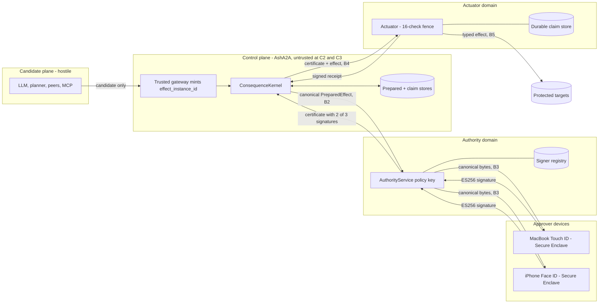

# sa2a-assurance-case-v26.9.29

Claims-Arguments-Evidence (CAE) assurance case for SA2A conformance profiles C0 to C3,
written against RFC-SA2A-006 section 31 as restated by RFC-SA2A-007 (errata). It states
what would have to be true and shows the evidence status of each node. It makes no
conformance claim.

**Subject at authoring:** `/Users/sac/ash_a2a` main at
`b812fe0b77693424654a460219a4322b55b2f026` plus uncommitted lane changes (OBSERVED).
**Verification status:** `mix ash_a2a.verify_conformance --profile c0..c3` was run at this
subject (dev build, `:dev_bypass`, dirty tree); all four are NOT CONFORMANT. Evidence nodes
below marked VERIFIED-BY-PROBE passed a verifier probe in that run; a probe pass on a dirty
`:dev_bypass` tree is not a claim and no mutation-revert was recorded by this document, so no
goal is satisfied by evidence. Other nodes keep the states PLANNED and EXISTS-UNVERIFIED-BY-RUN.
**Current standing:** C0 PARTIAL (subject_identity fails on dirty tree); C1, C2, C3 not claimed.
**Target:** C3, independence tier I2, signers MacBook Touch ID (Secure Enclave P-256), iPhone
Face ID (Secure Enclave P-256) and an automated AuthorityService policy key, 2-of-3.
**Last Updated:** 2026-09-29. Supersedes `sa2a-assurance-case-v26.9.28.md`.

## Update since v26.9.28: defect status (OBSERVED)

| Defect | v26.9.28 | v26.9.29 observation | Status |
|---|---|---|---|
| D1 kernel not on live path | ACTIVE | `CommandBus` calls `ConsequenceKernel.W4.DispatchInversion.execute/2` (command_bus.ex:1443); probe c1.command_bus_no_direct_dispatch PASS; c1.closure_report FAILED at probe time (ClosureCourt.report/0 was absent; module now in working tree, probe not re-run) | MITIGATED-UNPROVEN |
| D2 term_to_binary identity | ACTIVE | probe c1.canonical_at_boundaries PASS for 9 boundary modules; `term_to_binary` remains in command.ex, actuation.ex, receipt_outbox.ex and others (grep) | PARTIAL |
| D3 signatures never verified | ACTIVE | probes c2.certificate_verifier_signatures and c2.crypto_verifier_primitives PASS (real Ed25519; ML-DSA fails closed) | MITIGATED (EdDSA only) |
| D4 authority in-process | ACTIVE | `authority_service/` and `actuator/` are separate mix projects with no dep on `:ash_a2a` (probes PASS); no separate process/host evidence, release_distribution UNVERIFIED | PARTIAL |
| D5 35 vacuous C2 courts | ACTIVE | `test/ash_a2a/c2/court_*_test.exs` now matched by `_test.exs` (file names); non-vacuity not re-established by this document | UNKNOWN |
| D6 SignerSet counts labels | ACTIVE | probe c3.signer_set_quorum PASS: custodian-distinct quorum, same-custodian keys refused | MITIGATED |
| D12 dev_bypass/legacy left on | PLANNED | verifier refuses `:dev_bypass`; boot enforces strict config (`SecurityProfile.Boot`) | MITIGATED (verifier-side) |

Failing probes that keep C1 unclaimed: c1.security_profile_strict, c1.closure_report,
c1.durable_claim_store, c1.keyed_journal (configuration or lane-landing gaps).

## Contents

1. Reading guide and notation
2. Threat model
3. Top claims and current standing
4. C0 argument
5. C1 argument
6. C2 argument
7. C3 argument
8. Defeaters
9. Assumptions register
10. Residual-risk register
11. Evidence index and status counts
12. See Also

## 1. Reading guide and notation

- Node ids: `G` goal (claim), `S` strategy (argument step), `E` evidence, `D` defeater,
  `A` assumption, `R` residual risk.
- A goal is satisfied only when every sub-goal is satisfied and every evidence node under
  it has a recorded passing run on the exact subject with a recorded mutation-revert that
  fails. Today no evidence node meets this, so no goal is satisfied by evidence.
- Court ids beginning `SEC-`, `L0x-`, `X#-` come from the lane map and CWE matrix; ids
  beginning `ERR7-` come from RFC-007. All are PLANNED unless the file is named.
- File paths in evidence nodes are OBSERVED to exist at authoring only where marked
  EXISTS-UNVERIFIED-BY-RUN.

## 2. Threat model

### 2.1 Assets

| Id | Asset | Why it matters |
|---|---|---|
| AS1 | Protected effects (change, external_do) | the consequence being protected |
| AS2 | Authority signing keys (Secure Enclave x2, policy key) | forging one lowers the quorum |
| AS3 | Signer registry (kid to custodian_id, revocation) | defines who counts |
| AS4 | Claim, effect-claim and prepared-effect stores | gate at-most-once and recovery |
| AS5 | Receipts and evidence log | basis for standing and audit |
| AS6 | Actuator credentials to real targets | the power to do the effect |
| AS7 | Release artifacts and build pipeline | the code that enforces everything |
| AS8 | Policy and revocation epochs | freshness of authority |

### 2.2 Actors and adversary capabilities

- **T1**: Prompt-injecting or malicious content author; Capability assumed: controls LLM input and
  candidate text
- **T2**: Compromised or hostile model, planner, peer agent, MCP or A2A endpoint; Capability
  assumed: arbitrary candidates and tool calls
- **T3**: Control-plane host attacker (strongest RFC-006 profile); Capability assumed: code
  execution and root on the AshA2A host
- **T4**: Network attacker; Capability assumed: read, replay, modify unauthenticated traffic
- **T5**: Insider or careless developer; Capability assumed: enables bypass, mis-sets profile,
  leaks a key
- **T6**: Supply-chain attacker; Capability assumed: poisons a dependency, NIF or build step
- **T7**: Stolen approver device; Capability assumed: possession of one unlocked or locked device
- **T8**: Actuator or authority host attacker; Capability assumed: root on that host (outside the
  theorem, E-A P1, P2)

The theorem holds against T1..T4, T6 in part, and T7 for fewer than k devices. T8 is outside
it. T5 is addressed by profile guards, not by cryptography.

### 2.3 Trust boundaries

- **B1**: Candidate plane to control plane; Crossing rule: candidates only; no authority, no
  credentials
- **B2**: Control plane to authority domain; Crossing rule: typed wire (UDS or mTLS); no Erlang
  distribution
- **B3**: Authority domain to approver devices; Crossing rule: canonical bytes to native app;
  signature back
- **B4**: Control plane or authority to actuator domain; Crossing rule: certificate plus canonical
  effect; typed wire
- **B5**: Actuator domain to targets; Crossing rule: narrow typed effectors, no ambient
  credentials
- **B6**: Build to release; Crossing rule: protected main, signed tag, attestation

### 2.4 Data-flow diagram



The same flow as ASCII, for readers without a renderer:

```text
[Candidate: LLM/planner/peer] --candidate--> [Gateway: effect_instance_id]
   --> [ConsequenceKernel + stores]  --canonical PreparedEffect (B2)-->
[AuthorityService + registry] --bytes (B3)--> [MacBook SE] [iPhone SE]
   <--ES256 signatures-- ; 2-of-3 certificate --> [Kernel] --cert+effect (B4)-->
[Actuator: fence + claim store] --typed effect (B5)--> [Targets]
[Actuator] --signed receipt--> [Kernel]
```

## 3. Top claims and current standing

- **G-C0**: Semantic separation: candidate, admitted, exact subject, SELECT, CONSTRUCT, DO are
  distinct; no compromise-tolerance claim; Standing: PARTIAL
- **G-C1**: Receipted consequence: `Compromise(Intelligence)` does not imply UnauthorizedDO,
  assuming the kernel is trustworthy; Standing: UNSATISFIED
- **G-C2**: `Compromise(ControlPlane)` does not imply UnauthorizedDO, assuming P1..P8 (RFC-007
  E-A); Standing: UNSATISFIED
- **G-C3**: `Compromise(ControlPlane + fewer than 2 signers)` does not imply UnauthorizedDO, at
  tier I2; Standing: UNSATISFIED

Standing is taken from the verifier run recorded above (dirty tree, `:dev_bypass`); it is not
derived from receipts and may not be upgraded by this document. Goal standings in the list
above are the v26.9.28 values; the defect table above is the v26.9.29 update.

## 4. C0 argument

**G-C0** Semantic separation holds on the live path.

- **S-C0-1** Argue over identity: request, effect and subject identities are distinct and
  exact.
  - E-C0-1 `test/ash_a2a/sec_m14_canonical_identity_test.exs` (key order only, no known
    answer). EXISTS-UNVERIFIED-BY-RUN; weak per `_LANES_V3.md`. Strengthened by
    SEC-M14-1..4. PLANNED.
  - E-C0-2 `test/ash_a2a/sec_m11_effect_instance_test.exs` (inequality and prefix regex
    only). EXISTS-UNVERIFIED-BY-RUN; weak. Strengthened by SEC-M11-A..C. PLANNED.
  - E-C0-3 ERR7-F-1..4 (JCS policy). PLANNED.
- **S-C0-2** Argue over admission and refusal typing.
  - E-C0-4 SEC-L03-1..6 (classification totality, doc parity). PLANNED.
  - E-C0-5 `test/ash_a2a/consequence_kernel/refusal_registry_test.exs` (codes checked
    against themselves; tautological). EXISTS-UNVERIFIED-BY-RUN; void as evidence.
- **S-C0-3** Argue that SELECT, CONSTRUCT and DO are separate transitions.
  - E-C0-6 Chicago court set (`lib/ash_a2a/chicago/courts/*`). EXISTS-UNVERIFIED-BY-RUN.
  - E-C0-7 `mix ash_a2a.chicago.mutate` result on the exact subject. PLANNED.
- **Gap:** the production path is `Agent -> CommandBus.run -> BrceAnchor.put ->
  Dispatcher.dispatch -> Ash.*` (`_LANES_V3.md`); the kernel is not on it, so the C0
  statement covers the legacy path only. Standing PARTIAL.

## 5. C1 argument

**G-C1** Every protected DO passes one kernel with effect claim, durable prepare, exclusive
DO path, unknown-outcome semantics and receipt/replay.

- **S-C1-1** Argue complete mediation as a graph property (RFC-006 section 27).
  - E-C1-1 `mix ash_a2a.effector_graph` and `mix verify.effector_graph`. PLANNED (L05, L20).
  - E-C1-2 L20-GRAPH-1,2 (graph court, wired path). PLANNED.
  - E-C1-3 `test/ash_a2a/c1_vectors/dispatcher_bypass_test.exs` (passes the forbidden
    module in the list it checks). EXISTS-UNVERIFIED-BY-RUN; vacuous, void.
  - E-C1-4 SEC-M01-1,2,3,6 (forgery, ambient, graph, observe). PLANNED.
- **S-C1-2** Argue at-most-once with unknown outcome (RFC-007 E-B).
  - E-C1-5 ERR7-B-1..3. PLANNED.
  - E-C1-6 SEC-M10 and RFC004-M12 x8, RFC004-UNKNOWN x5. PLANNED (L10).
  - E-C1-7 `test/ash_a2a/consequence_kernel/unknown_outcome_test.exs` (field copy only).
    EXISTS-UNVERIFIED-BY-RUN; void.
  - E-C1-8 `test/ash_a2a/consequence_kernel/claim_test.exs` (London-style delegation tuple).
    EXISTS-UNVERIFIED-BY-RUN; void.
- **S-C1-3** Argue durable prepare and keyed journal.
  - E-C1-9 SEC-M09-1..5, PE-1, PE-2. PLANNED (L04).
  - E-C1-10 `test/ash_a2a/prepared_effect_test.exs` (`sha256:` prefix only).
    EXISTS-UNVERIFIED-BY-RUN; void.
- **S-C1-4** Argue exact identity on the live path.
  - E-C1-11 SEC-M14 no-BEAM-serialization court (`sec_m14_no_beam_serialization`). PLANNED.
  - E-C1-12 `priv/sa2a/c1/vectors/*.json` (26 descriptors, no expected digests).
    EXISTS-UNVERIFIED-BY-RUN; void until known-answer vectors are added.
- **S-C1-5** Argue derived standing and receipts.
  - E-C1-13 SEC-M15-1..4, 6, 7. PLANNED (L19).
  - E-C1-14 C-L18-1..7 (receipt seal, wire). PLANNED; definitions not yet pinned.
- **Standing basis:** `_LANES_V3.md` lists seven discriminating findings; the kernel has no
  production caller and no store implements its claim callbacks.

## 6. C2 argument

**G-C2** Protected DO requires an independently issued certificate over the exact effect;
the actuator verifies it independently; the control plane holds no protected credentials;
premises P1..P8 hold.

- **S-C2-1** Argue the certificate is verified cryptographically (RFC-007 E-E).
  - E-C2-1 X1-C1..C6 (sa2a_wire Verifier, known-answer, mutation of each signed field).
    PLANNED.
  - E-C2-2 ERR7-E-1..5. PLANNED.
  - E-C2-3 `lib/ash_a2a/c2/certificate_verifier.ex` currently checks only that the
    algorithm atom is supported (`_LANES_V3.md`). EXISTS-UNVERIFIED-BY-RUN; known defect.
- **S-C2-2** Argue authority is outside the control-plane host.
  - E-C2-4 X2-C1..C6, including a real second OS process. PLANNED.
  - E-C2-5 ERR7-D-1..3 (no distribution across domains). PLANNED.
  - E-C2-6 Deployment evidence for hosting scope (RFC-007 E-A): OS user, namespace or host.
    PLANNED.
  - E-C2-7 `lib/ash_a2a/c2/*` in-process code. EXISTS-UNVERIFIED-BY-RUN; it is inside the
    control plane and provides no separation.
- **S-C2-3** Argue the actuator verifies independently and fails closed.
  - E-C2-8 SEC-X4-1..11 and fence_16 vectors with per-check mutation. PLANNED.
  - E-C2-9 ERR7-J-1..3 (revocation staleness), ERR7-K-1..3 (TTL). PLANNED.
  - E-C2-10 SEC-X4-12,13 (real actuator process; BLOCKED on X2, L11, L20b). PLANNED.
- **S-C2-4** Argue no ambient credentials in the control plane.
  - E-C2-11 SEC-REL-22 (canary credential absent from candidate view). PLANNED.
  - E-C2-12 Key-fence court: control-plane host holds no authority key (physical, not a
    name blocklist). PLANNED.
- **S-C2-5** Argue receipts crossing boundaries are non-repudiable (RFC-007 E-O).
  - E-C2-13 ERR7-O-1..5. PLANNED.
- **S-C2-6** Argue courts are non-vacuous (RFC-007 E-H).
  - E-C2-14 `test/ash_a2a/c2/court_001..035.exs` (35 files asserting digest inequality
    only, not matched by `_test.exs`). EXISTS-UNVERIFIED-BY-RUN; void as conformance
    evidence.
  - E-C2-15 ERR7-H-1..3 (linter, status renderer, pickup count). PLANNED.
- **S-C2-7** Argue profile guards (RFC-007 E-L, E-M, E-P).
  - E-C2-16 ERR7-L-1..6, ERR7-M-1..3, ERR7-P-1..3. PLANNED.

## 7. C3 argument

**G-C3** With C2 satisfied, an effect requires 2 valid signatures from distinct custodians;
compromise of the control plane and one signer does not permit DO.

- **S-C3-1** Argue signer counting and independence (RFC-007 E-C).
  - E-C3-1 X3-C1..C8 (registry, k-of-n over distinct authority domains, revocation bound to
    epoch). PLANNED.
  - E-C3-2 ERR7-C-1..4. PLANNED.
  - E-C3-3 `lib/ash_a2a/c2/signer_set.ex` (`AshA2A.C3.SignerSet` counts unique labels, no
    independence, no callers). EXISTS-UNVERIFIED-BY-RUN; known defect, rename or delete.
- **S-C3-2** Argue approvers see what they sign (RFC-007 E-I).
  - E-C3-4 ERR7-I-1..3 (native approver recomputes digest from canonical bytes). PLANNED.
  - E-C3-5 Real Secure Enclave known-answer vector verified by sa2a_wire. PLANNED.
- **S-C3-3** Argue single-signer compromise is insufficient.
  - E-C3-6 RFC-006 section 26 court cases "single compromised signer below quorum" and
    "insufficient quorum" against the real actuator. PLANNED.
- **S-C3-4** Argue resource conservation (RFC-006 section 28).
  - E-C3-7 SEC-M22-1..7 and differential apportion court. PLANNED (L17; 5 and 6 blocked on
    L05).
  - E-C3-8 Property-based amplification generator over spawn, delegate, retry. PLANNED.
- **S-C3-5** Argue supply chain (RFC-007 E-Q).
  - E-C3-9 ERR7-Q-1..5. PLANNED.
  - E-C3-10 `release.yml` steps for locked deps, SBOM, provenance. EXISTS-UNVERIFIED-BY-RUN
    (workflow read, not run; no artifact for this subject).
- **S-C3-6** Argue the claim statement is computed (RFC-007 section 4).
  - E-C3-11 Conformance verifier output for a release subject. PLANNED.

## 8. Defeaters

Each defeater, if it holds, undermines the named goal. Status is whether the defeater is
currently active (ACTIVE) or has a planned mitigation that has not run (MITIGATION PLANNED).

- **D1**: Kernel has no production caller; live path bypasses it; Undermines: G-C1, G-C2, G-C3;
  Status: MITIGATED-UNPROVEN (see update table) (was ACTIVE at v26.9.28)
- **D2**: Production identity uses term_to_binary, not JCS; Undermines: G-C1; Status: PARTIAL (was ACTIVE at v26.9.28)
- **D3**: `CertificateVerifier` never verifies a signature; Undermines: G-C2, G-C3; Status: MITIGATED (EdDSA only) (was ACTIVE at v26.9.28)
- **D4**: Authority code is in-process in the control plane; Undermines: G-C2, G-C3; Status:
  PARTIAL (was ACTIVE at v26.9.28)
- **D5**: All 35 C2 courts are vacuous; Undermines: G-C2, G-C3; Status: UNKNOWN (was ACTIVE at v26.9.28)
- **D6**: `SignerSet` counts labels, not custodians; Undermines: G-C3; Status: MITIGATED (was ACTIVE at v26.9.28)
- **D7**: Co-hosted authority or actuator; host root defeats theorem; Undermines: G-C2, G-C3;
  Status: MITIGATION PLANNED (scope statement, E-A)
- **D8**: Control plane renders the approval UI; Undermines: G-C3; Status: MITIGATION PLANNED
  (native app, E-I)
- **D9**: Two Apple devices held by one person (tier I3 not met); Undermines: G-C3 at I3; Status:
  ACCEPTED at I2; claim states tier
- **D10**: A courts run is pinned to a sibling or stale subject; Undermines: all; Status:
  MITIGATION PLANNED (E-N, section 4)
- **D11**: Retry framework re-runs an unknown outcome; Undermines: G-C1 to G-C3; Status:
  MITIGATION PLANNED (E-B)
- **D12**: `dev_bypass` or `legacy_compat` left on in a release; Undermines: all; Status:
  MITIGATION PLANNED (E-L, E-M, E-P)
- **D13**: Revocation view arbitrarily stale at the actuator; Undermines: G-C2, G-C3; Status:
  MITIGATION PLANNED (E-J)
- **D14**: Reused or long-lived approval; Undermines: G-C2, G-C3; Status: MITIGATION PLANNED (E-K)
- **D15**: Shared-key MAC receipts accepted as cross-boundary proof; Undermines: G-C2, G-C3;
  Status: MITIGATION PLANNED (E-O)

## 9. Assumptions register

Each assumption is a premise the claims rely on. Violating it is a residual risk or a
disqualifier; none is verified by this document.

- **A1**: Key custody; Assumption: Secure Enclave P-256 keys are non-exportable and require
  biometric user presence per signature; Consequence if false: one device compromise yields
  repeated signatures
- **A2**: Key custody; Assumption: The AuthorityService policy key is readable only by its OS user
  (0600 file in 0700 dir outside the workspace); Consequence if false: policy signer forgeable by
  a control-plane attacker
- **A3**: Key custody; Assumption: No authority or actuator key exists on the control-plane host;
  Consequence if false: C2 and C3 claims void
- **A4**: Key custody; Assumption: Signer registry is integrity-sealed and its seal key is outside
  the control plane; Consequence if false: attacker adds a signer or remaps custodians
- **A5**: Clock; Assumption: Actuator and authority clocks are within the declared skew of trusted
  time; Consequence if false: TTL and staleness bounds unsound
- **A6**: BEAM/OTP; Assumption: OTP 29.1.1 and Elixir 1.20.4-otp-29 contain no exploitable defect
  in the used features (`:crypto`, `:ssl`, supervision); Consequence if false: kernel or verifier
  compromise
- **A7**: BEAM/OTP; Assumption: Separate cookies and `RELEASE_DISTRIBUTION=none` prevent
  cross-domain distribution; Consequence if false: control plane reaches authority VM
- **A8**: Crypto libraries; Assumption: OpenSSL as used by `:crypto`, ECDSA P-256, SHA-256,
  Ed25519 hold; `:crypto.verify` strict on inputs; Consequence if false: forged signature accepted
- **A9**: Secure Enclave; Assumption: Signatures are DER ECDSA over SHA-256, not low-s normalized;
  replay control is keyed on (kid, nonce); Consequence if false: signature-byte malleability
  defeats replay control if keyed on bytes
- **A10**: Secure Enclave; Assumption: The native approver app is genuine, not tampered, and
  recomputes the digest from canonical bytes; Consequence if false: WYSIWYS defeated
- **A11**: Operator; Assumption: Operator does not approve effects without reading the rendered
  effect; two devices are not left unlocked and available together; Consequence if false: tier I2
  collapses to one actor
- **A12**: Operator; Assumption: Release is cut only from protected main by the single release
  path with a signed tag; Consequence if false: supply-chain wall bypassed
- **A13**: Operator; Assumption: Actuator and authority hosts are patched and administered
  separately from the control plane; Consequence if false: hosting scope overstated
- **A14**: Wire; Assumption: Canonical PreparedEffect bytes reach the approver without silent
  rewrite, or rewrite is detected by digest; Consequence if false: display/sign mismatch
- **A15**: Registry; Assumption: Every counted `kid` maps to exactly one `custodian_id` and the
  mapping is truthful; Consequence if false: independence tier overstated

## 10. Residual-risk register

Risks the design does not remove. Each has an owner action and is disclosed in any
conformance statement's scope.

- **R1**: wasmex NIF runs in the BEAM VM (`mix.exs:400`, `application.ex:140`); Effect: a native
  crash or memory-safety bug shares the kernel's crash domain; Treatment: move GraphLaw behind the
  out-of-process `graphlaw_host`; CONTAINED at best until then
- **R2**: VM or OS zero-days (BEAM, wasmtime, kernel); Effect: full compromise of a host;
  Treatment: out of scope of the theorem (E-A P4, P7); patch cadence and hosting scope
- **R3**: Availability and volumetric DoS; Effect: the system stops acting; Treatment: not a
  confidentiality or integrity claim; fail closed; rate limits are best effort
- **R4**: Disclosure by an authorized reader; Effect: data leaves via a legitimate reader;
  Treatment: outside the protected-DO theorem; PII commitments limit binding, not reading
- **R5**: Generic input validity (CWE-20) beyond the typed surface; Effect: malformed input
  reaches parsers; Treatment: shape validation is UNKNOWN in `gall/*` and `semantic/*`; CONTAINED
  by kernel refusal
- **R6**: UI XSS in any web surface (CWE-79); Effect: UI content manipulation; Treatment: not a
  signing surface (native approver, E-I); still a control-plane defect
- **R7**: Non-reproducible build; Effect: artifact cannot be independently rebuilt; Treatment:
  attested artifact digest; recorded by ERR7-Q-5
- **R8**: Approver coercion or social engineering; Effect: humans sign a harmful effect;
  Treatment: out of cryptographic scope; TTL and rendering reduce, not remove
- **R9**: Both Apple devices under one person; Effect: tier I3 not met; Treatment: claim states
  tier I2 (E-C)
- **R10**: Co-hosted authority/actuator on one host; Effect: host root compromise defeats claim;
  Treatment: scope statement names `same-host-os-user`; stronger scopes need more hosts
- **R11**: Target-side non-idempotence after UNKNOWN_OUTCOME; Effect: reconcile may be manual;
  Treatment: at-most-once only (E-B); operator resolution signed
- **R12**: Trusted-time source failure or skew; Effect: TTL and staleness decisions wrong;
  Treatment: fail closed on stale anchor (E-J, E-O)
- **R13**: Precompiled NIF and native binary digests unpinned today; Effect: supply-chain tamper;
  Treatment: UNKNOWN; pin in release closure (E-Q)
- **R14**: Advisory status of wasmtime, cranelift, ferroplan dependencies; Effect:
  known-vulnerable transitive code; Treatment: UNKNOWN; no `cargo audit` run

## 11. Evidence index and status counts

Counts are of evidence nodes named in sections 4 to 7 (E-C0-1..7, E-C1-1..14, E-C2-1..16,
E-C3-1..11), tallied by hand at authoring. They are approximate to one node.

| Profile | Evidence nodes | PLANNED | EXISTS-UNVERIFIED-BY-RUN | of which void or vacuous |
|---|---|---|---|---|
| C0 | 7 | 4 | 3 | 1 |
| C1 | 14 | 9 | 5 | 5 |
| C2 | 16 | 12 | 4 | 3 |
| C3 | 11 | 9 | 2 | 1 |
| Total | 48 | 34 | 14 | 10 |

VERIFIED nodes: 0 (goal-level). Probe-level passes at this subject: 13 verifier probes (listed in
`docs/jira/v26.9.29/HANDOFF.md`); counts in the table above are the v26.9.28 tally and were not
re-tallied.

Other register counts: defeaters D1..D15 (15; D1-D6 no longer marked ACTIVE, see update table), assumptions A1..A15
(15), residual risks R1..R14 (14).

## See Also

- `docs/jira/v26.9.29/HANDOFF.md` — verifier output and release state
- `docs/rfc/RFC-SA2A-007-errata-v26.9.28.md` — errata this case is written against
- `docs/rfc/RFC-SA2A-006-adversarial-control-plane-v26.9.28.md` — profile definitions C0..C3
- `docs/rfc/RFC-SA2A-005-cwe-court-matrix-v26.9.28.md` — CWE and release courts
- `docs/jira/v26.9.28-kernel/_LANES_V3.md` — current lane status and honest wiring truth
- `docs/jira/v26.9.28-kernel/HANDOFF.md` — branch and merge state
